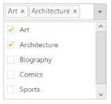

## MultiSelection modes

Dropdownlist widget allows you to select multiple values from the suggestion list using AllowMultiSelection property. You can select multiple values by setting AllowMultiSelection value to true.

Configuring MultiSelection Mode

The following code explain you the configuration of the AllowMultiSelection for a Dropdownlist textbox.

1. Add the below code snippet with ,multiple item selection option in Dropdownlist

[CSHTML]

// Add a DropDownList element using the helper class in CSHTML

@Html.EJ().DropDownList("dropdownlist").TargetID("list").AllowMultiSelection(true).ShowCheckbox(true).Width("200px")

    <ul>

        <li>Art</li>

        <li>Architecture</li>

        <li>Biography</li>

        <li>Comics</li>

        <li>Sports</li>

        <li>Science</li>

    </ul>

Output for Dropdown control that provides multiple selection is as follows.

{{ '' | markdownify }}
{:.image }

_Figure 18: Dropdown with_ AllowMultiSelection _property_ 

