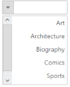

## RTL

This feature supports to change the left-to-right alignment of the Dropdown widget to right-to-left (RTL). 

Defining the RTL property

The following steps explains you the configuration of EnableRTL properties in Dropdownlist.

1. Please add the below code in your page to render the dropdown list with RTL alignment

[CSHTML]

// Add a DropDownList element using the helper class in CSHTML

@Html.EJ().DropDownList("dropdownlist").TargetID("list").EnableRTL(true) 

        &lt;div id="list"&gt;

            &lt;ul&gt;

                <li>Art</li>

                <li>Architecture</li>

                <li>Biography</li>

                <li>Comics</li>

                <li>Sports</li>

                <li>Science</li>

            &lt;/ul&gt;

        &lt;/div&gt;

[ASPX]

// Add Dropdown list widget in ASPX page

&lt;div class="control"&gt;

      &lt;ej:DropDownList ID="dropdownlist" TargetID="list" Width="200px" EnableRTL="true"  runat="server"&gt;

      &lt;/ej:DropDownList&gt;

     &lt;div id="list"&gt;

            &lt;ul&gt;

                <li>Art</li>

                <li>Architecture</li>

                <li>Biography</li>

                <li>Comics</li>

                <li>Sports</li>

                <li>Science</li>

             &lt;/ul&gt;

     &lt;/div&gt;

&lt;/div&gt;    

Output of the above steps

{  | markdownify }
{:.image }

_Figure 30: Dropdown with EnableRTL property_  

