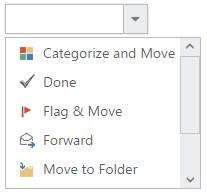

# Rendering Mode

DropDownList control can be created using UL-LI element. 

By default DropDownList control is rendered using DropDownList helper to which you can pass popup items using Datasource and DropDownListFields property. 

## Target Rendering

You can bind the predefined set of UL-LI elements to generate the list of popup items. These items can be customized by adding any images, div elements, radio buttons, text boxes etc.

Create a div with UL-LI elements and assign that div id into TargetID property for rendering the DropDownList control.



	@Html.EJ().DropDownList("DropDownList1").TargetID("mail")

	

    	<ul>

        	<li>

            	

            	Categorize and Move</li>
        
        	<li>
            	

            	Done</li>
        
        	<li>
            
            	

            	Flag & Move</li>
        
        	<li>
            
	            

    	        Forward</li>
        
	        <li>
            
	            

	            Move to Folder</li>
        
	        <li>
            
	            

	            New E-mail</li>
        
	        <li>
            
	            

	            New Meeting</li>
        
	        <li>
            
	            

	            Reply & Delete</li>
        
    	</ul>
    
	

	




    	 .mailtools {
        	display: block;
        	background-image: url('iconsapps.png');
        	height: 25px;
        	width: 25px;
        	background-position: center center;
        	background-repeat: no-repeat;
        
    	}
    
     	.mailtools.done {
	        background-position: 0 0;
        
	    }
    
	     .mailtools.movetofolder {
    	    background-position: 0 -22px;
        
	    }
    
	     .mailtools.categorize {
	        background-position: 0 -46px;
        
	    }
    
	    .mailtools.flag {
    	    background-position: 0 -70px;
        
    	}
    
     	.mailtools.forward {
        	background-position: 0 -94px;
        
    	}
    
     	.mailtools.newmail {
        	background-position: 0 -116px;
        
	    }
    
    	 .mailtools.reply {
        	background-position: 0 -140px;
        
    	}
    
     	.mailtools.meeting {
        	background-position: 0 -164px;
        
    	}    





    	$(function() {
		
        	$('#dropdown1').ejDropDownList({
			
            	targetID: "mail"
				
        	});
			
    	});



N> Images for this sample are available in (installed location)\Syncfusion\Essential Studio\{{ site.releaseversion }}\JavaScript\samples\web\themes\images 
	
	

N> Any EJ control can be embedded in the target element but the default action of that control should be prevented in order to create custom actions. To show a sample, integration with TreeView control is demonstrated [here](http://mvc.syncfusion.com/demos/web/dropdownlist/integrationwithwidgets)
