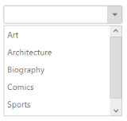

## Search Options 

Incremental Search 

This feature provides support to Dropdown List with search options that enables the search options by quick typing in the textbox when popup is displayed. In case if the matched optio`ns is not available in list, it automatically selects the last one in the list.  The data type of EnableIncrementalSearch is Boolean type.

Case-Sensitive Search 

This features provides support to search option with case sensitive. To achieve this you need to enable the incremental search on dropdown and the data type of CaseSensitiveSearch is Boolean type. 

Define the Incremental Search with Case-Sensitive 

The following steps explains you the configuration of search options in DropDownList

1. Add the below code snippet to render the dropdown list

[CSHTML]

// Add a DropDownList element using the helper class in CSHTML

@Html.EJ().DropDownList("dropdownlist").TargetID("list").Width("200px").ShowRoundedCorner(true).EnableIncrementalSearch(true).CaseSensitiveSearch(false)

    <ul>

        <li>Art</li>

        <li>Architecture</li>

        <li>Biography</li>

        <li>Comics</li>

        <li>Sports</li>

        <li>Science</li>

    </ul>

Output of the above steps

{{ '' | markdownify }}
{:.image }

_Figure 16: Dropdown with incremental search with case sensitive property_  

