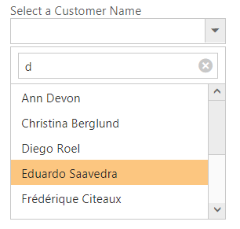
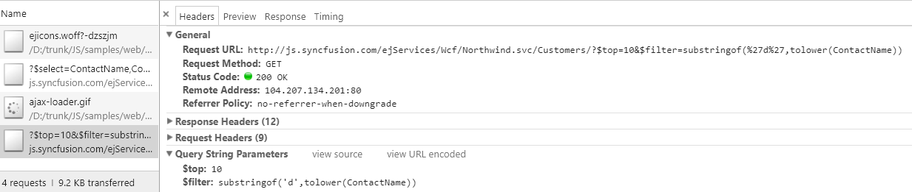

# Server Filtering

Server filtering for displaying only a fixed amount of dataset from the whole dataset. In general, DropDownList displays just the data returned from the server. This feature is convenient for you to apply when the user does not want to see the whole dataset in the popup wrapper.
EnableServerFiltering If set to true, the filtering operations performed in the remote service and returns the result.


     
Select a Company Name

    @(Html.EJ().DropDownList("ContactName")
                .Datasource(ds => ds.URL("http://js.syncfusion.com/demos/ejServices/Wcf/Northwind.svc/Customers").CrossDomain(true))
        .DropDownListFields(f => f.Text("ContactName").Value("ContactName"))
        .Width("100%")
        .EnableFilterSearch(true)
        .EnableServerFiltering(true)
        .WatermarkText("Select a Contact Name")
    )



This sample raises the query on Customer service. Returns ContactName records for customers with ContactName containing the string “d”.

