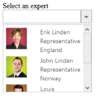

# Template Support

Dropdown widget provides the Template support for the Dropdownlist, when binding the data’s for the dropdown. For this behaviour you need to set the common syntax /element in Template property. You can add any Html mark-up element inside of dropdown list using this property.

The following steps explains you the behaviour of template support with Dropdownlist

1. Add the below code to render the view page to configure Dropdownlist widget

   N> Images for this sample are available in ‘installed location /themes/images’ 

   ~~~ html

		  // Add a DropDownList element using the helper class in CSHTML
		  

		  
Select an expert

		  @Html.EJ().DropDownList("dropdownlist").Datasource((IEnumerable<EmpData>)ViewData["emp"]).Width("200px").Template("" +"

 ${Text} 

 ${Designation} 

 ${Country} 

")
</td></tr>

   ~~~
   {:.prettyprint }
   
   ~~~ cs
   
		  // Initialize the control in controller
		  public ActionResult Property()
		  {
			  List<EmpData> emp = new List<EmpData>();
			  emp.Add(new EmpData() { Text = "Erik Linden", Img = "3", Designation = "Representative", Country = "England" });
			  emp.Add(new EmpData() { Text = "John Linden", Img = "6", Designation = "Representative", Country = "Norway" });
			  emp.Add(new EmpData() { Text = "Louis", Img = "7", Designation = "Representative", Country = "Australia" });
			  emp.Add(new EmpData() { Text = "Lawrence", Img = "8", Designation = "Representative", Country = "India" });
			  ViewData["emp"] = emp;   return View();
		 }
		 public class EmpData
		 { 
			 public string Text { get; set; } 
			 public string Img { get; set;}
			 public string Designation { get; set; }
			 public string Country { get; set; }
		 }

		 
   ~~~
   {:.prettyprint }

2. Customize the template in CSS. 

   ~~~ css

		  

   ~~~
   {:.prettyprint }

3. Output of the above steps.

_Figure 29: Dropdown with template support_  

