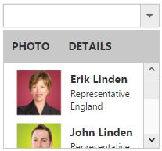

# Template Support

By default you can add any text or image to the DropDownList list item. To customize the items layout or to create your own visualized elements you can use this template support.

## Header Template

You can create the popup header by using HeaderTemplate property. You can add any HTML content in header template.

N> Please refer the [How-To](http://help.syncfusion.com/aspnetmvc/dropdownlist/howto#add-check-all-option-in-popup-list) section for the check all option in Header

## Template Field

Create a set of div containers with common syntax or elements and assign it to the Template property. You can add any HTML mark-up element inside the DropDownList list using this property.

In the demo, a List data is created with Text, Image, Role and Country which is initialized with DataSource property. Content template is created by using the corresponding fields and assigned in template property. The content template is customized with images and custom CSS styles to visualize the items in popup.



	
        @model MVCApplication.Controllers.HomeController
        
        @Html.EJ().DropDownList("DropDownList1").Datasource((IEnumerable<Employee1>)ViewData["LocalDataSource"]).HeaderTemplate("
PHOTO DETAILS
").Template("
<Image class='ImageId' src='../Content/Employees/${Image}.png' alt='employee'/> 
 ${Text} 

 ${Role} 

 ${Country} 

")
		
	
    
    

    	.ImageId {
        	margin: 0;
        	padding: 3px 10px 3px 3px;
        	border: 0 none;
        	width: 60px;
        	height: 60px;
        	float: none;
    	}

    
    
    
        public ActionResult Index()
        {
           List<Employee1> Data = new List<Employee1>();
            Data.Add(new Employee1
            {
                Text = "Erik Linden",
                Role = "Representative",
                Country = "England",
                Image = "3",
                ImageAttr = "class='ImageId'"
            });
            Data.Add(new Employee1
            {
                Text = "John Linden",
                Role = "Representative",
                Country = "Norway",
                Image = "6",
                ImageAttr = "class='ImageId'"
            });
            Data.Add(new Employee1
            {
                Text = "Louis",
                Role = "Representative",
                Country = "Australia",
                Image = "7",
                ImageAttr = "class='ImageId'"
            });
            Data.Add(new Employee1
            {
                Text = "Lawrence",
                Role = "Representative",
                Country = "India",
                Image = "8",
                ImageAttr = "class='ImageId'"
            });
            ViewData["LocalDataSource"] = Data;
            return View();
        }
        public class Employee
        {
            public string Text { get; set; }
            public string Role { get; set; }
            public string Country { get; set; }
            public string Image { get; set; }
            public string ImageAttr { get; set; }
        }
    
    


N> Images for this sample are available in (installed location)\Syncfusion\Essential Studio\{{ site.releaseversion }}\JavaScript\samples\web\themes\images 

