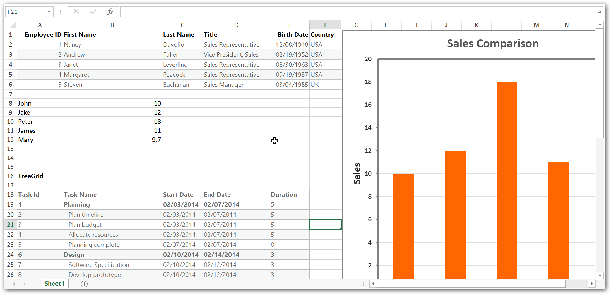

#  Exporting Multiple Syncfusion Controls

We can export multiple Syncfusion controls like Grid, Chart, TreeGrid, etc., in a single document. 
This can be achieved by calling `ej.exportAll` method. exportAll method accepts two necessary parameters; one for routing URL (either to export Excel or PDF) and other for passing multiple controls ID’s as an array.  
In the server side we can handle exporting multiple control either Excel or PDF exporting by calling `ExportAll` method

The following code example describes the above behavior.
 
  
 

     @Html.EJ().Button("ExcelExport").Size(ButtonSize.Medium).ShowRoundedCorner(true).Text("Excel Export").ClientSideEvents(eve=>eve.Click("ExcelExport"))

    @Html.EJ().Button("PdfExport").Size(ButtonSize.Medium).ShowRoundedCorner(true).Text("Pdf Export").ClientSideEvents(eve => eve.Click("PdfExport"))

    @(Html.EJ().Grid<EmployeeView>("MasterGrid")
        .Datasource((IEnumerable<object>)ViewBag.datasource)
        .Columns(col =>
        {
            col.Field("EmployeeID").HeaderText("Employee ID").IsPrimaryKey(true).TextAlign(TextAlign.Right).Width(100).Add();
            col.Field("FirstName").HeaderText("First Name").Width(100).Add();
            col.Field("LastName").HeaderText("Last Name").Width(100).Add();
            col.Field("Title").HeaderText("Title").Width(90).Add();
            col.Field("BirthDate").HeaderText("Birth Date").TextAlign(TextAlign.Right).Width(100).Format("{0:MM/dd/yyyy}").Add();
            col.Field("Country").Width(120).HeaderText("Country").Add();

        })
    )

    @(Html.EJ().TreeGrid("TreeGridContainer")
              .ChildMapping("Children")
              .TreeColumnIndex(1)
              .Columns(co =>
              {
                  co.Field("TaskId").HeaderText("Task Id").Width(80).Add();
                  co.Field("TaskName").HeaderText("Task Name").Add();
                  co.Field("StartDate").HeaderText("Start Date").Add();
                  co.Field("EndDate").HeaderText("End Date").Add();
                  co.Field("Duration").HeaderText("Duration").Add();
              })
              .EditSettings(es => es.AllowDeleting(false))
              .SizeSettings(ss => ss.Width("100%").Height("350px"))
             .Datasource(ViewBag.data)

    )
    
      @(Html.EJ().Chart("ChartContainer").ChartArea(cr => cr.Border(ab => ab.Color("transparent")))
              .Border(border => border.Opacity(1))
              .Series(sr =>
                  {
                      sr.Points(pt =>
                          {
                              pt.X("John").Y(10).Add();
                              pt.X("Jake").Y(12).Add();
                              pt.X("Peter").Y(18).Add();
                              pt.X("James").Y(11).Add();
                              pt.X("Mary").Y(9.7).Add();
                          }).Name("Person").Type(SeriesType.Column).XName("XValue").YName("YValue1").EnableAnimation(true).Tooltip(d => d.Visible(true)).Add();
                  })
              
              .EnableCanvasRendering(true))



    
    public class GridController : Controller
     {
               
        public ActionResult GridFeatures()
        {

            var MasterData = new NorthwindDataContext().EmployeeViews.Take(5).ToList();
            ViewBag.dataSource = MasterData;
            var data = this.GetDefaultData();
            ViewBag.data = data;
            return View();
            
        }
      public void ExcelExport (FormCollection controlModel)
        {
            Dictionary<string, string> val =controlModel.AllKeys.ToDictionary(k => k, v=>controlModel[v]);

            ExcelExport exp = new ExcelExport();
            var EmployeeData = new NorthwindDataContext().EmployeeViews.Take(5).ToList();   //DataSource for Grid.
            var treeData = this.GetDefaultData();                                           //DataSource for TreeGrid.

            List<ExportChartData> chartData = new List<ExportChartData>();
            chartData.Add(new ExportChartData("John", 10));
            chartData.Add(new ExportChartData("Jake", 12));
            chartData.Add(new ExportChartData("Peter", 18));
            chartData.Add(new ExportChartData("James", 11));
            chartData.Add(new ExportChartData("Mary", 9.7));
            var chartDataSource = chartData;                                                 //DataSource for Chart
            
            Dictionary<string, object> items = new Dictionary<string, object>();
            items.Add("ejGrid",EmployeeData);
            items.Add("ejTreeGrid", treeData);
            items.Add("ejChart", chartDataSource);
            
            exp.ExportAll(val, items, "Export.xlsx", ExcelVersion.Excel2010, "flat-saffron");
        }

      
        public void PdfExport (FormCollection controlModel)
        {
            Dictionary<string, string> val = controlModel.AllKeys.ToDictionary(k => k, v => controlModel[v]);

            PdfExport exp = new PdfExport();

            var EmployeeData = new NorthwindDataContext().EmployeeViews.Take(5).ToList();    //DataSource for TreeGrid.
            var treeData = this.GetDefaultData();                                            //DataSource for TreeGrid.

            List<ExportChartData> chartData = new List<ExportChartData>();
            chartData.Add(new ExportChartData("John", 10));
            chartData.Add(new ExportChartData("Jake", 12));
            chartData.Add(new ExportChartData("Peter", 18));
            chartData.Add(new ExportChartData("James", 11));
            chartData.Add(new ExportChartData("Mary", 9.7));
            var chartDataSource = chartData;                                                 //DataSource for Chart

            Dictionary<string, object> items = new Dictionary<string, object>();
            items.Add("ejGrid", EmployeeData);
            items.Add("ejTreeGrid", treeData);
            items.Add("ejChart", chartDataSource);

            exp.ExportAll(val, items, "Export.pdf", "flat-saffron");
        }
   }




        

  

The following output is displayed as a result of the above code example.

 
   