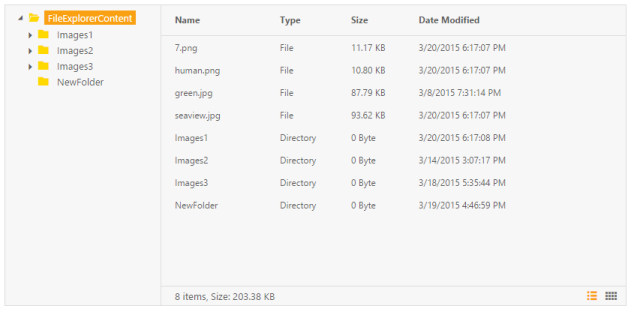
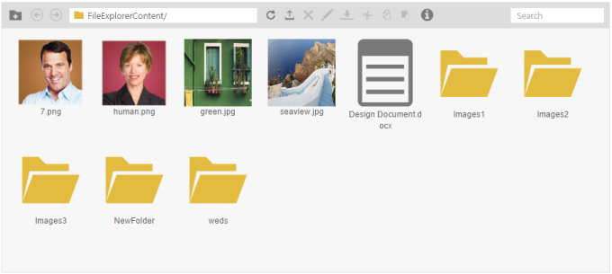

# Customization layout 

You can easily customize the layout of the FileExplorer control, show or hide the sub control parts in FileExplorer as per your requirement. For example: show/ hide toolbar, tree view, layout, footer part.

1. To render FileExplorer in MVC with above customizing options, include the following code in your View page.

   ~~~ html
	
	 @Html.EJ().FileExplorer("fileExplorer").Path("~/FileExplorerContent/").AjaxAction(@Url.Content("FileActionDefault")).ShowToolbar(false)

   ~~~
   {:.prettyprint }

    There is no change in the controller part, the same controller part is used as mentioned above.

    
	

2. To render FileExplorer in MVC with disable tree view and footer options, include the following code in your View page.

   ~~~ html
	
		@Html.EJ().FileExplorer("fileExplorer").Path("~/FileExplorerContent/").AjaxAction(@Url.Content("FileActionDefault")).ShowTreeview(false).ShowFooter(false).Layout(LayoutType.Tile)

   ~~~
	{:.prettyprint }

    There is no change in the controller part, the same controller part is used as mentioned above.

    

