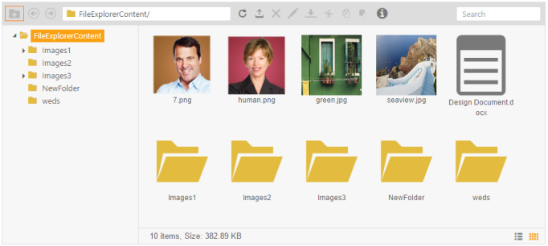

## Disable or Enabling toolbar tool

In Toolbar, you can disable or enable the tools as per your requirement. For example when you want to disable the Add a new folder tool, you can achieve it using the following code.

1. To render FileExplorer in MVC with the Toolbar Tool Disabled option, include the following code in your View page.

[_cshtml]

@Html.EJ().FileExplorer("fileExplorer").Path("~/FileExplorerContent/").AjaxAction(@Url.Content("FileActionDefault")).Layout(LayoutType.Tile)

In your script section please add following code to disable toolbar tool.

[JavaScript]

There is no change in the controller part, it is the same controller part used as mentioned above.

{{ '' | markdownify }}
{:.image }

