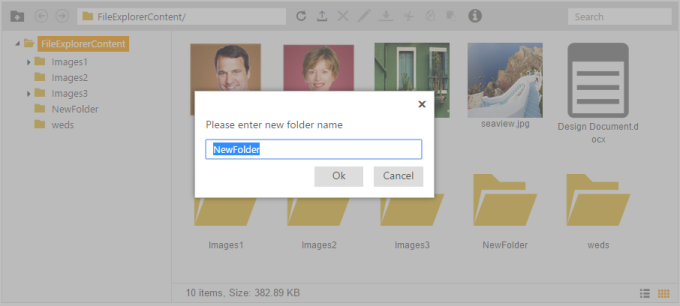
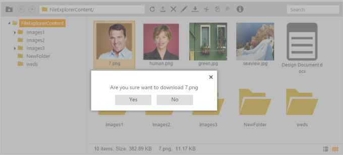
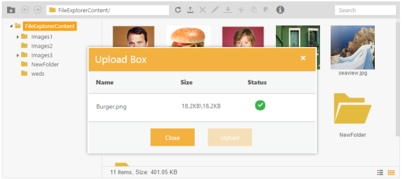
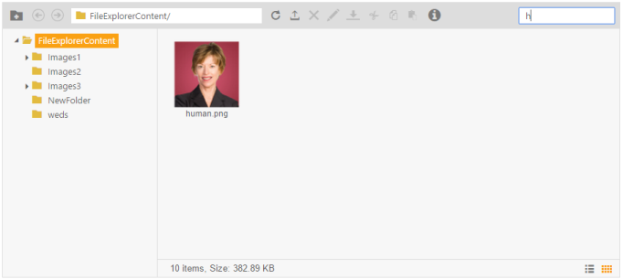
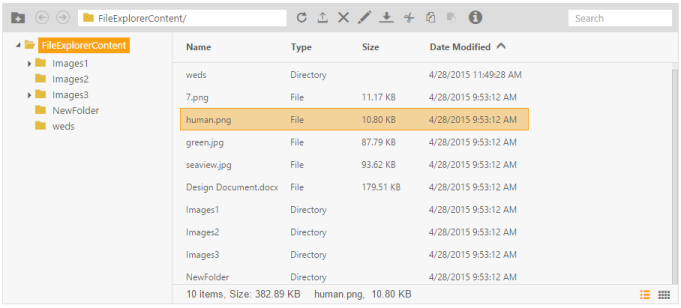

# File management options

## Creating New Folder

By clicking the New Folder Icon, the highlighted model dialog opens as shown in the following screenshot using which you can add a new folder in the file system with the required name.

FileExplorer with adding folder model dialog
{:.caption}

## Download option

The Download option is used to download the required files from the online file system. After selecting the download option, the following model dialog opens with the downloadable option.

FileExplorer with download file option
{:.caption}

## Upload option

You can upload files to the required place using the built-in Upload box control.

FileExplorer with upload option
{:.caption}

## Search support

To easily search the files in file system, you are provided with the Search bar option.

FileExplorer with search option
{:.caption}

## Sorting support

In the Details view, you can sort the files using required fields. For example, in the following screenshot the Details view files are sorted in ascending order with respect to the modified date of files and folders.

FileExplorer in details view with sorting support
{:.caption}