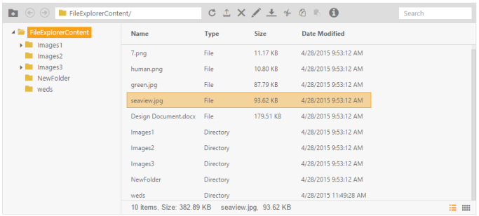
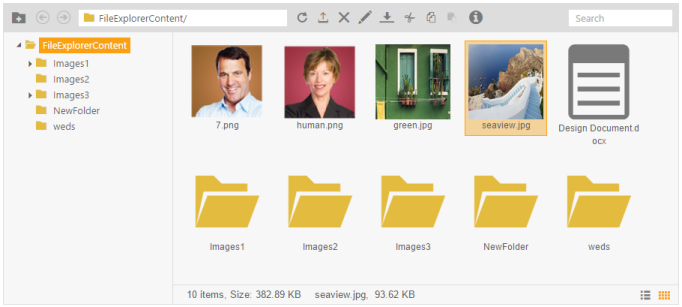

# Getting Started

This section explains briefly about how to create a FileExplorer in your application with ASP.NET MVC.

## Create your first FileExplorer in MVC

ASP.NET MVC FileExplorer widget provides support to access the online file system and managing the files in an efficient way. From the following guidelines, you can learn how to access online file system and managing the files using FileExplorer control.

The following screenshot demonstrates the functionality of FileExplorer with Details view and Thumbnail view.

{{ '' | markdownify }}
{:.image }

{{ '' | markdownify }}
{:.image }

In the above screenshot, you can access and manage the remote file system. While you perform the operation on files like delete or rename, this is handled in the controller part.

Create FileExplorer

ASP.NET MVC FileExplorer widget renders built-in features like accessing online file system through web and managing files like creating a folder, upload files, delete, rename, move or copy and search files.  You can easily create the FileExplorer widget by using the following steps.

1. You can create an MVC project and add necessary assemblies, styles, and scripts with the help of the given [MVC-Getting Started](http://help.syncfusion.com/ug/js/Documents/gettingstartedwithmv.htm) Documentation.
2. Add the following code example to the corresponding View page to render the FileExplorer.

[CSHTML]

@Html.EJ().FileExplorer("fileExplorer").Path("~/FileExplorerContent/").AjaxAction(@Url.Content("FileActionDefault"))

3. Add the following code example to the corresponding controller page, FileActionDefault method is triggered, when you have made Ajax request on client-side. This FileActionDefault method finds out the specific operations using the ActionType property and calls the FileExplorerOperations methods according to that.

using System;

using System.Collections.Generic;

using System.Linq;

using System.Web;

using System.Web.Mvc;

using Syncfusion.JavaScript;

using MVCSampleBrowser.Models;

namespace MVCSampleBrowser.Controllers

{

    public partial class FileExplorerController : Controller

    {                

        public ActionResult Default()

        {

            return View();

        }

        public ActionResult FileActionDefault(FileExplorerParams args)

        {

            switch (args.ActionType)

            {

                case "Read":

                    return Json(FileExplorerOperations.Read(args.Path,                        args.ExtensionsAllow));

                case "CreateFolder":

                    return Json(FileExplorerOperations.CreateFolder(args.Path, args.Name));

                case "Paste":

                    FileExplorerOperations.Paste(args.LocationFrom, args.LocationTo, args.Name, args.Type, args.Action);

                    break;

                case "Delete":

                    FileExplorerOperations.Delete(args.Name.Split(','), args.Path);

                    break;

                case "Rename":

                    FileExplorerOperations.Rename(args.Path, args.PreviousName, args.NewName, args.Type);

                    break;

                case "GetDetails":

                    return Json(FileExplorerOperations.GetDetails(args.Path, args.Name, args.Type));

                case "Download":

                    FileExplorerOperations.Download(args.Path);

                    break;

                case "Upload":

                    FileExplorerOperations.Upload(args.FileUpload, args.Path);

                    break;

            }

            return Json("");

        }

    }

}

FileExplorerOperations is a predefined Class, which is used to perform File Explorer-based operations like read, createFolder, download, upload, rename, paste, getImage. It minimizes the work load on server-side. 

By default, we send following parameters in data field of corresponding Ajax request. This helps to handle server side operation. Some Server side action method will only return the response data. This response data and request parameter are explained in following table. 

_Table1: FileExplorerOperations_

<table>
<tr>
<td>
Operation</td><td>
Default Request Parameter</td><td>
Response data</td><td>
Details</td></tr>
<tr>
<td>
Read</td><td>
String ActionType,String Path,String ExtensionsAllow</td><td>
Should return data in array of JSON format and JSON fields need to be in following field names{{{ ''_“name, size, type, dateModified, hasChild”_'' | markdownify }}}{{{ ''_For example:_'' | markdownify }}}[{name: "7.png", type: "File", size: 11439, dateModified: "3/31/2015 3:16:38 PM", hasChild: false},{name: "human.png", type: "File", size: 11059, dateModified: "3/31/2015 3:16:35 PM", hasChild: false}]</td><td>
Read the data from the given path</td></tr>
<tr>
<td>
CreateFolder</td><td>
String ActionType,String Path,String Name</td><td>
Should return new folder name in string</td><td>
Create the new folder to given path</td></tr>
<tr>
<td>
Paste</td><td>
String ActionType, String LocationFrom, String LocationTo, String Name,String Type, String Action</td><td>
Void</td><td>
Paste the content from source to target place</td></tr>
<tr>
<td>
Delete</td><td>
String ActionType, String Name,String Path</td><td>
Void</td><td>
Delete the data from the given path</td></tr>
<tr>
<td>
Rename</td><td>
String ActionType, String Path,String PreviousName, String NewName, String Type</td><td>
Void</td><td>
Rename the file or folder from the given path</td></tr>
<tr>
<td>
GetDetails</td><td>
String ActionType, String Path, String Name,String Type</td><td>
Response data should be in JSON format like below{CreationTime:"4/28/2015 9:44:32 AM", Extension:".png", Format:"Archive", FullName:"F:\All samples\FileExplorer_Custom\FileExplorerContent\human.png", LastAccessTime:"4/28/2015 9:44:32 AM", LastWriteTime:"3/31/2015 3:16:35 PM", Length:11059, Name:"human.png"}Here you may add additional date fields with this JSON</td><td>
To get the details of the data from the given path</td></tr>
<tr>
<td>
Download</td><td>
String ActionType,String Path</td><td>
Void</td><td>
To download the data from the given path</td></tr>
<tr>
<td>
Upload</td><td>
String ActionType, IEnumerable<HttpPostedFileBase> FileUpload, String Path</td><td>
Void </td><td>
To upload the data from the given path</td></tr>
</table>

The following screenshot displays a FileExplorer control.

{{ '' | markdownify }}
{:.image }

