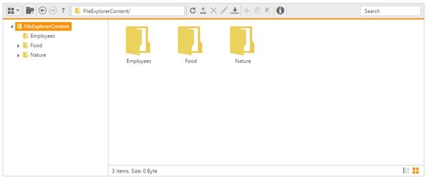

# Getting Started

The following section is briefly explain the things to get started with FileExplorer control.

## A new MVC Application and required assemblies with dependent files

To get start with Essential ASP.NET MVC FileExplorer, create a new MVC Application and add the required assemblies in references and then refer the below specified dependent CSS file as well as scripts

To create a MVC Project and add necessary assemblies you can use the help of the given [MVC-Getting Started](http://help.syncfusion.com/aspnetmvc/getting-started#) Documentation.

## Adding the references

To include the control in the application the following references need to be added:

* CSS references

* Script references

CSS file

* [ej.web.all.min.css](http://cdn.syncfusion.com/13.4.0.58/js/web/flat-azure/ej.web.all.min.css#) includes all widgets styles (To know more about theme refer [Theming in Essential JavaScript Component](http://help.syncfusion.com/js/theming-in-essential-javascript-components#)

N> Essential JS widgets having the support for 13 built-in themes, to know more please check [here](http://docs.syncfusion.com/js/theming-in-essential-javascript-components#)

### Script references

The external script dependencies of the FileExplorer widget are,

* [jQuery 1.7.1](http://jquery.com/#) or later versions.

* [jQuery.easing](http://gsgd.co.uk/sandbox/jquery/easing/#) - to support the animation effects.

* [jsrender](https://www.jsviews.com/#jsrender) – for grid view template.

And the internal script dependencies of the FileExplorer widget are:
<table>
<tr>
<td>
File
</td>
<td>
Description/Usage
</td>
</tr>
<tr>
<td>
ej.core.min.js  </td>
<td>
Must be referred always before using all the JS controls.  </td>
</tr>
<tr>
<td>
ej.data.min.js  </td>
<td>
Used to handle data operation and should be used while binding data to JS controls.  </td>
</tr>
<tr>
<td>
ej.touch.min.js
</td>
<td>
Used to handle touch operations
</td>
</tr>
<tr>
<td>
ej. draggable.min.js
</td>
<td>
Used to handle the drag and drop functionality  </td>
</tr>
<tr>
<td>
ej.scroller.min.js  </td>
<td>
Used to show the scrollbar in the layout area  </td>
</tr>
<tr>
<td>
ej.button.min.js  </td>
<td>
Used to display the buttons in the toolbar  </td>
</tr>
<tr>
<td>
ej.checkbox.min.js
</td>
<td>
Used to display the checkbox in files items

</td>
</tr>
<tr>
<td>
ej.splitbutton.min.js
</td>
<td>
Used to display the split buttons in the toolbar  </td>
</tr>
<tr>
<td>
ej.treeview.min.js  </td>
<td>
Used to display the “TreeView” in the navigation pane  </td>
</tr>
<tr>
<td>
ej.uploadbox.min.js  </td>
<td>
Used to perform the upload functionality   </td>
</tr>
<tr>
<td>
ej.waitingpopup.min.js  </td>
<td>
Used to showcase the waiting popup  </td>
</tr>
<tr>
<td>
ej.dialog.min.js  </td>
<td>
Used to create the alert windows   </td>
</tr>
<tr>
<td>
ej.splitter.min.js  </td>
<td>
Used as the body section to separate the navigation and layout area  </td>
</tr>
<tr>
<td>
ej.toolbar.min.js  </td>
<td>
Used to showcase the hearer section  </td>
</tr>
<tr>
<td>
ej.menu.min.js  </td>
<td>
Used to showcase the context menu  </td>
</tr>
<tr>
<td>
ej.grid.min.js  </td>
<td>
Used to showcase the grid layout view  </td>
</tr>
<tr>
<td>
ej.fileexplorer.min.js
</td>
<td>
FileExplorer plugin
</td>
</tr>
<tr>
<td>
ej.globalize.min.js
</td>
<td>
Used to working with different localization culture formats

</td>
</tr>
</table>

You can use the “**ej.web.all.min.js**” file, which encapsulates all the EJ MVC controls and frameworks in one single file

N> To add required assembly references, scripts and CSS files automatically into your application, please refer following link [http://help.syncfusion.com/aspnetmvc/getting-started#through-syncfusion-nuget-packages-2](http://help.syncfusion.com/aspnetmvc/getting-started#through-syncfusion-nuget-packages-2). Also, it configures the “web.config” file automatically.

## FileExplorer using helper

In the view page, add FileExplorer helper as shown below. 

   
    
        @(Html.EJ().FileExplorer("fileExplorer")
            .Path("~/FileExplorerContent/")
            .AjaxAction(@Url.Content("FileActionDefault"))
        )
        
   
 
In above code block, “Path” denotes the URL of filesystem that are to be explored in "FileExplorer" and “AjaxAction” specifies the URL of server side AJAX handling method that handles the file operations of FileExplorer control. So “[Path](http://help.syncfusion.com/js/api/ejfileexplorer#members:path)” and “[AjaxAction](http://help.syncfusion.com/js/api/ejfileexplorer#members:ajaxaction)” are the mandatory configuration at here.

Add the following code example to the corresponding controller page. 

    
    
            public ActionResult FileActionDefault(FileExplorerParams args)
            {
                FileExplorerOperations operation = new FileExplorerOperations();
                switch (args.ActionType)
                {
                    case "Read":
                        return Json(operation.Read(args.Path, args.ExtensionsAllow));
                    case "CreateFolder":
                        return Json(operation.CreateFolder(args.Path, args.Name));
                    case "Paste":
                        return Json(operation.Paste(args.LocationFrom, args.LocationTo, args.Names, args.Action, args.CommonFiles));
                    case "Remove":
                        return Json(operation.Remove(args.Names, args.Path));
                    case "Rename":
                        return Json(operation.Rename(args.Path, args.Name, args.NewName, args.CommonFiles));
                    case "GetDetails":
                        return Json(operation.GetDetails(args.Path, args.Names));
                    case "Download":
                        operation.Download(args.Path, args.Names);
                        break;               
                    case "Upload":
                        operation.Upload(args.FileUpload, args.Path);
                        break;
                    case "Search":
                        return Json(operation.Search(args.Path, args.ExtensionsAllow, args.SearchString, args.CaseSensitive));
                }
                return Json("");
            }
            
    

Once you have completed the above steps, you will get an output like below.

