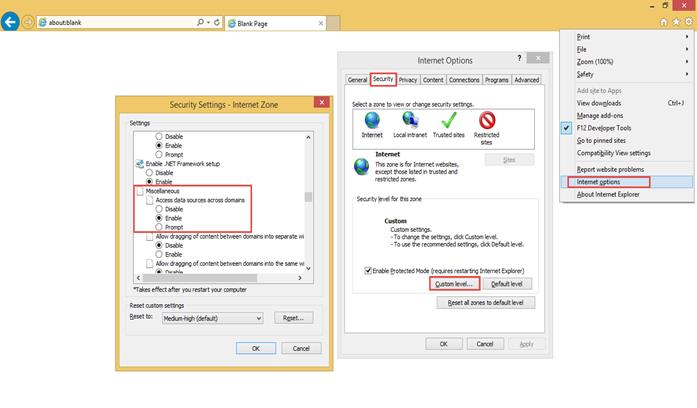

# How To

## Cross-origin resource sharing support for FileExplorer

**Cross-origin request**

The “FileExplorer” can browse and manage files on remote servers, which is located in other domains. If a server is located on a different domain, on a different port or using different protocol (HTTP / HTTPS) such requests are considered to be “**cross-origin requests**”. These type requests are prohibited by IE9 and its earlier browsers.

**Enabling cross-origin request in IE8 and IE9**

By default, Internet Explorer 9 and earlier prohibits cross-origin requests for Internet Zone, also it ignores "Access-Control-Allow" headers. To enable cross-origin in IE8 and IE9, we have specified two type of options. As per the requirements, you can use any option that is mentioned below.

**Option 1: Enabling cross-origin in IE through browser settings**

To enable cross-origin access using settings of IE browser, go to Tools->Internet Options->Security tab, click on “Custom Level” button. Find the Miscellaneous and select “Enable” option, which is available under “Access data sources across domains” settings.

If your server is located in Intranet Zone, In IE Browser, confirmation dialog will be popped during first cross-domain request as “*This page is accessing information that is not under its control. This poses a security risk. Do you want to continue*?”

To suppress this warning, you need to specify the "*Access data sources across domains*" setting to “allow”.

**Option 2: Using JSONP for cross-origin request**

Using JSONP data type, you can perform cross origin-request. To enable cross-origin request, in your “FileExplorer”, you have to specify “**AjaxDataType”**as “**jsonp**”. And we have provided “**doJSONPAction**” method to handle “jsonp” type Ajax request on server side.  Please refer below code snippet to specify “**AjaxDataType”**as “**jsonp**”.

Code example [CSHTML]:

    
    
    
        @(Html.EJ().FileExplorer("fileExplorer")
            .Path("http://mvc.syncfusion.com/ODataServices/FileBrowser/")
            .AjaxAction("http://mvc.syncfusion.com/OdataServices/fileExplorer/fileoperation/doJSONPAction")
            .AjaxDataType("jsonp")
        )
        
    
    
If we specify “AjaxDataType” as “jsonp”, data will be received in string format while calling “doJSONPAction” method of Web API Controller, here you need to deserialize the received “json” data into “[FileExplorerParams](#_FileExplorerParams_class_1)” object. After performing corresponding operations, you have to specify the response data in serialized format with wrapped callback function. Please refer below code snippet to handle “jsonp” operations on server.

Code example [C#]:

    
    
    
        [HttpGet]
        [ActionName("doJSONPAction")]
        public object doJSONPAction(string callback, string json)
        {	
            object Data = null;
            var serializer = new JavaScriptSerializer();
            FileExplorerParams args = (FileExplorerParams)serializer.Deserialize(json, typeof(FileExplorerParams));
            try
            {            
                switch (args.ActionType)
                {
                    case "Read":
                        Data = FileExplorerOperations.ReadData(args.Path, args.ExtensionsAllow);
                        break;
                    case "Search":
                        Data = FileExplorerOperations.Search(args.Path, args.ExtensionsAllow, args.SearchString, args.CaseSensitive);
                        break;
                    case "CreateFolder":
                        Data = FileExplorerOperations.NewFolder(args.Path, args.Name);
                        break;
                    case "Paste":
                        Data = FileExplorerOperations.Paste(args.LocationFrom, args.LocationTo, args.Names, args.Action, args.CommonFiles);
                        break;
                    case "Remove":
                        Data = FileExplorerOperations.Remove(args.Names, args.Path);
                        break;
                    case "Rename":
                        Data = FileExplorerOperations.Rename(args.Path, args.Name, args.NewName, args.CommonFiles);
                        break;
                    case "GetDetails":
                        Data = FileExplorerOperations.GetDetails(args.Path, args.Names);
                        break;
                }
                HttpContext.Current.Response.Write(string.Format("{0}({1});", callback, serializer.Serialize(Data)));
                return "";
            }
            catch (Exception e)
            {
                FileExplorerResponse Response = new FileExplorerResponse();
                Response.error = e.GetType().FullName + ", " + e.Message;
                HttpContext.Current.Response.Write(string.Format("{0}({1});", callback, serializer.Serialize(Response)));
                return "";
            }
        }
            [HttpPost]
            [ActionName("doJSONPAction")]
            public void doJSONPAction()
            {
                if (HttpContext.Current.Request.Files.Count > 0)
                    FileExplorerOperations.Upload(HttpContext.Current.Request.Files,    HttpContext.Current.Request.QueryString.GetValues("Path")[0]);
            }
            [HttpGet]
            [ActionName("doJSONPAction")]
            public void doJSONPAction(string ActionType, string Path, string SelectedItems)
            {
                if (ActionType == "Download")
                FileExplorerOperations.Download(Path, HttpContext.Current.Request.QueryString.GetValues("Names"));
            else if (ActionType == "GetImage")
                FileExplorerOperations.GetImage(Path);
            }
            
    
    
In IE8 and IE9 Browser, These options helps to render our “FileExplorer” control with cross-origin resource support.

## Access static physical path using FileExplorer control

Using “FileExplorer”, also you can manage the files that are available in local file system by referring its physical path. Please refer below example to achieve this.

In the view page, add “FileExplorer” helper and specify the physical path as below shown format.

    
    
        @(Html.EJ().FileExplorer("fileExplorer")
            .Path("C:/Samples/web/FileExplorerContent")
            .AjaxAction(@Url.Content("FileActionDefault"))        
        )
        
    

In the controller page, specify the “[GetImage](http://help.syncfusion.com/cr/cref_files/aspnetmvc/dociohelper/Syncfusion.EJ~Syncfusion.JavaScript.FileExplorerOperations~GetImage.html#)” handling operation as shown below. This handling function is necessary to render the images in FileExplorer, while physical path has been mentioned.
    
    
    
            public ActionResult FileActionDefault(FileExplorerParams args)
            {
                FileExplorerOperations operation = new FileExplorerOperations();
                switch (args.ActionType)
                {
                    case "Read":
                        return Json(operation.Read(args.Path, args.ExtensionsAllow));
                    case "CreateFolder":
                        return Json(operation.CreateFolder(args.Path, args.Name));
                    case "Paste":
                        return Json(operation.Paste(args.LocationFrom, args.LocationTo, args.Names, args.Action, args.CommonFiles));
                    case "Remove":
                        return Json(operation.Remove(args.Names, args.Path));
                    case "Rename":
                        return Json(operation.Rename(args.Path, args.Name, args.NewName, args.CommonFiles));
                    case "GetDetails":
                        return Json(operation.GetDetails(args.Path, args.Names));
                    case "Download":
                        operation.Download(args.Path, args.Names);
                        break;
                    case "Upload":
                        operation.Upload(args.FileUpload, args.Path);
                        break;
                    case "Search":
                        return Json(operation.Search(args.Path, args.ExtensionsAllow, args.SearchString, args.CaseSensitive));
                    case "GetImage":
                        operation.GetImage(args.Path);
                        break;
                }
                return Json("");
            }
            
    
    
## Adding Custom column in grid view of FileExplorer

You can add custom column in grid view of “FileExplorer”. To achieve this requirement, in controller page you have to add the custom column with existing AJAX response by overriding the “Read” method, which is available in “[FileExplorerOperations](http://help.syncfusion.com/cr/cref_files/aspnetmvc/dociohelper/Syncfusion.EJ~Syncfusion.JavaScript.FileExplorerOperations.html#)” class. Please refer following code example.
    
    
    
        public partial class FileExplorerController : Controller
        {
            public ActionResult Default()
            {
                return View();
            }
    
            public ActionResult FileActionDefault(FileExplorerParams args)
            {
                FileExplorerCustomOperations customOperation = new FileExplorerCustomOperations();
                FileExplorerOperations operation = new FileExplorerOperations();
                switch (args.ActionType)
                {
                    case "Read":
                        return Json(customOperation.Read(args.Path, args.ExtensionsAllow));
                    case "CreateFolder":
                        return Json(operation.CreateFolder(args.Path, args.Name));
                    case "Paste":
                        return Json(operation.Paste(args.LocationFrom, args.LocationTo, args.Names, args.Action, args.CommonFiles));
                    case "Remove":
                        return Json(operation.Remove(args.Names, args.Path));
                    case "Rename":
                        return Json(operation.Rename(args.Path, args.Name, args.NewName, args.CommonFiles));
                    case "GetDetails":
                        return Json(operation.GetDetails(args.Path, args.Names));
                    case "Download":
                        operation.Download(args.Path, args.Names);
                        break;
                    case "Upload":
                        operation.Upload(args.FileUpload, args.Path);
                        break;
                    case "Search":
                        return Json(operation.Search(args.Path, args.ExtensionsAllow, args.SearchString, args.CaseSensitive));
                    case "GetImage":
                        operation.GetImage(args.Path);
                        break;
                }
                return Json("");
            }
    
        }
        public class FileExplorerCustomOperations : FileExplorerOperations
        {
            public override object Read(string path, string filter, IEnumerable<object> selectedItems = null)
            {
                CustomFileExplorerResponse ReadResponse = new CustomFileExplorerResponse();
                try
                {
                    var directory = new DirectoryInfo(GetPhysicalPath(ToAbsolute(path)));
                    filter = filter.Replace(" ", "");
                    var extensions = (filter ?? "*").Split(",|;".ToCharArray(), System.StringSplitOptions.RemoveEmptyEntries);
                    var files = extensions.SelectMany(directory.GetFiles)
                        .Select(file => new CustomFileExplorerDirectoryContent
                        {
                            name = file.Name,
                            isFile = true,
                            size = file.Length,
                            type = "File",
                            dateModified = file.LastWriteTime.ToString(),
                            hasChild = false,
                            //assign the value in extention property
                            extention = file.Extension
                        });
    
                    var directories = directory.GetDirectories().Select(subDirectory => new CustomFileExplorerDirectoryContent
                    {
                        name = subDirectory.Name,
                        size = 0,
                        isFile = false,
                        type = "Directory",
                        dateModified = subDirectory.LastWriteTime.ToString(),
                        hasChild = subDirectory.GetDirectories().Length > 0 ? true : false,
                        extention = ""
                    });
    
                    object fileDetails = files.Concat(directories);
                    ReadResponse.files = (IEnumerable<CustomFileExplorerDirectoryContent>)fileDetails;
                    return ReadResponse;
                }
                catch (Exception e)
                {
                    ReadResponse.error = e.GetType().FullName + ", " + e.Message;
                    return ReadResponse;
                }
            }
        }
        public class CustomFileExplorerDirectoryContent
        {
            public string name { get; set; }
            public string type { get; set; }
            public long size { get; set; }
            public string dateModified { get; set; }
            public bool hasChild { get; set; }
            public bool isFile { get; set; }
            //add custom property
            public string extention { get; set; }        
        }
    
        //customize the FileExplorer response
        public class CustomFileExplorerResponse
        {
            public IEnumerable<CustomFileExplorerDirectoryContent> files { get; set; }
            public IEnumerable<FileDetails> details { get; set; }
            public object error { get; set; }
        }
    
    
    
In the view page, add the custom column in grid using “[GridSettings](http://help.syncfusion.com/js/api/ejfileexplorer#members:gridsettings)” API of “FileExplorer”.

    

    @(Html.EJ().FileExplorer("fileExplorer")
        .Path("~/FileExplorerContent/")
        .AjaxAction(@Url.Content("FileActionDefault"))
        .GridSettings(grid => 
            grid.Column(column=>
                {
                    column.Add().Field("name").HeaderText("Name").Width("30%");
                    column.Add().Field("type").HeaderText("Type");
                    //adding new column
                    column.Add().Field("extention").HeaderText("Extention");
                    column.Add().Field("size").HeaderText("Size");
                    column.Add().Field("dateModified").HeaderText("Date Modified");
                }
            )
        )
    )

    
