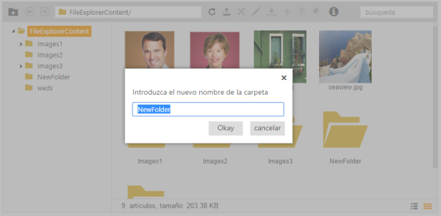
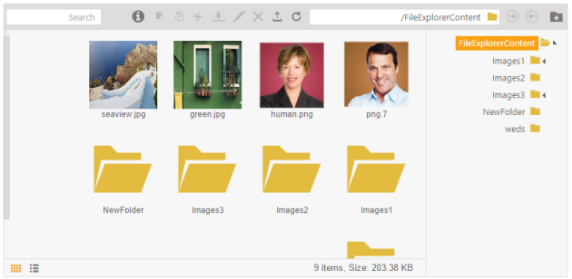

# Localization and RTL Support

## Localization

You can globalize the FileExplorer, so that users of different cultures can make use of it and post their content. For your convenience, you can format the FileExplorer control to your culture. When your blog is in your culture, the viewers of your culture can understand about your company and its products. You can achieve localization using the “Locale” property. 

FileExplorer support all the cultures. Globalize.js is a simple JavaScript library that allows you to use different cultures. Globalize cultures is the open source and you can get all the culture files from [http://cdnjs.com/libraries/globalize/](http://cdnjs.com/libraries/globalize/) link. 

In this example, globalize.min.js file is used that includes all the cultures information. And in this example Spanish culture is used. 

1. Add the following code in your CSHTML page to initialize the FileExplorer with Spanish content.

   ~~~ html

			@Html.EJ().FileExplorer("fileExplorer").Path("~/FileExplorerContent/").AjaxAction(@Url.Content("FileActionDefault")).Locale("es-ES").GridSettings(settings => settings.Column(col =>

                        {

                            col.Add().Field("name").HeaderText("nombre");

                            col.Add().Field("type").HeaderText("tipo");

                            col.Add().Field("size").HeaderText("tamaño");

                            col.Add().Field("dateModified").HeaderText("fecha de modificación");

                        })).Layout(LayoutType.Tile)

   ~~~
   {:.prettyprint }

2. Add the following code in your script section to render FileExplorer with Spanish culture.

   ~~~ html

			

   ~~~
   {:.prettyprint }
   
3. _Figure 13: Showcase of FileExplorer with Spanish culture_
    

	There is no change in the controller part, it is the same controller part used as mentioned above.

## RTL

RTL control supports right-to-left functionality and features for languages that work in a right-to-left way for entering, editing, and displaying text. You can change your display to read right-to-left. Arabic and Hebrew are written from right to left. The customers with writing style from right-to left can use this feature in FileExplorer. You can achieve this in the editing area by using the EnableRTL property. Setting this property to “True” allows you to write in the right-to-left format. Position of the toolbars also changes from right to left.

1. Add the following code to the script section in your CSHTML page to initialize the FileExplorer.

   ~~~ html

		@Html.EJ().FileExplorer("fileExplorer").Path("~/FileExplorerContent/").AjaxAction(@Url.Content("FileActionDefault")).EnableRTL(true).Layout(LayoutType.Tile)
   
   ~~~
   {:.prettyprint }

2. There is no change in the controller part, it is the same controller part used as mentioned above

	_Figure 14:Showcase of FileExplorer with right to left appearance_

	