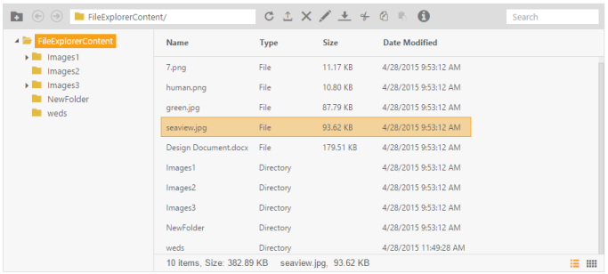

# Toolbar Support

The FileExplorer control provides a number of tool items that help manage the remote file system in an effective way. It brings to the Web, popular file management system found in the desktop Windows Explorer.

## File Management

All the managing tools allow you to manage the file system easily. Using these tools you can add folders, upload files, delete, rename, move, copy, search etc.

### List of Toolbar Items

* Add: Add a new folder.
* Address bar: Used to point the current viewing folder and provide navigation support with options for editing.
* Refreshing: Used to refresh the current viewing folder. 
* Upload: Provides the built-in Upload box control using which you can upload files easily.
* Deletion: You can delete the files and folders from the file system.
* Rename: It is used to rename file and folders easily.
* Download: Provides support for downloading files.
* Search bar: You can search for the files you require, easily with the customizable search option.

## Backward and Forward

As the name explains, using the “Backward” tool you can navigate into the previously selected directories. And using the “Forward” tool, you can navigate into the forward direction of selected directories.

## Clipboard action

The most used clipboard actions are cut, copy, and paste. These tools are used to rearrange the files in your file system. You can copy and paste the files or folders from one directory to another directory

1. To render FileExplorer in MVC with the above toolbar options, include the following code in your View page.

   ~~~ html

		@Html.EJ().FileExplorer("fileExplorer").Path("~/FileExplorerContent/").AjaxAction(@Url.Content("FileActionDefault"))
   
   ~~~
   {:.prettyprint }

2. Add the following code block to the corresponding controller page, the FileActionDefault method is triggered, when you have made ajax request on client-side. This FileActionDefault method finds out the specific operation using the ActionType property and then call FileExplorerOperations methods according to that.

   ~~~ cs

			using System;

			using System.Collections.Generic;

			using System.Linq;

			using System.Web;

			using System.Web.Mvc;

			using Syncfusion.JavaScript;

			using MVCSampleBrowser.Models;

			namespace MVCSampleBrowser.Controllers

			{

				public partial class FileExplorerController : Controller

				{                

					public ActionResult Default()

					{

						return View();

					}

				public ActionResult FileActionDefault(FileExplorerParams args)

				{

					switch (args.ActionType)

					{

					case "Read":

						return Json(FileExplorerOperations.Read(args.Path,args.ExtensionsAllow));

					case "CreateFolder":

						return Json(FileExplorerOperations.CreateFolder(args.Path, args.Name));

					case "Paste":

						FileExplorerOperations.Paste(args.LocationFrom, args.LocationTo, args.Name, args.Type, args.Action);

						break;

					case "Delete":

						FileExplorerOperations.Delete(args.Name.Split(','), args.Path);

						break;

					case "Rename":

						FileExplorerOperations.Rename(args.Path, args.PreviousName, args.NewName, args.Type);

						break;

					case "GetDetails":

						return Json(FileExplorerOperations.GetDetails(args.Path, args.Name, args.Type));

					case "Download":

						FileExplorerOperations.Download(args.Path);

						break;                

					case "Upload":

						FileExplorerOperations.Upload(args.FileUpload, args.Path);

						break;

					}

					return Json("");

				}

				}

			}
		
   ~~~
   {:.prettyprint }

FileExplorerOperations is a predefined Class, which is used to perform File Explorer-based operations like read, createFolder, download, upload, rename, paste and getImage. It minimizes the work load on server-side.

