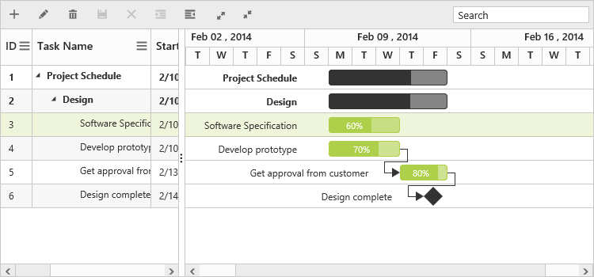

# Appearance and Styling

The look and feel of the Gantt control can be customized by applying themes and formatting the schedule header.

## Schedule Header Customization

### Schedule Header Unit Format

You can change the format of schedule headers in various timescale modes by using `DayHeaderFormat`, `HourHeaderFormat`, `WeekHeaderFormat`, `MonthHeaderFormat` and `YearHeaderFormat` properties available in `ScheduleHeaderSettings` property.
And you can change the background of weekends available in timescale by using `WeekendBackground` property, please refer the following code example.



@(Html.EJ().Gantt("GanttContainer")
       //...
 .ScheduleHeaderSettings(sh=>
		 {
			 sh.WeekHeaderFormat("MMM yyyy");
			 sh.DayHeaderFormat("d");
			 sh.HourHeaderFormat("HH");
			 sh.MonthHeaderFormat("MMM");
			 sh.YearHeaderFormat("yyyy");
			 sh.WeekendBackground("#F2F2F2");                         
		 })
)@(Html.EJ().ScriptManager())


The following screenshot shows the customized format schedule header in Gantt control.

### Schedule Header Unit Width

Schedule header units width value can be customized by using `ScheduleHeaderSettings.TimescaleUnitSize` property. The default value of this property was `100%`, we can set value for this property from `50%` to `500%`.
The following code example shows how to use this properties.



@(Html.EJ().Gantt("Gantt")
//..
.ScheduleHeaderSettings(sh=>
	  {
			sh.TimescaleUnitSize("70%");
	  })  
)@(Html.EJ().ScriptManager())

The following screenshot shows the output of above code example.

Schedule header units with `300%` width value
{:.caption}

Schedule header units with `70%` width value
{:.caption}

## Taskbar Customization

### Taskbar Background

Background color of child taskbars and parent taskbars can be customized by using `TaskbarBackground` and `ParentTaskbarBackground` properties. The following code example shows how to use this properties.


@(Html.EJ().Gantt("Gantt")
        //..
       .TaskbarBackground("#1764d7")
       .ParentTaskbarBackground("#91dc88")  
)@(Html.EJ().ScriptManager())



The following screenshot shows the customized parent and child taskbars in Gantt.

### Taskbar Height

Height of child taskbars and parent taskbars can be customized by using `TaskbarHeight` property. The following code example shows how to use the property.


@(Html.EJ().Gantt("Gantt")
        //..
       .TaskbarHeight(30)
       .RowHeight(40)  
)@(Html.EJ().ScriptManager())



The following screenshot shows the output of above code example.

N> `TaskbarHeight` value should be lower than `RowHeight` property value.

### Progressbar Customization

Background color of child task's progress bar and parent task's progress bar can be customized by using `ProgressbarBackground` and `ParentProgressbarBackground` properties. Progress bars height can be changed by using `ProgressbarHeight` property. The visibility of progress status label inside the taskbars can be changed by using `ShowProgressStatus` property.
The following code example shows how to use this properties.


@(Html.EJ().Gantt("Gantt")
        //..
       .ProgressbarBackground("#8c83b1")
       .ParentProgressbarBackground("#af2f2f")
       .ProgressbarHeight(80)
       .ShowProgressStatus(true)  
)@(Html.EJ().ScriptManager())



The following screenshot shows the customized progress bar of parent and child tasks in Gantt.

N> `ProgressbarHeight` property value should be in 0 to 100, because this value was considered as percentage value of taskbar height value.

### Conditional Formatting

The Taskbar can be customized based on the task information in Gantt control by using `QueryTaskbarInfo` event. The following code example shows how to customize the Taskbar in Gantt control.



@(Html.EJ().Gantt("Gantt")
.ClientSideEvents(eve =>
{
	eve.QueryTaskbarInfo("queryTaskbarInfo");
})
)@(Html.EJ().ScriptManager())



The following screenshot shows the customized taskbar in Gantt control.

## Dependency line customization

Width and background color of dependency line in Gantt can be customized by using `ConnectorlineWidth` and `ConnectorLineBackground` properties. The following code example shows how to use this properties.



@(Html.EJ().Gantt("Gantt")
    .ConnectorlineWidth(2)
    .ConnectorLineBackground("#0aecb8")
)@(Html.EJ().ScriptManager())



The following screenshot shows the customized dependency lines in Gantt.

## Weekend background

Background color of weekends in Gantt can be changed by using [`weekendBackground`](/api/js/ejgantt#members:weekendbackground) property. The following code example shows how to use this properties.



@(Html.EJ().Gantt("Gantt")
         //..
    .WeekendBackground("rgba(116, 195, 231, 0.26)")    
)@(Html.EJ().ScriptManager())



The following screenshot shows the customized dependency lines in Gantt.

## Themes

The following are the types of themes available in Gantt control.

1.Flat Azure                           
2.Flat Azure Dark                  
3.Flat Lime                             
4.Flat Lime Dark                   
5.Flat Saffron                        
6.Flat Saffron Dark
7.Gradient Azure
8.Gradient Azure Dark
9.Gradient Lime
10.Gradient Lime Dark
11.Gradient Saffron
12.Gradient Saffron Dark
13.Bootstrap
14.High Contrast 01
15.High Contrast 02
16.Material
17.Office-365

The theme (Gradient lime) can be applied to the Gantt control by using the style sheet from the online link as follows.



    <!DOCTYPE html>

    <html xmlns="http://www.w3.org/1999/xhtml">
        <head>
        <title>Getting Started with Gantt Control for JavaScript</title>
        <!-- style sheet for default theme(gradient lime) -->
        <link href="http://cdn.syncfusion.com/{{ site.releaseversion }}/js/web/flat-azure/ej.web.all.min.css" rel="stylesheet" /> 
        //...
    </html>



The following screenshot shows the Gantt control with `Gradient-lime` theme.

## Configuring CSS Class

In Gantt `CssClass` property was used to apply different customized styles to multiple Gantt controls available in same page. The following code example shows how to apply different background color for each Gantt control's toolbar element.


    
     @(Html.EJ().Gantt("GanttContainer")
         .CssClass("c-class1")
     )
	 @(Html.EJ().Gantt("GanttContainer1")
         .CssClass("c-class2")
     )@(Html.EJ().ScriptManager())


The below screenshot shows the output of above code example.

## Customize rows and cells

While rendering the rows in Grid part of Gantt `RowDataBound` event and `QueryCellInfo` event will be triggered for each rows and cells. Using this event we can customize the rows and cells. The below code example shows how to customize the cell and row element using this events.



@(Html.EJ().Gantt("Gantt")
.ClientSideEvents(eve =>
{
	eve.QueryCellInfo("queryCellInfo");
	eve.RowDataBound("rowDataBound");
})
)@(Html.EJ().ScriptManager())



The below screenshot shows the output of above code example.

