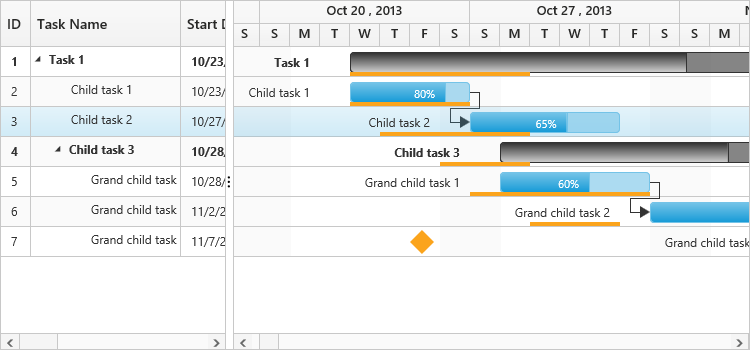

# Baseline

Baseline is used to describe the original plan of the task and it can be the same as current duration of the task or different. 
Baseline can be enabled by setting `RenderBaseline` as `true` and baseline color can be changed by `BaselineColor` property. 
To render the baseline you have to map the baseline start date and baseline end date values from data source. 
This can be done by using `BaselineStartDateMapping` and `BaselineEndDateMapping` properties. 
The following code example shows how to enable baseline in Gantt control.



@(Html.EJ().Gantt("Gantt")
        //...
        .BaselineStartDateMapping("baselineStartDate") //Mapping BaselineStartDate to Gantt
        .BaselineEndDateMapping("baselineEndDate") //Mapping BaselineEndDate to Gantt
        .RenderBaseline(true) //Show/Hide the baseline in Gantt
        .BaselineColor("#fba41c")
        )
@(Html.EJ().ScriptManager())



[Click](https://mvc.syncfusion.com/demos/web/gantt/baseline) here to view the online demo sample for baselines in Gantt.

The following screenshot shows the baseline in Gantt control.

