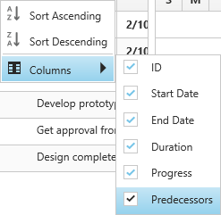
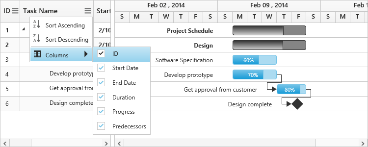

# Gantt Columns

 Gantt column displays the information from a bounded data source and it will be editable to update the task details through TreeGrid.

## Column Edit Types

Gantt supports the following types of column editors,

  * String 
  * Date
  * Datetime
  * Numeric
  * Maskedit
  * Currency
  * Dropdown

You can change the width of the column in TreeGrid to show the entire text of the column by resizing the column. The following code example shows you how to enable the column resize feature at Gantt initialize.

## Format Column

It is possible to format a column using `Load` event. The following code examples show how to format the progress column with percentage value.



@(Html.EJ().Gantt("Gantt")
    //...
    .ClientSideEvents(eve=>
    {
        eve.Load("load");
    })
    )
@(Html.EJ().ScriptManager())



N> For more numeric format strings, please refer to this [link](https://msdn.microsoft.com/library/dwhawy9k(v=vs.100).aspx).

N> For more date format strings, please refer to this [link](https://msdn.microsoft.com/library/az4se3k1(v=vs.100).aspx).

## Column Resizing

You can change the width of the column to show the entire text of the column by resizing the column. 
In Gantt column resizing can be enabled by setting `AllowColumnResize` property as `true`. 
The following code example shows you how to enable the column resize feature in Gantt.



@(Html.EJ().Gantt("Gantt")
    //...
    .AllowColumnResize(true)
    )
 @(Html.EJ().ScriptManager())
  


## Column Template

Column template is used to customize the column’s look and feel, based on requirement. 

The following code example shows you how to display a column with resource images.




@(Html.EJ().Gantt("Gantt")
    //...
    .ResourceInfoMapping("ResourceID")
    .ResourceNameMapping("ResourceName")
    .ResourceIdMapping("ResourceID")
    .ClientSideEvents(eve=>
            {
                eve.Load("load");
            })
    .Resources(ViewBag.datasource1)
    )
 @(Html.EJ().ScriptManager())



public class GanttController : Controller
    {
        // GET: /GanttColumnTemplate/

        public ActionResult GanttColumnTemplate()
        {
            var DataSource = GetTaskData();
            ViewBag.datasource = DataSource;            
            return View();
        }
		public class TaskDetails
        {
            public int TaskID { get; set; }
            public string TaskName { get; set; }
            public string StartDate { get; set; }
            public string EndDate { get; set; }
            public int Duration { get; set; }
            public string Progress { get; set; }
            public List<TaskDetails> SubTasks { get; set; }
            public List<object> ResourceID { get; set; }
            public string Predecessors { get; set; }
        }
		public List<TaskDetails> GetTaskData()
        {
            List<TaskDetails> tasks = new List<TaskDetails>();
            tasks.Add(new TaskDetails()
            {
                TaskID = 1,
                TaskName = "Project Schedule",
                StartDate = "02/06/2017",
                EndDate = "03/10/2017"
            });
            tasks[0].SubTasks = new List<TaskDetails>();
            tasks[0].SubTasks.Add(new TaskDetails()
            {
                TaskID = 2,
                TaskName = "Planning",
                StartDate = "02/06/2017",
                EndDate = "02/10/2017"
            });
            tasks[0].SubTasks[0].SubTasks = new List<TaskDetails>();
            tasks[0].SubTasks[0].SubTasks.Add(new TaskDetails()
            {
                TaskID = 3,
                TaskName = "Plan timeline",
                StartDate = "02/06/2017",
                EndDate = "02/10/2017",
                Duration = 5,
                Progress = "100",
                ResourceID = new List<object>() { 1 }
            });
			     //..
		}
	}

	

 

The following screenshot displays the customized column in Gantt control.

## Column Menu

### Show column chooser

Gantt supports enabling and disabling the visibility of the columns dynamically with the `ShowColumnChooser` property. The visibility of the custom columns can also be toggled with this property. Column chooser option is rendered as a sub menu item within the column menu in the Gantt columns. 

The column menu is enabled with the `ShowColumnChooser` property, where the default value for this property is `false`.

The column menu provides the following options:

* Sort Ascending
* Sort Descending
* Columns 

Sort Ascending and Sort Descending options can be enabled or disabled with the `AllowSorting` property. Single level sorting can be performed with these options. To perform multilevel sorting, the `AllowMultiSorting` property should be enabled. You can also disable the visibility of a particular column in the column collection manually by setting the `visible` property to `false`.



@(Html.EJ().Gantt("gantt")
    // ...
    .ShowColumnChooser(true)
    .AllowSorting(true)
    .AllowMultiSorting(true)
    )
@(Html.EJ().ScriptManager())
 


The following screenshot displays the column chooser in the Gantt control.

### Show Column Options

You can customize the column with some more options with the `ShowColumnOptions` property. Use this property to insert a new column, delete a column and to update the header text of the column.

The column options can be enabled or disabled with the `ShowColumnOptions` property, where the default value for this property is `false`.

The column options provide the following options:

* Insert column left
* Insert column right
* Delete column
* Rename column

Inserting column provides the dialog to enter the details for the column.

These fields can be customized with the `ColumnDialogFields` property. The following code sample shows you how to customize these fields.



@(Html.EJ().Gantt("gantt")
    // ...
    .ShowColumnChooser(true)
    .ShowColumnOptions(true)
    .ColumnDialogFields(new List <GanttColumnDialogFields>(){
        GanttColumnDialogFields.Field,
        GanttColumnDialogFields.HeaderText,
        GanttColumnDialogFields.EditType
    })
    )
@(Html.EJ().ScriptManager())
 


## Change visibility of the columns dynamically

Gantt columns visibility can be changed dynamically by using [`showColumn`](/api/js/ejgantt#methods:showcolumn "showColumn(headerText)") and [`hideColumn`](/api/js/ejgantt#methods:hidecolumn "hideColumn(headerText)") methods. The below code example shows how to change the visibility of the column in Gantt dynamically.


<button id="hide_column">Hide</button>
<button id="show_column">Show</button>
@(Html.EJ().Gantt("gantt")
    //..
    )
@(Html.EJ().ScriptManager())



## Change Tree/Expander Column

Tree/Expander column is a column in Gantt which has icons to expand/collapse the parent records. We can define the tree column index in Gantt by using `TreeColumnIndex` property, default value of this property was `0`. The following code example shows how to use this property.



@(Html.EJ().Gantt("gantt")
    // ...
    .TreeColumnIndex(2)
    )
@(Html.EJ().ScriptManager())
 


The below screenshot shows the output of above code example.

