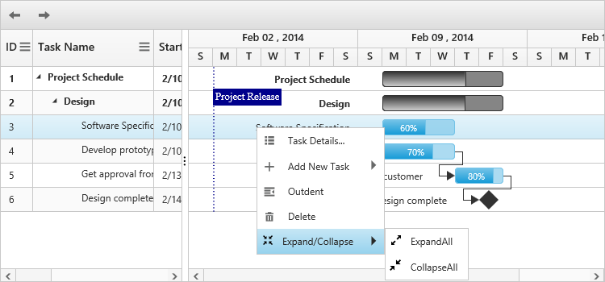

# Context Menu

## Default Menu Items

Context menu in Gantt has the following default menu items.

* Task Details
* Add New Task
* Indent
* Outdent
* Delete

Context menu in Gantt can be enabled by using `EnableContextMenu` property.
The following code example explains how to enable the context menu in Gantt control.



@(Html.EJ().Gantt("Gantt")
  //.
 .EnableContextMenu(true)
 )@(Html.EJ().ScriptManager())



The following screenshot shows the default context menu in Gantt control.

## Custom Menu Item

It is possible to add a custom context menu item in Gantt control by using `ContextMenuOpen` event. The following code example explains on how to add the custom context menu item.



@(Html.EJ().Gantt("Gantt")
  //..
 .EnableContextMenu(true)
 .ClientSideEvents(eve=>
		  {
				  eve.ContextMenuOpen("contextMenuOpen");
		  })
 )@(Html.EJ().ScriptManager()) 



The screenshot of the custom context menu items in Gantt control is as follows.

### Custom menu item with sub menu item

It is possible to create a custom menu item with a sub menu, by mapping the parentMenuId property from the contextMenuItems argument in the `ContextMenuOpen` event.

The following code example explains on how to add sub context menu for custom menu items.



@(Html.EJ().Gantt("Gantt")
  //..
 .EnableContextMenu(true)
 .ClientSideEvents(eve=>
		  {
				  eve.ContextMenuOpen("contextMenuOpen");
		  })
 )@(Html.EJ().ScriptManager()) 
 



The screenshot of the custom context menu items in Gantt control is as follows.

[Click](https://mvc.syncfusion.com/demos/web/gantt/ganttcontextmenu) here to view the online demo sample for custom context menu in Gantt.
