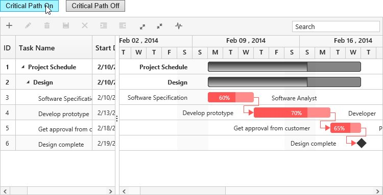
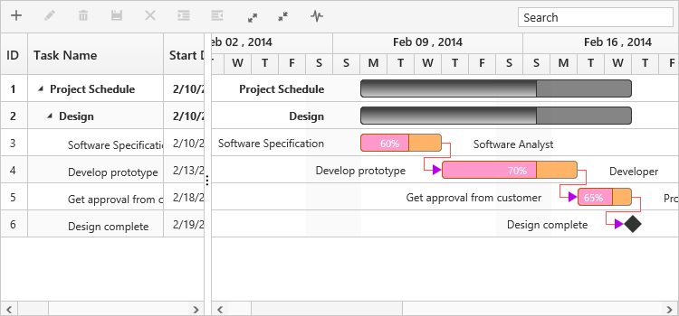

# Critical Path

The critical path in a project is indicated by a single task or a series of tasks in a project, critical path describes the calculated start date or end date of a project. If a task in a critical path is delayed, then the entire project will be delayed.

The critical path can be enabled in Gantt by using built-in toolbar button or [`showCriticalPath`](/api/js/ejgantt#methods:showcriticalpath "showCriticalPath(isShown)") method.

## Using Toolbar Icon

You can enable/disable the critical path in Gantt by using toolbar button, and this button can be enabled in the Gantt toolbar by using the following code example.


@(Html.EJ().Gantt("Gantt")
    .ToolbarSettings(toolbar =>
    {
        toolbar.ShowToolbar(true);
        toolbar.ToolbarItems(new List<GanttToolBarItems>()
            {
                //..
                GanttToolBarItems.CriticalPath
            });
    }) 
    )
@(Html.EJ().ScriptManager())



[Click](https://mvc.syncfusion.com/demos/web/gantt/criticalpath) here to view the online demo sample for critical path in Gantt.

## Using Method

You can enable the critical path by using [`showCriticalPath`](/api/js/ejgantt#methods:showcriticalpath "showCriticalPath(isShown)") method with parameter as `true`. And critical path can be disabled using the same method with parameter as `false`.


 



## Customizing critical path background

You can customize the critical task background by setting custom color codes to the critical task element's class names,

Taskbar–.e-ganttchart .e-criticaltaskbar 

Progressbar–.e-ganttchart .e-criticalprogressbar     

Connector line–.e-ganttchart .e-criticalconnectorline       

Connector line left arrow– .e-ganttchart .e-criticalconnectorlineleftarrow  

Connector line right arrow–  .e-ganttchart .e-criticalconnectorlinerightarrow 


 



