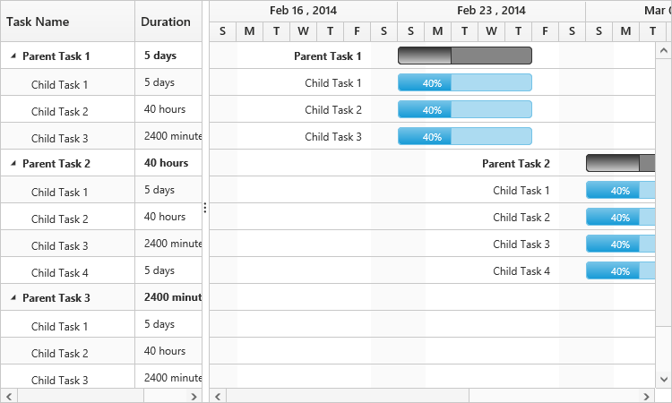

# Duration Units

In Gantt, the task's duration value can be measured by the following duration units, 

* Day
* Hour
* Minute

Each task in the project can be defined with different duration units and the duration unit of a task can be defined by the following ways,

1. Using `DurationUnitMapping` property, to map the duration unit data source field.
2. Defining the duration unit value along with the duration field in the data source.

## Mapping the Duration Unit field

The below code snippet explains the mapping of duration unit data source field to the Gantt control using the `DurationUnitMapping` property.

  

public class GanttController : Controller
    {
        //
        // GET: /DurationUnits/
        public ActionResult GanttDurationUnits()
        {
            ViewBag.DataSource = GetData();
            return View();
        }

        public static List<GanttDuratioUnitData> GetData()
        {
            List<GanttDuratioUnitData> list = new List<GanttDuratioUnitData>();
            list.Add(new GanttDuratioUnitData()
            {
                TaskID = 1,
                TaskName = "Parent Task 1",
                StartDate = "02/27/2017",
                Duration = "5day",
                Progress = 40,
                Children = (new List<GanttDuratioUnitData>()
                    {
                        new GanttDuratioUnitData()
                        {
                            TaskID = 2,
                            TaskName = "Child Task 1",
                            StartDate = "02/27/2017",                            
                            Duration = "5d",
                            Progress = 40
                        },
                        new GanttDuratioUnitData()
                        {
                            TaskID = 3,
                            TaskName = "Child Task 2",
                            StartDate = "02/27/2017",
                            Duration = "40",
                            DurationUnit="hour",
                            Progress = 40,
                        },
                        new GanttDuratioUnitData()
                        {
                            TaskID = 4,
                            TaskName = "Child Task 3",
                            StartDate = "02/27/2017",
                            Duration = "2400",
                            DurationUnit = "minute",
                            Progress = 40
                        }
                    })
					//..
            });
            return list;
        }

        public class GanttDuratioUnitData
        {
            //..
            public string Duration { get; set; }
            public string DurationUnit { get; set; }
        }
    }



 @(Html.EJ().Gantt("ganttdurtionunits")
	    //..
	   .DurationMapping("Duration")
	   .DurationUnitMapping("DurationUnit")	  
    )@(Html.EJ().ScriptManager())



N> 1. The default value of the `DurationUnit` property is GanttDurationUnit.Day.

## Defining duration unit along with duration field

Duration units for the tasks can also be defined along with the duration values, the below code snippet explains the duration unit for a task along with duration value,


 @(Html.EJ().Gantt("ganttdurtionunits")
	    //..
	   .DurationMapping("Duration")	  
    )@(Html.EJ().ScriptManager())



The below sample explains the task's duration unit in Gantt.

[Duration Unit](https://mvc.syncfusion.com/demos/web/gantt/ganttdurationunits)

The below screen shot shows different duration unit support in Gantt control.

N> 1. The edit type of the duration column in Gantt is string, to support editing the duration field along with duration units.

## Localizing the duration unit

We can localize the duration unit texts like below,



ej.Gantt.Locale["en-US"] = {
    //...
    durationUnitTexts: {
        days: "days",
        hours: "hours",
        minutes: "minutes",
        day: "day",
        hour: "hour",
        minute: "minute"
    },
    durationUnitEditText: {
        minute: ["m", "min", "minute", "minutes"],
        hour: ["h", "hr", "hour", "hours"],
        day: ["d", "dy", "day", "days"]
    }
};



N> **durationUnitTexts** property is used to display the unit of duration in columns and taskbar tooltips.
N> **durationUnitEditText** property is used to save the edited duration unit value on editing action.

[Click](https://mvc.syncfusion.com/demos/web/gantt/ganttdurationunits) here to view the online demo sample for mapping the duration units.