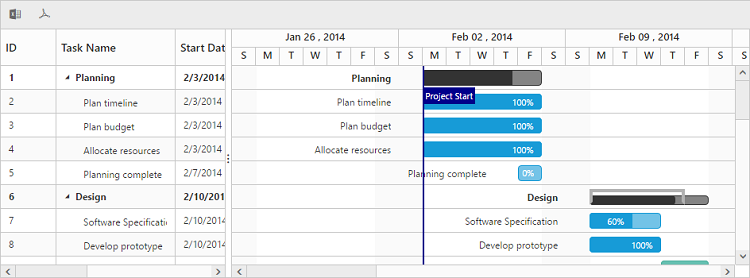

# Export

Gantt provides support to export the contents in PDF and excel. 
To export the contents, the `ExcelExport` and `PdfExport` toolbar items must be included in the `ToolbarSettings.ToolbarItems` property. 
And you need to call the [`export`](/api/js/ejgantt#methods:export "export(action, [serverEvent], [multipleExport])") method with the export mapper as parameter in the toolbar button click action. We can export multiple Gantt control in same file by using multiple exporting support, this can be enabled by setting `AllowMultipleExporting` property as `true`.
The below code snippet explains the above behavior,




@(Html.EJ().Gantt("GanttContainer")
    //...
    .ToolbarSettings(tool =>
    {
        tool.ShowToolbar(true);
        tool.ToolbarItems(new List<GanttToolBarItems>()
        {                      
            GanttToolBarItems.PdfExport, 
            GanttToolBarItems.ExcelExport
        });
    })
    .Datasource(ViewBag.datasource)
    )
@(Html.EJ().ScriptManager())





public class GanttController : Controller
    {
        public ActionResult GanttExporting()
        {
            ViewBag.datasource = this.GetDataSource();
            return View();
        }
        public void ExportToPdf(string GanttModel)
        {
            PdfExport exp = new PdfExport();
            var datasource = this.DataSource();
            GanttProperties obj = ConvertGanttObject(GanttModel);
            GanttPdfExportSettings settings = new GanttPdfExportSettings();
            settings.Theme = GanttExportTheme.FlatSaffron;
            settings.Locale = Request.Form["locale"];
            exp.Export(obj, datasource, settings, "Gantt");
        }
         public void ExportToExcel(string GanttModel)
        {
            ExcelExport exp = new ExcelExport();
            var DataSource = this.GetEditingDataSource();
            GanttProperties obj = ConvertGanttObject(GanttModel);
            exp.Export(obj, DataSource, "GanttExport.xlsx", ExcelVersion.Excel2010, new GanttExportSettings() { Theme = ExportTheme.FlatSaffron });
        }

         private GanttProperties ConvertGanttObject(string gridProperty)
        {
            JavaScriptSerializer serializer = new JavaScriptSerializer();
            IEnumerable div = (IEnumerable)serializer.Deserialize(gridProperty, typeof(IEnumerable));
            GanttProperties gridProp = new GanttProperties();
            foreach (KeyValuePair<string, object> ds in div)
            {
                var property = gridProp.GetType().GetProperty(ds.Key, BindingFlags.Instance | BindingFlags.Public | BindingFlags.IgnoreCase);
                if (property != null)
                {
                    Type type = property.PropertyType;
                    string serialize = serializer.Serialize(ds.Value);
                    object value = serializer.Deserialize(serialize, type);
                    property.SetValue(gridProp, value, null);
                }
            }
            return gridProp;
        }
    }


 

The PDF and Excel exporting services for Gantt are explained in detail [here](https://help.syncfusion.com/js/gantt/services-reference).

The below screen shot shows Gantt with excel and PDF exporting enabled.

## Server dependencies
Export Helper functions are available in the Assembly `Syncfusion.EJ.Export`, which is available in the Essential Studio & Essential ASP.NET MVC builds. The list of assemblies needed for Gantt Export as follows

* Syncfusion.EJ
* Syncfusion.EJ.Export
* Syncfusion.Linq.Base
* Syncfusion.Compression.Base
* Syncfusion.XlsIO.Base
* Syncfusion.PDF.Base

## Supported Export Types
Currently server helper function allows following two types of exporting.

* Excel
* PDF

## Export Mapper in MVC
Mappers is used to change the default routing path for exporting. By using `Mappers` you can change any action name in controller and the action can be in any controller (Need not to be in Gantt View Page Controller).

 


@(Html.EJ().Gantt("GanttContainer")
    //...
    .Mappers(map => map.ExportToPdfAction("PdfAction").ExportToExcelAction("ExcelAction"))
    .ToolbarSettings(tool =>
    {
            tool.ShowToolbar(true);
            tool.ToolbarItems(new List<GanttToolBarItems>()
            {                      
                GanttToolBarItems.PdfExport,
                GanttToolBarItems.ExcelExport

            });
    })
    //...
    )
@(Html.EJ().ScriptManager())





    public partial class GanttController : Controller
    {
        public void PdfAction(string GanttModel)
        {
            PdfExport exp = new PdfExport();
            var DataSource = this.GetEditingDataSource();
            GanttProperties obj = ConvertGanttObject(GanttModel);
            GanttPdfExportSettings settings = new GanttPdfExportSettings();
            settings.Theme = GanttExportTheme.FlatSaffron;
            settings.Locale = sRequest.Form["locale"];
            exp.Export(obj, DataSource, settings, "Gantt");
        }

       public void ExcelAction(string GanttModel)
        {
            ExcelExport exp = new ExcelExport();
            var DataSource = this.GetEditingDataSource();
            GanttProperties obj = ConvertGanttObject(GanttModel);
            exp.Export(obj, DataSource, "GanttExport.xlsx", ExcelVersion.Excel2010, new GanttExportSettings() { Theme = ExportTheme.FlatSaffron });
        }

    }


 

## Multiple exporting
Multiple export is used for export more than one Gantt object in the same file. Multiple export in Gantt can be enabled by setting `AllowMultipleExporting` property to `true`. Gantt properties of all the Gantt which are available in current page are passed as string array parameter to controller action method.

The following code example describes exporting multiple Gantt in PDF format

 


@(Html.EJ().Gantt("GanttContainer")
    //...
    .AllowMultipleExporting(true)
    .ToolbarSettings(tool =>
    {
            tool.ShowToolbar(true);
            tool.ToolbarItems(new List<GanttToolBarItems>()
            {                      
                GanttToolBarItems.PdfExport
            });
    })
    .Mappers(map => map.ExportToPdfAction("MultipleExportToPDF"))
    .Datasource(ViewBag.datasource)
    )

@(Html.EJ().Gantt("GanttContainer1")
//...
 .Datasource(ViewBag.datasource1)
)

@(Html.EJ().Gantt("GanttContainer2")
//...
.Datasource(ViewBag.datasource2)
)
@(Html.EJ().ScriptManager())





public partial class GanttController : Controller
    {

        public void MultipleExportToPDF(string[] GanttModel)
        {
            PdfExport exp = new PdfExport();
            var PlanData = this.GetPlanDataSource();
            var DesignData = this.GetDesignDataSource();
            var ImplementationData = this.GetImplementationDataSource();
            PdfDocument document = null;
            GanttPdfExportSettings settings = new GanttPdfExportSettings();
            settings.Theme = GanttExportTheme.FlatSaffron;
            settings.Locale = Request.Form["locale"];
            int controlCount = 1;
            foreach (string ganttProperty in GanttModel)
            {
                GanttProperties ganttProp = this.ConvertGanttObject(ganttProperty);
                if (controlCount == 1)
                {
                    document = exp.Export(ganttProp, (IEnumerable)PlanData, settings, false);
                }
                else if (controlCount == 2)
                {
                    document = exp.Export(ganttProp, (IEnumerable)DesignData, settings, document, false);
                }
                else
                {
                    exp.Export(ganttProp, (IEnumerable)ImplementationData, settings, "Gantt", document, true);
                }
                count++;
            }
        }
}


 

[Click](https://mvc.syncfusion.com/demos/web/gantt/ganttmultipleexporting) here to view the online demo sample for multiple exporting.

## Export Theme
The Gantt export supports the below themes, 

* flat-azure
* flat-azure-dark
* flat-lime
* flat-lime-dark
* flat-saffron
* flat-saffron-dark
* gradient-azure
* gradient-azure-dark
* gradient-lime
* gradient-lime-dark
* gradient-saffron
* gradient-saffron-dark
* bootstrap-theme

The desired theme should be passed as a parameter to the Export method and the code snippet for this as follows



public void ExportToExcel(string GanttModel)
{
    ExcelExport exp = new ExcelExport();
    var DataSource = this.GetEditingDataSource();
    GanttProperties obj = ConvertGanttObject(GanttModel);
    exp.Export(obj, DataSource, "GanttExport.xlsx", ExcelVersion.Excel2010, new GanttExportSettings() { Theme = ExportTheme.FlatSaffron });
}



## Customization

In Gantt, we can customize Grid cells, taskbars in Excel and PDF files by using exporting events. While exporting the Gantt as Excel or PDF files, events are triggered to customize the Grid cells and taskbars.

### Customize Excel cell

Excel cells can be customized by using `ServerExcelQueryCellInfo` event, in this event we can get the details about current record, Excel cell and current column information. Using this information we can customize the background color, font color and value of Excel cell, please find the event argument details below.

<table>
<tr>
<th>Name</th><th>Description</th><th>Type</th>
</tr>
<tr>
<td>Data</td><td>Returns the current row details </td><td>GanttRecordDetails</td>
</tr>
<td>Cell</td><td>Returns current Excel cell information</td><td>IRange</td>
</tr>
<tr>
<td>Column</td><td>Returns current column information</td><td>GanttColumn</td>
</tr>
</table>

The following code snippets shows how to bind `ServerExcelQueryCellInfo` event in Web API controller and how to customize Excel cell using this event.



    public partial class GanttController : Controller
    {
        public ActionResult GanttConditionalExporting()
        {
            ViewBag.dataSource = GetExportDataSource();
            return View();
        }
        GanttProperties.GanttEJExportEventHandler queryExcelCellDelegate = new GanttProperties.GanttEJExportEventHandler(GanttExcelQueryCell);

        public void ConditionalExcel(string GanttModel)
        {
            ExcelExport export = new ExcelExport();
            var DataSource = GetExportDataSource();
            GanttProperties obj = ConvertToGanttObject(GanttModel);
            `obj.ServerExcelQueryCellInfo = queryExcelCellDelegate;`
            export.Export(obj, DataSource, "GanttExport.xlsx", ExcelVersion.Excel2010, new GanttExportSettings() { Theme = ExportTheme.FlatSaffron });
        }

        public static void GanttExcelQueryCell(object model, object args)
        {
            var record = (GanttRecordDetails)((Dictionary<string, object>)args)["Data"];
            var cell = (IRange)((Dictionary<string, object>)args)["Cell"];
            var column = (GanttColumn)((Dictionary<string, object>)args)["Column"];
            var ganttModel = (GanttProperties)model;

            if (column.MappingName == ganttModel.ProgressMapping && !record.IsParentRow)
            {
                if (float.Parse(cell.Value) > 80)
                {
                    cell.CellStyle.Color = new PdfColor(165, 105, 189);
                    cell.CellStyle.Font.Color = ExcelKnownColors.White;
                }
                else if (float.Parse(cell.Value) < 20)
                {
                    cell.CellStyle.Color = new PdfColor(240, 128, 128);
                    cell.CellStyle.Font.Color = ExcelKnownColors.White;
                }
            }

        }

        private GanttProperties ConvertToGanttObject(string gridProperty)
        {
            JavaScriptSerializer serializer = new JavaScriptSerializer();
            IEnumerable div = (IEnumerable)serializer.Deserialize(gridProperty, typeof(IEnumerable));
            GanttProperties gridProp = new GanttProperties();
            foreach (KeyValuePair<string, object> ds in div)
            {
                var property = gridProp.GetType().GetProperty(ds.Key, BindingFlags.Instance | BindingFlags.Public | BindingFlags.IgnoreCase);
                if (property != null)
                {
                    Type type = property.PropertyType;
                    string serialize = serializer.Serialize(ds.Value);
                    object value = serializer.Deserialize(serialize, type);
                    property.SetValue(gridProp, value, null);
                }
            }
            return gridProp;
        }
    }



[Click](https://mvc.syncfusion.com/demos/web/gantt/ganttconditionalexporting) here to view the online demo sample with above code example.

N> Refer this [link](https://help.syncfusion.com/cr/aspnetmvc/Syncfusion.XlsIO.IExtendedFormat.html) to know more about what are the properties are available in Excel cell and it's type values.

### Customize PDF cell

PDF cells in Gantt can be customized by using `ServerPdfQueryCellInfo` event, in this event we can get the details about current record, PDF cell and current column information. Using this information we can customize the background color and font color of PDF cells, please find the event argument details below.

<table>
<tr>
<th>Name</th><th>Description</th><th>Type</th>
</tr>
<tr>
<td>Data</td><td>Returns the current row details </td><td>GanttRecord</td>
</tr>
<td>Cell</td><td>Returns current Excel cell information</td><td>PdfTreeGridCell</td>
</tr>
<tr>
<td>Column</td><td>Returns current column information</td><td>GanttColumn</td>
</tr>
</table>

The following code snippets shows how to bind `ServerPdfQueryCellInfo` event in Web API controller and how to customize PDF cell using this event.



    public partial class GanttController : Controller
    {
        public ActionResult GanttConditionalExporting()
        {
            ViewBag.datasource = GetExportDataSource();
            return View();
        }
        
        GanttProperties.GanttEJExportEventHandler queryExcelCellDelegate = new GanttProperties.GanttEJExportEventHandler(GanttExcelQueryCell);

        public void ConditionalPdf(string GanttModel)
        {
            PdfExport exp = new PdfExport();
            var DataSource = GetExportDataSource();
            GanttProperties obj = ConvertToGanttObject(GanttModel);
            `obj.ServerPdfQueryCellInfo = queryCellDelegate;`
            GanttPdfExportSettings settings = new GanttPdfExportSettings();
            settings.Theme = GanttExportTheme.FlatSaffron;
            settings.Locale = Request.Form["locale"];
            settings.IsFitToWidth = true;
            exp.Export(obj, DataSource, settings, "Gantt");
        }
        
        public static void GanttPdfQueryCell(object model, object args)
        {
            var record = (GanttRecord)((Dictionary<string, object>)args)["Data"];
            var cell = (PdfTreeGridCell)((Dictionary<string, object>)args)["Cell"];
            var column = (GanttColumn)((Dictionary<string, object>)args)["Column"];
            var ganttModel = (GanttProperties)model;

            if (column.MappingName == ganttModel.ProgressMapping && !record.IsParentRow)
            {
                if (record.Progress > 80)
                {
                    PdfBrush color = new PdfSolidBrush(new PdfColor(165, 105, 189));
                    cell.Style.BackgroundBrush = color;
                }
                else if (record.Progress < 20)
                {
                    PdfBrush color = new PdfSolidBrush(new PdfColor(240, 128, 128));
                    cell.Style.BackgroundBrush = color;
                }

            }
        }

        private GanttProperties ConvertToGanttObject(string gridProperty)
        {
            JavaScriptSerializer serializer = new JavaScriptSerializer();
            IEnumerable div = (IEnumerable)serializer.Deserialize(gridProperty, typeof(IEnumerable));
            GanttProperties gridProp = new GanttProperties();
            foreach (KeyValuePair<string, object> ds in div)
            {
                var property = gridProp.GetType().GetProperty(ds.Key, BindingFlags.Instance | BindingFlags.Public | BindingFlags.IgnoreCase);
                if (property != null)
                {
                    Type type = property.PropertyType;
                    string serialize = serializer.Serialize(ds.Value);
                    object value = serializer.Deserialize(serialize, type);
                    property.SetValue(gridProp, value, null);
                }
            }
            return gridProp;
        }
    }      


[Click](https://mvc.syncfusion.com/demos/web/gantt/ganttconditionalexporting) here to view the online demo sample with above code example.

N> Refer this [link](http://help.syncfusion.com/cr/aspnetmvc/Syncfusion.EJ.Export.PdfTreeGridCellStyle.html) to know more about what are the properties are available in PDF cell and it's type values.

### Customize PDF taskbar

PDF taskbars in Gantt can be customized by using `ServerPdfQueryTaskbarInfo` event, in this event we can get the details about current record and taskbar information. Using this information we can customize the background color of taskbar and progress bar, please find the event argument details below.

<table>
<tr>
<th>Name</th><th>Description</th><th>Type</th>
</tr>
<tr>
<td>Data</td><td>Returns the current row details </td><td>GanttRecord</td>
</tr>   
<td>Taskbar</td><td>Returns current Excel cell information</td><td>PdfGanttTaskbar</td>
</tr>
</table>

The following code snippets shows how to bind `ServerPdfQueryTaskbarInfo` event in Web API controller and how to customize PDF taskbar using this event.



    public partial class GanttController : Controller
    {
        public ActionResult GanttConditionalExporting()
        {
            ViewBag.datasource = GetExportDataSource();
            return View();
        }
        
        GanttProperties.GanttEJExportEventHandler queryTaskbarDelegate = new GanttProperties.GanttEJExportEventHandler(GanttQueryTaskbar);

        public void ConditionalPdf(string GanttModel)
        {
            PdfExport exp = new PdfExport();
            var DataSource = GetExportDataSource();
            GanttProperties obj = ConvertToGanttObject(GanttModel);
            `obj.ServerPdfQueryTaskbarInfo = queryTaskbarDelegate;`
            GanttPdfExportSettings settings = new GanttPdfExportSettings();
            settings.Theme = GanttExportTheme.FlatSaffron;
            settings.Locale = Request.Form["locale"];
            settings.IsFitToWidth = true;
            exp.Export(obj, DataSource, settings, "Gantt");
        }
        
        public static void GanttQueryTaskbar(object model, object args)
        {
            var record = (GanttRecord)((Dictionary<string, object>)args)["Data"];
            var taskbar = (PdfGanttTaskbar)((Dictionary<string, object>)args)["Taskbar"];
            if (!record.IsParentRow)
            {
                if (record.Progress > 80)
                {
                    taskbar.ProgressColor = new PdfColor(108, 52, 131);
                    taskbar.TaskBorderColor = taskbar.TaskColor = new PdfColor(165, 105, 189);
                }
                else if (record.Progress < 20)
                {
                    taskbar.ProgressColor = new PdfColor(205, 92, 92);
                    taskbar.TaskBorderColor = taskbar.TaskColor = new PdfColor(240, 128, 128);
                }
            }
        }

        private GanttProperties ConvertToGanttObject(string gridProperty)
        {
            JavaScriptSerializer serializer = new JavaScriptSerializer();
            IEnumerable div = (IEnumerable)serializer.Deserialize(gridProperty, typeof(IEnumerable));
            GanttProperties gridProp = new GanttProperties();
            foreach (KeyValuePair<string, object> ds in div)
            {
                var property = gridProp.GetType().GetProperty(ds.Key, BindingFlags.Instance | BindingFlags.Public | BindingFlags.IgnoreCase);
                if (property != null)
                {
                    Type type = property.PropertyType;
                    string serialize = serializer.Serialize(ds.Value);
                    object value = serializer.Deserialize(serialize, type);
                    property.SetValue(gridProp, value, null);
                }
            }
            return gridProp;
        }
    }      


[Click](https://mvc.syncfusion.com/demos/web/gantt/ganttconditionalexporting) here to view the online demo sample with above code example.
