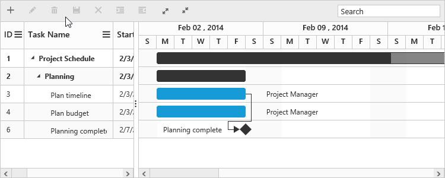

# Filtering

Filtering helps to view specific or related records from data source which meets a given filtering criteria. The `FilterSettings` property in Gantt is used to set the filtering criteria at load time.

## Filter columns at initial load
It is possible to filter one or more columns at initial load by providing the `Field`, `Value`,`Predicate` and `Operator` to the `FilteredColumns` property. The following code example explains how to filter a column on initial load.



@(Html.EJ().Gantt("GanttContainer")
.FilterSettings(filter =>
{
	filter.FilteredColumns(filtered =>
		{
			filtered.Value("plan").Field("taskName").Predicate("and").Operator(FilterOperatorType.StartsWith).Add();
		});
})
)@(Html.EJ().ScriptManager())



The output of the filtering applied for a specific column is as follows.

## Filtering a specific column by public method

It is possible to filter columns dynamically by using the [`filterColumn`](/api/js/ejgantt#methods:filtercolumn "filterColumn(fieldName, filterOperator, filterValue, [predicate], [matchCase])") public method. 
The below code snippet explains the above behavior.



<button id="filterColumn">Filter Column</button>
@(Html.EJ().Gantt("GanttContainer")
   //..
)@(Html.EJ().ScriptManager())



## Clearing the filter applied to Gantt

You can clear all the filtering condition done in the Gantt by using the [`clearFilter`](/api/js/ejgantt#methods:clearfilter "clearFilter()") public method. 
The below code snippet explains the above behavior.



<button id="clearFilter">Clear Filter</button>

@(Html.EJ().Gantt("GanttContainer")
   //..
)@(Html.EJ().ScriptManager())

