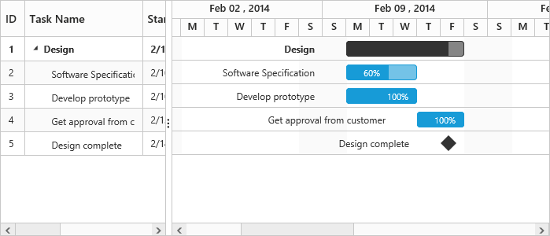
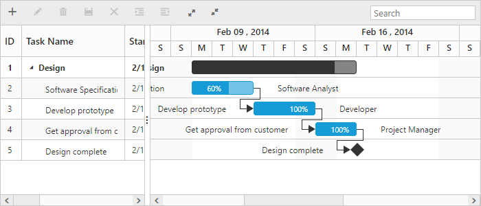

# Getting Started

This section explains briefly about how to create a Gantt chart in your application with ASP.NET MVC.

## Create your first Gantt in MVC

This section explains briefly about the control structure and how to create a Gantt chart.

### Control Structure

Gantt chart is used to edit and visualize project schedule and also to track progress of a task. The following screen shot illustrates the elements of a Gantt chart.

Elements of a Gantt chart
{:.caption}

* Toolbar – It is a collection of toolbar buttons to add, edit, delete a task. You can outdent and indent a task using outdent and indent buttons. Following screen shot illustrates the function of each toolbar button,

Toolbar of Gantt chart
{:.caption}

* Search Textbox – It is used to search tasks, which contains the search string.
* Resource Names – It displays the names of the resources assigned to that task.
* Task bar – It is a graphical representation of the duration of task.
* Task Progress – It displays the percentage of the task completed.
* Header – It represents time scale based on which a task bar is drawn.
* Tree Grid – It displays the tasks and its sub tasks in hierarchical table.
* Task Relationship – It determines when to start or finish a task.
* Interactive Editing – You can edit the duration of a task by dragging or resizing the task bar. Following screen shot illustrates this.

Editing options Gantt chart
{:.caption}

## Create your Gantt chart

In this tutorial, you will learn how to create a simple Gantt chart, add tasks and subtasks, and set relationship between tasks for design phase of software project. The following screen shot displays the output after completing this tutorial.

Simple Gantt chart
{:.caption}

1. First, create a new MVC Razor project; please refer [MVC-Getting Started](http://help.syncfusion.com/aspnetmvc/getting-started)  documentation to create new project and add necessary DLL’s and script files.

2. Create a data source in Controllers/HomeController.cs file, We can bind datasource to Gantt using Datasource property.

   ~~~ csharp

	public class DefaultData
        {
            public string StartDate { get; set; }
            public string EndDate { get; set; }
            public int TaskID { get; set; }
            public string TaskName { get; set; }
            public int Duration { get; set; }
            public int Progress { get; set; }
            public List<DefaultData> SubTasks { get; set; }
            public string Predecessors { get; set; }
            public List<int> ResourceID { get; set; }
        }

	 public class GanttDefaultData
        {
            public static List<DefaultData> GetData()
            {
                List<DefaultData> tasks = new List<DefaultData>();
                tasks.Add(new DefaultData()
                    {
                        TaskID = 1,
                        TaskName = "Design",
                        StartDate = "02/10/2014",
                        EndDate = "02/14/2014",
                        Duration = 6,

                    });
                tasks[0].SubTasks = new List<DefaultData>();
                tasks[0].SubTasks.Add(new DefaultData()
                {
                    TaskID = 2,
                    TaskName = "Software Specification",
                    StartDate = "02/10/2014",
                    EndDate = "02/12/2014",
                    Duration = 3,
                    Progress = 60,
                    ResourceID = new List<int>() { 2 }
                });
                tasks[0].SubTasks.Add(new DefaultData()
                 {
                     TaskID = 3,
                     TaskName = "Develop prototype",
                     StartDate = "02/10/2014",
                     EndDate = "02/12/2014",
                     Duration = 3,
                     Progress = 100,
                     Predecessors = "2FS",
                     ResourceID = new List<int>() { 3 }
                 });
                tasks[0].SubTasks.Add(new DefaultData()
                {
                    TaskID = 4,
                    TaskName = "Get approval from customer",
                    StartDate = "02/13/2014",
                    EndDate = "02/14/2014",
                    Duration = 2,
                    Progress = 100,
                    Predecessors = "3FS",
                    ResourceID = new List<int>() { 1 }
                });
                tasks[0].SubTasks.Add(new DefaultData()
                {
                    TaskID = 5,
                    TaskName = "Design complete",
                    StartDate = "02/14/2014",
                    EndDate = "02/14/2014",
                    Duration = 0,
                    Predecessors = "4FS"
                });
                return tasks;
            }
        }

	public ActionResult SimpleGantt()
	{
		var DataSource = GanttDefaultData.GetData();
		ViewBag.datasource = DataSource;         
		return View();
	}       
   ~~~
   
3. Add the following code example in the Index.cshtml file to create a Gantt control in the View page.	

   ~~~ cshtml

   @(Html.EJ().Gantt("GanttContainer")

             .TaskIdMapping("TaskID")//Provide name of the property which contains task id in the data source

             .TaskNameMapping("TaskName")//Provide name of the property which contains task name in the data source

             .StartDateMapping("StartDate")//Provide name of the property which contains start date of the task in the data source

             .DurationMapping("Duration")//Provide name of the property which contains duration of the task in the data source

             .ProgressMapping("Progress")//Provide name of the property which contains progress of the task in the data source

             .ScheduleStartDate("02/01/2014")//Provide schedule header start date

             .ScheduleEndDate("03/14/2014")//Provide schedule header end date

             .ChildMapping("SubTasks")//Provide name of the property which contains subtask of the task in the data source

             .TreeColumnIndex(1)
             
             .SizeSettings(ss=>ss.Width("700").Height("300"))
             .Datasource(ViewBag.datasource) //Provides data source for Gantt
             )  
      
	  @(Html.EJ().ScriptManager())   

   ~~~
   
   
The following screen shot displays the Gantt.

Gantt chart
{:.caption}

### Enable Toolbar

Gantt control contains the toolbar options to edit, search, expand and collapse all records, indent, outdent, delete, and add a task. You can enable toolbar using Toolbar option.



@(Html.EJ().Gantt("GanttContainer")
     .ToolbarSettings(ts=>
     ts.ShowToolbar(true)
      .ToolbarItems(new List<GanttToolBarItems>()
        {
        GanttToolBarItems.Add,
        GanttToolBarItems.Edit,
        GanttToolBarItems.Delete,
        GanttToolBarItems.Update,
        GanttToolBarItems.Cancel,
        GanttToolBarItems.Indent,
        GanttToolBarItems.Outdent,
        GanttToolBarItems.ExpandAll,
        GanttToolBarItems.CollapseAll,
        GanttToolBarItems.Search   
        })
    )
)                   


The following screen shot displays a Tool bar in Gantt.

Toolbar in Gantt chart
{:.caption}

N> add, edit, delete options are enabled when enabling the allowEditing, allowAdding, allowDelete in the edit Options.

## Enable sorting 

Gantt control has the sorting functionality for arranging the tasks in ascending or descending based on the particular column.

### Multicolumn sorting:

Enable the multicolumn sorting in Gantt by setting AllowMultiSorting to `true`. You can sort multiple columns in Gantt by selecting the desired column header while holding the CTRL key.



  @(Html.EJ().Gantt("GanttContainer")

   //...  

   //...           

    .AllowSorting(true)

    .AllowMultiSorting(true)

 )



#### Enable Editing

You can enable editing using EditOption and AllowGanttChartEditing options.

#### Cell Editing:

Modify the task details through the grid cell editing by setting the EditMode as CellEditing.

#### Normal Editing:

Modify the task details through the edit dialog by setting the EditMode as Normal.

#### Taskbar Editing:

Modify the task details through user interaction like resizing and dragging the taskbar.

#### Predecessor Editing:

Modify the predecessor details of a task by using mouse interactions by setting AllowGanttChartEditing as true and setting the value for PredecessorMapping property.



@(Html.EJ().Gantt("GanttContainer")                           
         
    //...  

   //...                   
   .AllowGanttChartEditing(true)

   .PredecessorMapping("Predecessor") // Predecessor editing

   .EditSettings(edit =>
    {
         edit.AllowEditing(true);
         edit.AllowAdding(true);
         edit.AllowDeleting(true);
         edit.EditMode("cellEditing");
         edit.AllowIndent(true);
    })
)



The following screen shot displays the Gantt control with Enable Editing options.

Gantt control with Enable Editing options
{:.caption}

N> Both cellEditing and normal editing operations are performed through double click action.

## Enable Context Menu

You can enable the context menu in Gantt by setting the EnableContextMenu to `true`.


               
 @(Html.EJ().Gantt("GanttContainer")              
    //...
    .EnableContextMenu(true)
 )



The following screen shot displays Gantt chart with Enable Context menu option.

Gantt chart with Enable Context menu option
{:.caption}

### Provide tasks relationship

In Gantt control, you have the predecessor support to show the relationship between two different tasks.

#### Types:

* Start to Start (SS)

You cannot start a task until the other task is also started.

* Start to Finish (SF)

You cannot finish a task until the other task is started.

* Finish to Start (FS)

You cannot start a task until the other task is completed.

* Finish to Finish (FF)

You cannot finish a task until the other task is completed.

You can show the relationship in tasks by using the PredecessorMapping as follows.



     @(Html.EJ().Gantt("GanttContainer")

     //...

     .PredecessorMapping("Predecessor")

     )

 



The following screen shot displays the relationship between tasks.

Gantt chart with relationships between tasks
{:.caption}

## Provide Resources

In ASP.NET MVCGantt, you can display and assign the resource for each task. Create a collection of JSON object, which contains id and name of the resource and assign it to ResourceCollection option. Then, specify the field name for id and name of the resource in the resource collection to ResourceIdMapping and ResourceNameMapping properties. The name of the field which contains the actual resources assigned for a particular task in the DataSource is specified using ResourceInfoMapping.



 public class Resources
        {
            public int ResourceID { get; set; }
            public string ResourceName { get; set; }
        }

        public class ResourceList
        {

            public static List<Resources> GetData()
            {

                List<Resources> resourceDetails = new List<Resources>();
                resourceDetails.Add(new Resources() { ResourceID = 1, ResourceName = "Project Manager" });
                resourceDetails.Add(new Resources() { ResourceID = 2, ResourceName = "Software Analyst" });
                resourceDetails.Add(new Resources() { ResourceID = 3, ResourceName = "Developer" });
                resourceDetails.Add(new Resources() { ResourceID = 4, ResourceName = "Testing Engineer" });
                return resourceDetails;
            }
        } 

public ActionResult SimpleGantt()

  {

     var DataSource = GanttDefaultData.GetData();

     ViewBag.datasource = DataSource;

     var Resources = ResourceList.GetData();

     ViewBag.resources = Resources;

     return View();

  }   



Add the following code example in the index.cshtml file, to create the Gantt control with resource in the View page.



  @(Html.EJ().Gantt("GanttContainer")

       //...          
        .ResourceInfoMapping("ResourceID")//Field name which contains resource details for the task 
        .ResourceNameMapping("ResourceName")//resource Name mapping
        .ResourceIdMapping("ResourceID")//resource Id Mapping
        //...
        .Resources(ViewBag.resources)//resource collection dataSource
        .Datasource(ViewBag.datasource) //Provides data source for Gantt
      )



The following screen shot displays resource allocation for tasks in Gantt.

Resource allocation for tasks in Gantt

This section explains briefly about the control structure and how to create a Gantt chart.

