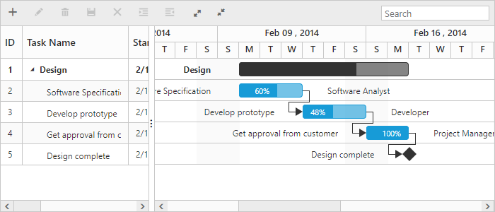
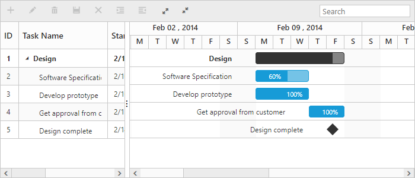
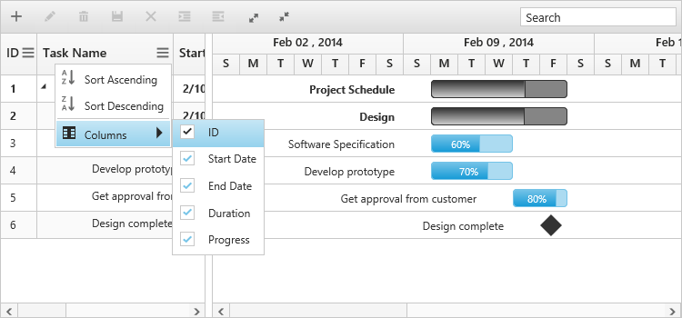

# Getting Started

This section explains briefly about how to create a Gantt chart in your application with ASP.NET MVC.

## Create your first Gantt in MVC

This section explains briefly about the control structure and how to create a Gantt chart.

### Control Structure

Gantt chart is used to edit and visualize project schedule and also to track progress of a task. The following screen shot illustrates the elements of a Gantt chart.

Elements of a Gantt chart
{:.caption}

* Toolbar – It is a collection of toolbar buttons to add, edit, delete a task. You can outdent and indent a task using outdent and indent buttons. Following screen shot illustrates the function of each toolbar button,

Toolbar of Gantt chart
{:.caption}

* Search Textbox – It is used to search tasks, which contains the search string.
* Resource Names – It displays the names of the resources assigned to that task.
* Task bar – It is a graphical representation of the duration of task.
* Task Progress – It displays the percentage of the task completed.
* Header – It represents time scale based on which a task bar is drawn.
* Tree Grid – It displays the tasks and its sub tasks in hierarchical table.
* Task Relationship – It determines when to start or finish a task.
* Interactive Editing – You can edit the duration of a task by dragging or resizing the task bar. Following screen shot illustrates this.

Editing options Gantt chart
{:.caption}

### Create your Gantt chart

In this tutorial, you will learn how to create a simple Gantt chart, add tasks and subtasks, and set relationship between tasks for design phase of software project. The following screen shot displays the output after completing this tutorial.

Simple Gantt chart
{:.caption}

1. First, create a new MVC Razor project; please refer [MVC-Getting Started](http://help.syncfusion.com/aspnetmvc/getting-started)  documentation to create new project and add necessary DLL’s and script files.

2. Create a data source in Controllers/HomeController.cs file, We can bind datasource to Gantt using Datasource property.

3. Add the following code example in the Index.cshtml file to create a Gantt control in the View page.	

 
  


	public class DefaultData
        {
            public string StartDate { get; set; }
            public string EndDate { get; set; }
            public int TaskID { get; set; }
            public string TaskName { get; set; }
            public int Duration { get; set; }
            public int Progress { get; set; }
            public List<DefaultData> SubTasks { get; set; }
            public string Predecessors { get; set; }
            public List<int> ResourceID { get; set; }
        }

	 public class GanttDefaultData
        {
            public static List<DefaultData> GetData()
            {
                List<DefaultData> tasks = new List<DefaultData>();
                tasks.Add(new DefaultData()
                    {
                        TaskID = 1,
                        TaskName = "Design",
                        StartDate = "02/10/2014",
                        EndDate = "02/14/2014",
                        Duration = 6,

                    });
                tasks[0].SubTasks = new List<DefaultData>();
                tasks[0].SubTasks.Add(new DefaultData()
                {
                    TaskID = 2,
                    TaskName = "Software Specification",
                    StartDate = "02/10/2014",
                    EndDate = "02/12/2014",
                    Duration = 3,
                    Progress = 60,
                    ResourceID = new List<int>() { 2 }
                });
                tasks[0].SubTasks.Add(new DefaultData()
                 {
                     TaskID = 3,
                     TaskName = "Develop prototype",
                     StartDate = "02/10/2014",
                     EndDate = "02/12/2014",
                     Duration = 3,
                     Progress = 100,
                     Predecessors = "2FS",
                     ResourceID = new List<int>() { 3 }
                 });
                tasks[0].SubTasks.Add(new DefaultData()
                {
                    TaskID = 4,
                    TaskName = "Get approval from customer",
                    StartDate = "02/13/2014",
                    EndDate = "02/14/2014",
                    Duration = 2,
                    Progress = 100,
                    Predecessors = "3FS",
                    ResourceID = new List<int>() { 1 }
                });
                tasks[0].SubTasks.Add(new DefaultData()
                {
                    TaskID = 5,
                    TaskName = "Design complete",
                    StartDate = "02/14/2014",
                    EndDate = "02/14/2014",
                    Duration = 0,
                    Predecessors = "4FS"
                });
                return tasks;
            }
        }

	public ActionResult SimpleGantt()
	{
		var DataSource = GanttDefaultData.GetData();
		ViewBag.datasource = DataSource;         
		return View();
	}       
  


 @(Html.EJ().Gantt("GanttContainer")
        .TaskIdMapping("TaskID")//Provide name of the property which contains task id in the data source
        .TaskNameMapping("TaskName")//Provide name of the property which contains task name
        .StartDateMapping("StartDate")//Provide name of the property which contains start date of the task
        .DurationMapping("Duration")//Provide name of the property which contains duration of the task
        .ProgressMapping("Progress")//Provide name of the property which contains progress of the task
		.ScheduleStartDate("02/01/2014")//Provide schedule header start date
        .ScheduleEndDate("03/14/2014")//Provide schedule header end date
        .ChildMapping("SubTasks")//Provide name of the property which contains subtask of the task
        .TreeColumnIndex(1)
        .SizeSettings(ss=>ss.Width("700").Height("300"))
        .Datasource(ViewBag.datasource) //Provides data source for Gantt
        )@(Html.EJ().ScriptManager())


  
   

The following screen shot displays the Gantt.

Gantt chart
{:.caption}

## Enable Toolbar

Gantt control contains the toolbar options to Add, Edit, Delete, Search, Indent, Outdent,  Expand and Collapse all records. You can enable toolbar using `ToolbarSettings`.



@(Html.EJ().Gantt("GanttContainer")
  .ToolbarSettings(ts =>
	 {
	 ts.ShowToolbar(true);
	 ts.ToolbarItems(new List<GanttToolBarItems>()
		{
              GanttToolBarItems.Add,
              GanttToolBarItems.Edit,
              GanttToolBarItems.Delete,
              GanttToolBarItems.Update,
              GanttToolBarItems.Cancel,
              GanttToolBarItems.Indent,
              GanttToolBarItems.Outdent,
              GanttToolBarItems.ExpandAll,
              GanttToolBarItems.CollapseAll,
              GanttToolBarItems.Search			                        
		});
	 })
)@(Html.EJ().ScriptManager())                   


The following screen shot displays a Tool bar in Gantt.

Toolbar in Gantt chart
{:.caption}

N> Add, Edit, Delete options are enabled when enabling the AllowEditing, AllowAdding, AllowDeleting in the `EditSettings`.

## Enable sorting 

Gantt control has the sorting functionality for arranging the tasks in ascending or descending based on the particular column.

### Multicolumn sorting

Enable the multicolumn sorting in Gantt by setting `AllowMultiSorting` to `true`. You can sort multiple columns in Gantt by selecting the desired column header while holding the `CTRL` key.



  @(Html.EJ().Gantt("GanttContainer")  
   //...         
  .AllowSorting(true)
  .AllowMultiSorting(true)
 )@(Html.EJ().ScriptManager())



## Enable Editing

You can enable editing using `EditSettings` and `AllowGanttChartEditing`.

### Cell Editing

Modify the task details through the grid cell editing by setting the `EditMode` as `CellEditing`.

### Normal Editing

Modify the task details through the edit dialog by setting the `EditMode` as `Normal`.

### Taskbar Editing

Modify the task details through user interaction like resizing and dragging the taskbar.

### Predecessor Editing

Modify the predecessor details of a task by using mouse interactions by setting `AllowGanttChartEditing` as `true` and setting the value for `PredecessorMapping` property.



@(Html.EJ().Gantt("GanttContainer")
   //...                   
   .AllowGanttChartEditing(true)
   .PredecessorMapping("Predecessor") // Predecessor editing
   .EditSettings(edit =>
    {
         edit.AllowEditing(true);
         edit.AllowAdding(true);
         edit.AllowDeleting(true);
         edit.EditMode("cellEditing");
         edit.AllowIndent(true);
    })
)@(Html.EJ().ScriptManager())



The following screen shot displays the Gantt control with dialog editing option.

## Enable Context Menu

You can enable the context menu in Gantt by setting the `EnableContextMenu` as `true`.


               
 @(Html.EJ().Gantt("GanttContainer")              
    //...
    .EnableContextMenu(true)
 )@(Html.EJ().ScriptManager())



The following screen shot displays Gantt chart with Enable Context menu option.

Gantt chart with Enable Context menu option
{:.caption}

## Enable Column Menu

You can enable the column menu in Gantt, by setting the `ShowColumnChooser` as `true`.


               
 @(Html.EJ().Gantt("GanttContainer")              
    //...
    .ShowColumnChooser(true)
 )@(Html.EJ().ScriptManager())



The following screen shot displays Gantt control in which column chooser option is enabled

## Provide tasks relationship

In Gantt, you have the predecessor support to show the relationship between two different tasks.

* **Start to Start (SS)** - You cannot start a task until the other task starts.
* **Start to Finish (SF)** - You cannot finish a task until the other task finishes.
* **Finish to Start (FS)** - You cannot start a task until the other task completes.
* **Finish to Finish (FF)** - You cannot finish a task until the other task completes.

You can show the relationship in tasks, by using the `PredecessorsMapping` property as shown in the following code example.



     @(Html.EJ().Gantt("GanttContainer")
     //...
     .PredecessorMapping("Predecessor")
     )@(Html.EJ().ScriptManager())


The following screen shot displays the relationship between tasks.

Gantt chart with relationships between tasks
{:.caption}

## Provide Resources

In Gantt control, you can display and assign the resource for each task. Create a collection of JSON object, which contains id and name of the resource and assign it to the resources property. Then, specify the field name for id and name of the resource in the resource collection to `ResourceIdMapping` and `ResourceNameMapping` options. The name of the field, which contains the actual resources assigned for a particular task in the `DataSource` is specified using the `ResourceInfoMapping`.



 public class Resources
        {
            public int ResourceID { get; set; }
            public string ResourceName { get; set; }
        }

        public class ResourceList
        {

            public static List<Resources> GetData()
            {

                List<Resources> resourceDetails = new List<Resources>();
                resourceDetails.Add(new Resources() { ResourceID = 1, ResourceName = "Project Manager" });
                resourceDetails.Add(new Resources() { ResourceID = 2, ResourceName = "Software Analyst" });
                resourceDetails.Add(new Resources() { ResourceID = 3, ResourceName = "Developer" });
                resourceDetails.Add(new Resources() { ResourceID = 4, ResourceName = "Testing Engineer" });
                return resourceDetails;
            }
        } 

public ActionResult SimpleGantt()

  {

     var DataSource = GanttDefaultData.GetData();

     ViewBag.datasource = DataSource;

     var Resources = ResourceList.GetData();

     ViewBag.resources = Resources;

     return View();

  }   


Add the following code example in the index.cshtml file, to create the Gantt control with resource in the View page.



  @(Html.EJ().Gantt("GanttContainer")
       //...          
        .ResourceInfoMapping("ResourceID")//Field name which contains resource details for the task 
        .ResourceNameMapping("ResourceName")//resource Name mapping
        .ResourceIdMapping("ResourceID")//resource Id Mapping
        //...
        .Resources(ViewBag.resources)//resource collection dataSource
        .Datasource(ViewBag.datasource) //Provides data source for Gantt
      )@(Html.EJ().ScriptManager())


The following screen shot displays resource allocation for tasks in Gantt.

This section explains briefly about the control structure and how to create a Gantt chart.

## Highlight Weekend

In Gantt, you can on or off weekends high lighting by setting the `HighlightWeekEnds` as `true` or `false`.



     @(Html.EJ().Gantt("GanttContainer")
     //...
     .HighlightWeekends(false)
     )@(Html.EJ().ScriptManager())



The following screen shot displays Gantt chart in which highlight weekends is disabled:

## Define dimension of Gantt

By default Gantt control was rendered with `100%` width and `450px` height, we can define the dimension of Gantt control by using `SizeSettings`property. Gantt control width and height can be defined by either `Height` and `Width` properties or by defining inline style in Gantt container element. The below code example shows how to define width and height for Gantt control.



<!--

-->



N> Gantt control will automatically update the width and height value based on container element on window resize action, this can be enabled by setting `IsResponsive` property as `true` for this `Height` and `Width` value will be defined in percentage.

## Add notes in tasks

In Gantt, we can add additional information about the tasks, this information can be defined in data source and this field was mapped to Gantt control by using `NotesMapping` property. Notes values can be defined as string or in HTML string format. This notes content was displayed in `Notes` column and notes value can be updated by using cell editing and dialog editing. The following code example shows how to use the `NotesMapping` property.



     @(Html.EJ().Gantt("GanttContainer")
     //...
     .NotesMapping("notesContent")
     )@(Html.EJ().ScriptManager())




 public class GanttController : Controller
    {
        //
        // GET: /Default/
        public ActionResult Default()
        {
            var DataSource = GanttDefaultData.GetData();
            ViewBag.datasource = DataSource;
            return View();
        }
        public class GanttDefaultData
        {
            public static List<DefaultData> GetData()
            {
                List<DefaultData> list = new List<DefaultData>();
                list.Add(new DefaultData()
                {
                    Id = 1,
                    Name = "Parent Task 1",
					notesContent="we can show additional information here",
                    //..                    
                });                  
                return list;
            }
        }
        public class DefaultData
        {
            public int Id { get; set; }
            public string Name { get; set; }
            public string notesContent { get; set; }

        }
    }



The below screenshot shows the output of above code example.

Notes column in Gantt
{:.caption}

Editing notes in edit dialog
{:.caption}

N> Notes value was displayed as plain text in Grid part and also when we edit the notes value by cell editing, value was stored as string value. We can use edit dialog to update the notes value of task in HTML string format.

## Milestones in Gantt

Milestones are used to denote the important event/stages in project management. Milestones start date and end date value will be same and duration value will be `0`. Using `MilestoneMapping` property we can map the datasource with Milestone mapping field and render Gantt tasks as milestone based on its mapping value. The below code example shows how to use this property.




     @(Html.EJ().Gantt("GanttContainer")
     //...
     .MilestoneMapping("isMileStone")
     )@(Html.EJ().ScriptManager())




 public class GanttController : Controller
    {
        //
        // GET: /Default/
        public ActionResult Default()
        {
            var DataSource = GanttDefaultData.GetData();
            ViewBag.datasource = DataSource;
            return View();
        }
        public class GanttDefaultData
        {
            public static List<DefaultData> GetData()
            {
                List<DefaultData> list = new List<DefaultData>();
                list.Add(new DefaultData()
                {
                    Id = 1,
                    Name = "Parent Task 1",
					isMileStone= false,
                    //..                    
                });                  
                return list;
            }
        }       
    }



The below screenshot shows the output of above code example.
