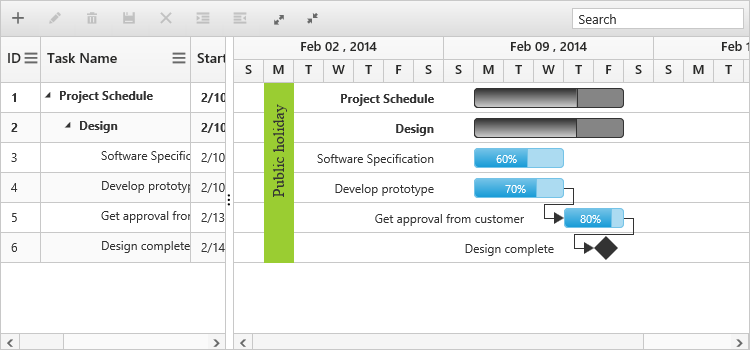

# Holidays

The Holidays in Gantt control is used to highlight the non-working days in Gantt control and it can be initialized by using `Holidays` property. 

Each holiday can be defined with `Day`, `Label`, `Background` properties. The following code example shows how to initialize the Holidays in Gantt control.



@(Html.EJ().Gantt("GanttContainer")
    //...
   .Holidays(new List<Syncfusion.JavaScript.Models.Holiday>
      {
             new Syncfusion.JavaScript.Models.Holiday()
             {
                    Day="2/03/2014", 
                    Background="YellowGreen",
                    Label="Public holiday"    
             },                       
       })
	.Datasource(ViewBag.datasource)
)
@(Html.EJ().ScriptManager())



The following screenshot shows the output of Holidays in Gantt control.

We can also load holidays from SQL database into Gantt. [Click](https://www.syncfusion.com/kb/8566/how-to-load-holidays-from-database-into-gantt) here to view our knowledge base for this.
