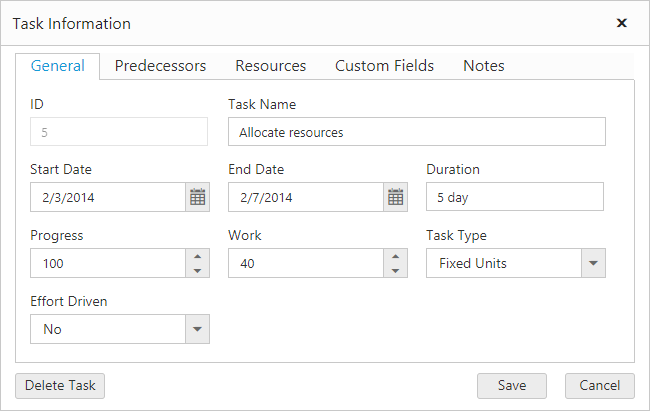
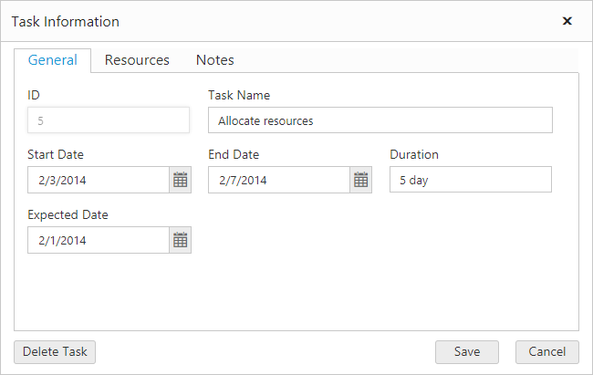

# Display custom fields in general tab
Gantt add and edit dialogs groups the data sources fields in five different tabs such as `General`, `Predecessors`, `Resources`, `Custom Fields` and `Notes`.

The custom fields are usually displayed in `Custom Fields` tab, but it is also possible to display the custom fields in general tab using `DisplayInGeneralTab` property in Gantt. By default, its value is false.

The following code example explains how to display custom fields in general tab



@(Html.EJ().Gantt("gantt")

    .AddDialogFields(ads =>
    {
        ads.Field("TaskID").Add();
        ads.Field("TaskName").Add();
        ads.Field("EndDate").Add();
        ads.Field("Duration").Add();
        ads.Field("Notes").Add();
        ads.Field("ExpectedDate").DisplayInGeneralTab(true).Add();
    })
    .EditDialogFields(eds =>
    {
        eds.Field("TaskID").Add();
        eds.Field("TaskName").Add();
        eds.Field("EndDate").Add();
        eds.Field("Duration").Add();
        eds.Field("Notes").Add();
        eds.Field("ExpectedDate").DisplayInGeneralTab(true).Add();
    })

)



The above code example makes Fridays and Saturdays as non-working days in a week.

The above screen shot shows custom column field “Expected Date” displayed in General tab.
{:.caption}
