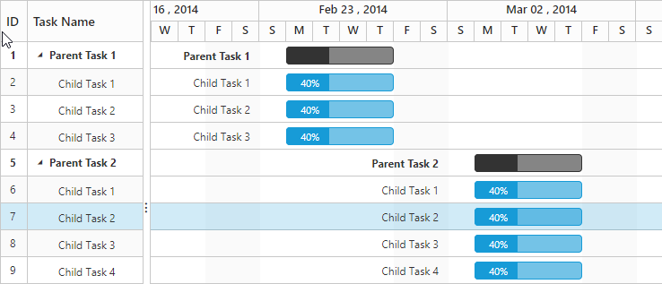

## Change Week end/Non-working day
Non-working days/weekend are used to represent the non-productive days in a project. It is possible to change the non-working days in a week using the `WorkWeek` property in Gantt.

By default, Saturdays and Sundays are considered as non-working days/weekend in a project. 

The following code example explains how to change weekend/non-workingdays



@(Html.EJ().Gantt("gantt")

    .WorkWeek(new List<string>() { "Sunday","Monday","Tuesday","Wednesday","Thursday" })

)



The above screen shot will be displayed after changing the non-working days in Gantt.
{:.caption}

