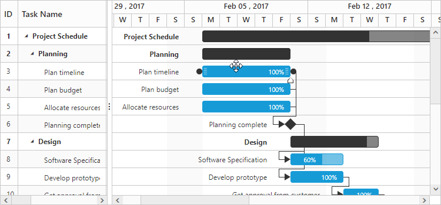

# Rendering the Gantt using Gantt properties in server-side

The GanttProperties helps to render the Gantt control in server-side.

The following code example which will explain to render the Gantt control in server-side.





  @(Html.EJ().Gantt("GanttControl", ViewBag.GanttModel))
  





   namespace Gantt_MVC.Controllers
{
    public class GanttController : Controller
    {
        public ActionResult Gantt()
        {
            GanttProperties gantt = new GanttProperties();
            gantt.TaskIdMapping = "TaskID";
            gantt.TaskNameMapping = "TaskName";
            gantt.StartDateMapping = "StartDate";
            gantt.DurationMapping = "Duration";
            gantt.ProgressMapping = "Progress";
            gantt.ScheduleStartDate = "02/01/2017";
            gantt.ScheduleEndDate = "03/14/2017";
            gantt.ChildMapping = "SubTasks";
            gantt.PredecessorMapping = "Predecessors";
            gantt.TreeColumnIndex = 1;
            gantt.SizeSettings.Width = "750px";
            gantt.SizeSettings.Height = "350px";
            gantt.DataSource = GetTaskData();
            
            ViewBag.GanttModel = gantt;
            return View();
        }
    }
}
   


 

The below screenshot show the output of above code example.

