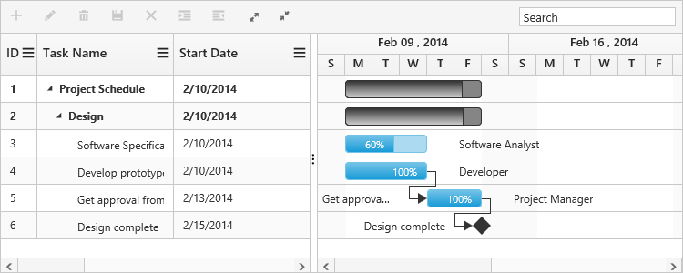
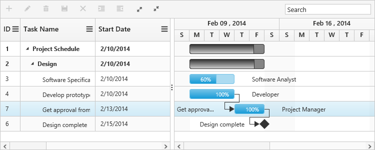

# Update task id value

Id value of Gantt tasks can be changed dynamically by using [`updateTaskId`](/api/js/ejgantt#methods:updatetaskid "updateTaskId(currentId, newId)") method. The below code example shows how to invoke this method on button click action.


@(Html.EJ().Gantt("gantt")
    //..      
	)
@(Html.EJ().ScriptManager())

$("#update_task_id").click(function () {
	var ganttObj = $("#gantt").ejGantt("instance");
	ganttObj.updateTaskId(5, 7);
});



The below screen shows the output of above code example.

Before id update
{:.caption}

After id update
{:.caption}