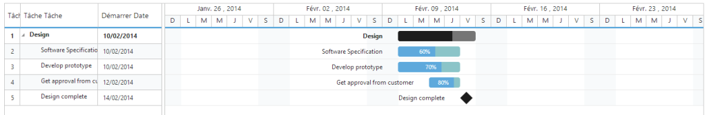

# Localization

Localization is the process of customizing the User Interface (UI) based on a culture, specific to a particular country or region, in order to display regional data. The culture is represented by a unique string like “en-US” for US English and “fr-FR” for French.

Localization is the key feature that provides solutions to global customers with the help of localized control. 

The following UIs are provided to localize based on culture. The default English Localization UIs are listed as follows:

_Localization_

<table>
<tr>
<th colspan = "2">
Localized string value for en-US culture</th></tr>
<tr>
<td>
Empty Record</td><td>
emptyRecord: "No records to display"</td></tr>
<tr>
<td>
Column Header Texts: 
taskId 
taskName 
startDate 
endDate 
resourceInfo 
duration 
status 
predecessor 
baselineStartDate 
baselineEndDate</td><td>
columnHeaderTexts: {     
taskId: "ID", 
taskName: "Task Name",  
startDate: "Start Date", 
endDate: "End Date", 
resourceInfo: "Resources", 
duration: "Duration", 
status: "Progress", 
predecessor: "Predecessor", 
 baselineStartDate: "Baseline Start Date", 
 baselineEndDate: "Baseline End Date" 
 }</td></tr>
<tr>
<td>
Edit Dialog Texts: 
addFormTitle 
editFormTitle 
saveButton 
cancelButton</td><td>
editDialogTexts: { 
addFormTitle: "New Task", 
editFormTitle: "Edit Task", 
saveButton: "Save", 
cancelButton: "Cancel" },</td></tr>
<tr>
<td>
Date Format</td><td>
calendars: { 
     standard: {    
		days: {   
			// full name of days   
			names: ["Sunday", "Monday", "Tuesday", "Wednesday", "Thursday", "Friday", "Saturday"], 

			// abbreviated names of days  
            namesAbbr: ["Sun", "Mon", "Tue", "Wed", "Thu", "Fri", "Sat"],          },  
			months: {              
				// full name of months   
				names: ["January", "February", "March", "April", "May", "June", "July", "August", "September", "October", "November", "December"], 

				// abbreviated name of months  
				namesAbbr: ["Jan", "Feb", "Mar", "Apr", "May", "Jun", "Jul", "Aug", "Sep", "Oct", "Nov", "Dec"]        
				},  
				// set of predefined date and time patterns used by the culture. 
				patterns: {   
					d: "M/d/yyyy",  
					D: "dddd, MMMM dd, yyyy", 
					F: "dddd, MMMM dd, yyyy h:mm:ss tt",  
					g: "M/d/yyyy h:mm tt",   
					G: "M/d/yyyy h:mm:ss tt",  
					m: "MMMM dd",   
					M: "MMMM dd",   
					s: "yyyy'-'MM'-'ddTHH':'mm':'ss", 
					t: "h:mm tt",          
					T: "h:mm:ss tt",      
					u: "yyyy'-'MM'-'dd HH':'mm':'ss'Z'",   
					y: "MMMM, yyyy",       
					Y: "MMMM, yyyy"     
					} 
				}
			}</td></tr>
</table>

To localize the Column Header Texts based on French culture, refer to the following code example.



@(Html.EJ().Gantt("GanttContainer")

//...

.Locale("fr-FR")

.Datasource(ViewBag.datasource)

)

@section ScriptSection{

     

 }



The following screenshot shows Gantt with French culture.

Localization
{:.caption}
