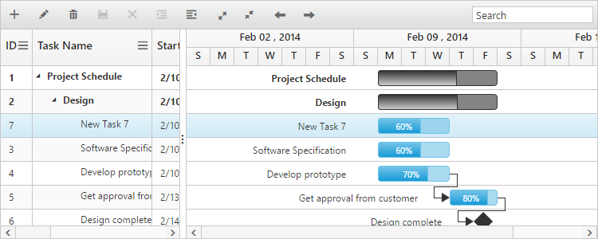
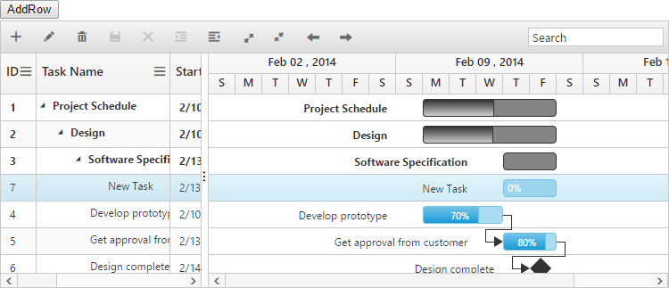
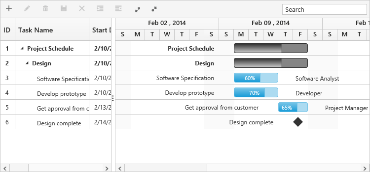

# Rows 

Row represents a task information from the data source, and it is possible to perform the following actions in Gantt rows.

## Adding a row

A row can be added in the following ways in Gantt.

* Toolbar 
* Context menu 
* Adding a row programmatically 

### Toolbar adding

Row can be added in Gantt from toolbar while the `EditSettings.AllowAdding` property is set to true. On clicking the toolbar add icon, you need to provide the task information in the add dialog. If a row is previously selected, then the new row will be added below and in the same hierarchical level as that of the selected row. If there are no rows selected in Gantt, by default the new row will be added as the top most row in Gantt.



@(Html.EJ().Gantt("Gantt")
.EditSettings(edit=>
	 {
		 edit.AllowAdding(true);
	 })
)@(Html.EJ().ScriptManager())



### Context menu adding

New rows can either be added above or below the selected rows by using the default context menu, while the `EnableContextMenu` is set to `true`. The new row added will have the same task information similar to the selected row.


@(Html.EJ().Gantt("Gantt")
.EnableContextMenu(true)
.EditSettings(edit=>
	 {
		 edit.AllowAdding(true);
	 })
)@(Html.EJ().ScriptManager())


### Adding a row programmatically

You can add rows in the below positions dynamically using [`addRecord`](/api/js/ejgantt#methods:addrecord "addRecord(data, rowPosition)") public method and we can define the default new record add position by using [`rowPosition`](/api/js/ejgantt#members:editsettings-rowposition "editSettings.rowPosition") property.

* Top of all the rows
* Bottom to all the existing rows
* Above the selected row
* Below the selected row
* As child to the selected row

The below code example explains on adding a row using a custom button.


<button id="addRow" style="top:27px;left:50px;position:absolute">AddRow</button>

@(Html.EJ().Gantt("GanttContainer")
     //...
)@(Html.EJ().ScriptManager())

$("#addRow").click(function(args) {
    //Create Gantt object
    var ganttObj = $("#GanttContainer").data("ejGantt");
    // data to be added
    var data = {
        taskID: 5,
        taskName: "New Task",
        startDate: "02/13/2014",
        endDate: "02/14/2014",
        duration: 2
		};
    ganttObj.addRecord(data, ej.Gantt.AddRowPosition.Child);
})


The following screen shot shows to add new row as child.

N> While adding a new record `ActionComplete` event will be triggered with arguments `addedRecord` value as new record and `requestType` value as `save`, using this event we can update new record information in server database.

## Row drag and drop

It is possible to dynamically re-arrange the rows in the Gantt control by using the `AllowDragAndDrop` property. With this property, row drag and drop can be enabled or disabled. Rows can be inserted above, below as a sibling or as a child to the existing row with the help of this feature. A default tooltip is rendered while dragging the Gantt row and this tooltip can be customized by the `DragTooltip` property. This property has inner properties such as `ShowTooltip`, `TooltipItems` and `TooltipTemplate`.

The `ShowTooltip` property is used to enable or disable the tooltip. By default, this property value is `false`.

The following code explains about enabling the row drag and drop with the default tooltip in the Gantt.



@(Html.EJ().Gantt("Gantt")
     //...
	 .AllowDragAndDrop(true)
	 .DragTooltip(dt =>
		 {
			 dt.ShowTooltip(true);
		 })
)@(Html.EJ().ScriptManager())



The following screenshot depicts a row drag and drop in the Gantt widget.

[Click](http://mvc.syncfusion.com/demos/web/gantt/ganttdraganddrop) here to view the online demo sample for row drag and drop in Gantt.

### Customizing drag tooltip

The `TooltipItems` property is used to customize the tooltip items. By using this property, specific fields can be rendered in the tooltip. By default this property value is `null`, and all the defined field items are rendered in the tooltip.

The `TooltipTemplate` property renders the template tooltip for row drag and drop in the Gantt control by using the JsRender template. You can provide either the id value of the script element or the script element to the property.

The following code shows how to render row drag tooltip with tooltip template.



@(Html.EJ().Gantt("Gantt")
     //...
	 .AllowDragAndDrop(true)
	 .DragTooltip(dt =>
		 {
			 dt.ShowTooltip(true);
			 dt.TooltipTemplate("#customTooltip");
		 })
)@(Html.EJ().ScriptManager())


### Customize row drag and drop action

In Gantt, `RowDragStart`, `RowDrag` and `RowDragStop` events are triggered on row drag and drop action. Using this event we can prevent drag and drop action of particular task and validate the drop position on particular row. The below code example shows how to use this events.



@(Html.EJ().Gantt("Gantt")
     //...
	 .AllowDragAndDrop(true)
	 .ClientSideEvents(eve =>
		{
			eve.RowDrag("rowDrag");
			eve.RowDragStart("rowDragStart");
			eve.RowDragStop("rowDragStop");                            
		})
)@(Html.EJ().ScriptManager())



N> This method was used to toggle the expand status of Gantt task, when we pass the id of task which is in expanded state to this method and this task will be collapsed, similarly collapsed task will be expanded.

### Expand/Collapse all the tasks dynamically

All the tasks in Gantt will be expanded/collapsed by clicking `expandAll` and `collapseAll` toolbar items or by using `expandAllItems` and `collapseAllItems` methods. We can invoke this methods dynamically on any action like external button click. The below code example shows how to use this methods.



@(Html.EJ().Gantt("GanttContainer")
     //...
     .ToolbarSettings(ts =>
		 {
			 ts.ShowToolbar(true);
			 ts.ToolbarItems(new List<GanttToolBarItems>()
				{
					 //..
                 GanttToolBarItems.ExpandAll,
                 GanttToolBarItems.CollapseAll	                                                       
				});
		 })	 
)@(Html.EJ().ScriptManager())



### Customize expand/collapse action

On expand action `Expanding` and `Expanded` event will be triggered with current expanding row's information. Similarly on collapse action `Collapsing` and `Collapsed` event will be triggered. Using this events and it's arguments we can customize the expand/collapse action. The following code example shows how to prevent the particular row from expand/collapse action using `Expanding` and `Collapsing` event.



@(Html.EJ().Gantt("Gantt")
     //...
	.ExpandStateMapping("ExpandState")
	.ClientSideEvents(eve =>
		{
			eve.Expanding("expanding");
			eve.Collapsing("collapsing");                                                        
		})
)@(Html.EJ().ScriptManager())

