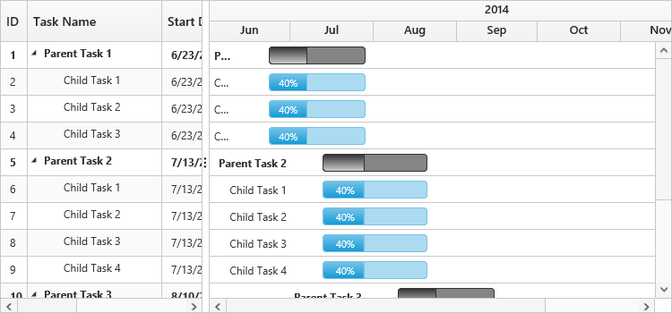
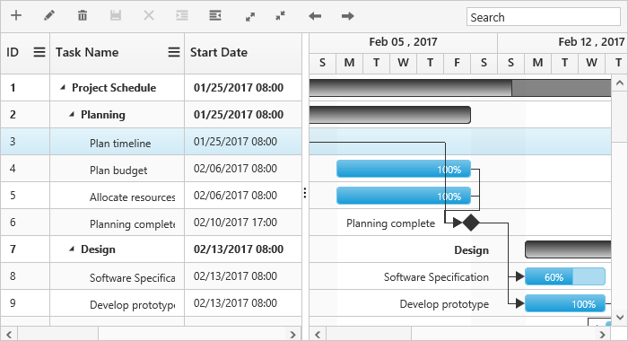

# Timescale customization

Gantt contains built-in support to switch over to various schedule mode. You can achieve this by defining a schedule header type for the Gantt.

## Schedule Header Types

Gantt contains the following built-in schedule header types:

* Day – Hour
* Week – Day
* Month – Week
* Year – Month

The following code example illustrates you on how to change the schedule mode.

### Week Schedule Mode

In the Week schedule mode, the upper part of the schedule header displays the weeks whereas the bottom half of the header displays the days. Refer the following code example.



@(Html.EJ().Gantt("Gantt")

  .ScheduleHeaderSettings(sh=>sh.ScheduleHeaderType(GanttScheduleHeaderType.Week)

  .WeekHeaderFormat("MMM dd , yyyy ")

  .DayHeaderFormat("ddd "))

)



The following screenshot illustrates the Week Schedule in Gantt control.

Week Schedule in Gantt control
{:.caption}

### Month Schedule Mode

In the Week schedule mode, the upper part of the schedule header displays the Months whereas the bottom header of the schedule displays its corresponding Weeks. Refer the following code example.



@(Html.EJ().Gantt("Gantt")

//...                             

.ScheduleHeaderSettings(sh=>sh.ScheduleHeaderType(GanttScheduleHeaderType.Month)

.MonthHeaderFormat("MMM yyyy")

.WeekHeaderFormat("M/dd"))

)


The following screenshot illustrates the Month Schedule in Gantt control.

Month Schedule in Gantt control
{:.caption}

### Year Schedule Mode

In the Week schedule mode, the upper schedule header displays the Years whereas the bottom header displays its corresponding Months. Refer the following code example.



@(Html.EJ().Gantt("Gantt")

.ScheduleHeaderSettings(sh=>sh.ScheduleHeaderType(GanttScheduleHeaderType.Year)

.YearHeaderFormat("yyyy")

.MonthHeaderFormat("MMM"))

)


The following screen shot shows the Year Schedule in Gantt control.

Year Schedule in Gantt control
{:.caption}

### Day Schedule Mode

In the Week schedule mode, the upper part of the header displays the Days whereas the bottom schedule header displays its corresponding Hours. Refer the following code example.



@(Html.EJ().Gantt("Gantt")

  //...

 .ScheduleHeaderSettings(sh=>sh.ScheduleHeaderType(GanttScheduleHeaderType.Day)

 .DayHeaderFormat("dd,MM,yy ")

 .HourHeaderFormat("HH"))

)



The following screenshot illustrates the Day Schedule in Gantt control.

Day Schedule in Gantt control
{:.caption}

### Hour Schedule Mode

An Hour-Minute Schedule Mode tracks the tasks in minutes scale. In this mode, upper schedule header displays hour scale and the lower schedule header displays its corresponding Minutes. The minute split-up in the lower schedule header can be defined by using the MinutesPerIntervalEnum property. The enumeration values of the MinutesPerInterval are,

* Auto
* OneMinute
* FiveMinutes
* FifteenMinutes
* ThirtyMinutes

The value, Auto, automatically calculates the interval depending upon the ScheduleStartDate and 

ScheduleEndDate, whereas the other enumeration values splits up accordingly.

The Hour Schedule Mode supports both the Minute and Hour duration units.



@(Html.EJ().Gantt("ganttContainer")

	   .DateFormat("M/d/yyyy hh:mm:ss tt")

	   .DurationUnit(GanttDurationUnit.Minute)

	  .ScheduleHeaderSettings(sh =>
	  {
		 
		 sh.ScheduleHeaderType(GanttScheduleHeaderType.Hour);
		 sh.MinutesPerInterval(GanttMinutesPerInterval.FiveMinutes);   
	   
	  })
)		   



Hour-Minute schedule mode in Gantt control
{:.caption}

## Week start day customization

In Gantt, we can customize week start day by using [`WeekStartDay`](/api/js/ejgantt#members:scheduleheadersettings-weekstartday) property.
By default the weekStartDay will be assigned with 0 which specifies the start day of the week.

In week schedule mode, week starts with Sunday by default. But we can customize the week start day by using below code example
 


@(Html.EJ().Gantt("ganttContainer")
	  .ScheduleHeaderSettings(sh =>
              {
                  sh.ScheduleHeaderType(GanttScheduleHeaderType.Week);                  
                  sh.WeekStartDay(3);
              })
)		   



## Rounding off timescale (schedule) start date

You can able to round off the schedule start date in a project by using the [`TimescaleStartDateMode`](/api/js/ejgantt#members:scheduleheadersettings-timescalestartdatemode) property. It is possible to set the following values to the property,

* auto
* month
* week
* year

The value `Auto`, automatically calculates the schedule header depending on the datasource values, whereas the other enumeration values rounds off the schedule header accordingly. For Instance, in year schedule if you set [`TimescaleStartDateMode`](/api/js/ejgantt#members:scheduleheadersettings-timescalestartdatemode) as `Month` then the schedule header will start from the immediate month of the schedule instead of starting from beginning of the year.



@(Html.EJ().Gantt("ganttContainer")
	  .ScheduleHeaderSettings(sh =>
              {
                  sh.ScheduleHeaderType(GanttScheduleHeaderType.Year);
                  sh.TimescaleStartDateMode(GanttTimescaleRoundMode.Month);                 
              })
)		   



[Click](http://mvc.syncfusion.com/demos/web/gantt/ganttschedulemodes) here to view the timescale modes in Gantt.

## Customize automatic timescale update action

In Gantt, schedule timeline was automatically updated when the tasks date values are updated beyond the schedule date values. This can be enabled/disabled by using [`UpdateTimescaleView`](/api/js/ejgantt#members:scheduleheadersettings-updatetimescaleview) property.
The following code snippets shows how to prevent the automatic timescale update in Gantt.
  

@(Html.EJ().Gantt("ganttContainer")
	.ScheduleHeaderSettings(sh =>
    {
        sh.ScheduleHeaderType(GanttScheduleHeaderType.Week);                  
        sh.UpdateTimescaleView(false);
    })
)		   


The following screenshot shows the output of above code example.

At Initial load
{:.caption}

`updateTimescaleView` property as `false`
{:.caption}

`updateTimescaleView` property as `true`
{:.caption}