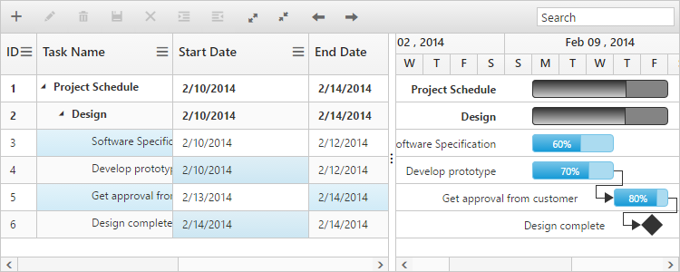

# Selection

## Row selection

The row selection in Gantt can be enabled or disabled, by using the  `AllowSelection` property. You can able to get the selected row object using the `selectedItem` property from the Gantt model. The following code example shows how to disable the row selection in Gantt.


@(Html.EJ().Gantt("Gantt")
  //...
  .AllowSelection(true)
  )
 @(Html.EJ().ScriptManager())


### Selecting a row on initial load

You can select a row on load time by setting the index of the row to `SelectedRowIndex` property. Find the following code example for details.


@(Html.EJ().Gantt("Gantt")
   //...
  .SelectedRowIndex(3)
  )
@(Html.EJ().ScriptManager())


### Selecting a row programmatically 

You can also select a row programmatically by setting index of the row value to [`SelectedRowIndex`](/api/js/ejgantt#members:selectedrowindex) property. The following code shows to select a row programmatically with a custom button click action,


 <button onclick="selectRow()">SelectRow</button>
@(Html.EJ().Gantt("Gantt")
  //...
  )
 @(Html.EJ().ScriptManager())



### Multiple row selection

It is also possible to select multiple rows by setting `SelectionType` as `Multiple`. You can select more than one row by holding down `CTRL` key while selecting multiple rows.
The following code example explains how to enable multiple selection in Gantt.


@(Html.EJ().Gantt("Gantt")
  //...
  .AllowSelection(true)
  .SelectionType(GanttSelectionType.Multiple)
  .SelectionMode(GanttSelectionMode.Row)
  )
@(Html.EJ().ScriptManager())


The output of the Gantt with multiple row selection is as follows.

### Selecting multiple rows programmatically 

You can also select multiple rows programmatically  by using `selectMultipleRows` public method. The following code example explains how to enable multiple selection in Gantt.


 <button onclick="selectMultipleRow()">selectMultipleRow</button>
@(Html.EJ().Gantt("Gantt")
  .SelectionType(GanttSelectionType.Multiple)
  .SelectionMode(GanttSelectionMode.Row)
  )
 @(Html.EJ().ScriptManager())



## Cell selection

You can select a cell in Gantt by setting `SelectionMode` property as `Cell`. And you can able to get the selected cell information using selectedCellIndexes property from the Gantt object. selectedCellIndexes is an object collection, which has the cell index and row index information of the selected cells.

Find the code example below to enable the cell selection in Gantt. 


@(Html.EJ().Gantt("Gantt")
   //
 .SelectionMode(GanttSelectionMode.Cell)
  )
@(Html.EJ().ScriptManager()) 


The following screen shots shows you cell selection.

### Selecting multiple cells

You can also select multiple cells by setting `SelectionType` property as `Multiple` while `SelectionMode` property is set to `cell`. Multiple cells can be selected by holding the ctrl key and to click on the cells. The following code example shows you to select multiple cells.


@(Html.EJ().Gantt("Gantt")
   //
 .SelectionType(GanttSelectionType.Multiple)
 .SelectionMode(GanttSelectionMode.Cell)
  )
@(Html.EJ().ScriptManager()) 


### Select cells programmatically 

You can select the cells programmatically using [`selectCells`](/api/js/ejgantt#methods:selectcells) public method. Find the code example below for details.


 <button onclick="selectCells()">selectCells</button>
@(Html.EJ().Gantt("Gantt")
   .SelectionType(GanttSelectionType.Multiple)
   .SelectionMode(GanttSelectionMode.Cell)
  )
@(Html.EJ().ScriptManager()) 



## MultiSelection – Touch Option

It is possible to select rows using touch action in Gantt. Gantt provides support for both single selection and multiple row selection using touch action. For multiple row selection, when we tap on a cell, a helper icon will be displayed using which we can select multiple rows.

The following code example describes how to enable multiple selection in Gantt.


@(Html.EJ().Gantt("Gantt")
  //...
  .SelectionType(GanttSelectionType.Multiple)
  .SelectionMode(GanttSelectionMode.Row)
  )
@(Html.EJ().ScriptManager()) 


The following output is displayed the result of multiple selection in touch device environment.

