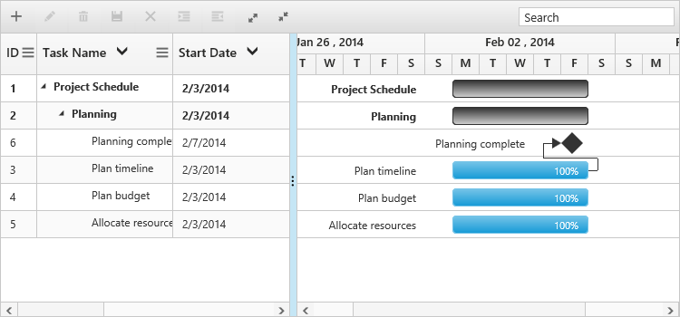

# Sorting

The Gantt control for JavaScript has built-in support for sorting one or more columns.

##Sorting Columns

Gantt allows the tasks to be sorted in ascending or descending order based on the selected column by enabling the `AllowSorting` option in Gantt control. The following code example shows you how to enable sorting in Gantt control.



@(Html.EJ().Gantt("Gantt")
//..
.AllowSorting(true)
.Datasource(ViewBag.datasource)
)@(Html.EJ().ScriptManager())



## Multicolumn sorting

Gantt allows you to sort multiple columns by clicking the desired column headers while holding the `CTRL` key with `AllowMultiSorting` as `true` . The following code example shows you how to enable multicolumn sorting in Gantt control.



@(Html.EJ().Gantt("Gantt")
//...
.AllowSorting(true)
.AllowMultiSorting(true)
.Datasource(ViewBag.datasource)
)@(Html.EJ().ScriptManager())


The following screenshot shows the output of multicolumn sorting in Gantt control.

Multicolumn Sorting
{:.caption}

## Sorting column on Gantt initialization

Gantt control can be rendered with sorted columns initially, this can be achieved by using `SortSettings` property. We can add columns which are sorted initially in `SortedColumns` collection. `SortedColumns` collection was defined with `Field` and `Direction` properties. The following code example shows how to add sorted column on Gantt initialization.



@(Html.EJ().Gantt("Gantt")
//...
.AllowSorting(true)
.SortSettings(sort=>
	{
	 sort.SortedColumns(sc =>
		 sc.Field("taskName").Direction(SortOrder.Descending).Add());
	})
.Datasource(ViewBag.datasource)
)@(Html.EJ().ScriptManager())


The following screenshot shows the output of above code example.

## Sorting column dynamically

Columns in Gantt control can be sorted dynamically by using [`sortColumn`](/api/js/ejgantt#methods:sortcolumn "sortColumn(mappingName, columnSortDirection)") method. The following code example shows how to invoke the [`sortColumn`](/api/js/ejgantt#methods:sortcolumn "sortColumn(mappingName, columnSortDirection)") method on button click action.



@(Html.EJ().Gantt("Gantt")
//...
.AllowSorting(true)
)@(Html.EJ().ScriptManager())

 


The following screenshot shows the output of above code example.

Before Sorting
{:.caption}

After Sorting
{:.caption}

N> when sorting a column using this method, previously sorted columns are cleared.

## Sorting multiple columns dynamically

Multiple columns in Gantt can be sorted dynamically by using `setModel` method with `sortSettings`property. The following code example shows how to use this method.



@(Html.EJ().Gantt("Gantt")
//...
.AllowSorting(true)
.AllowMultiSorting(true)
.Datasource(ViewBag.datasource)
)@(Html.EJ().ScriptManager())



The following screenshot shows the output of the above code example.

Before Sorting
{:.caption}

After Sorting
{:.caption}
