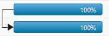
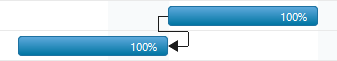
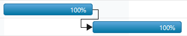
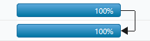
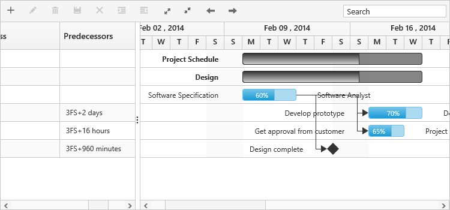
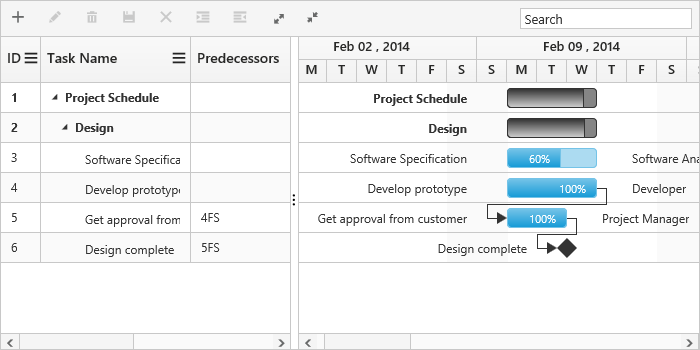
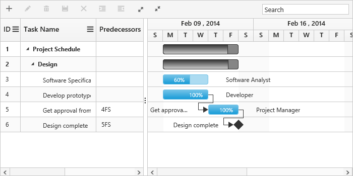
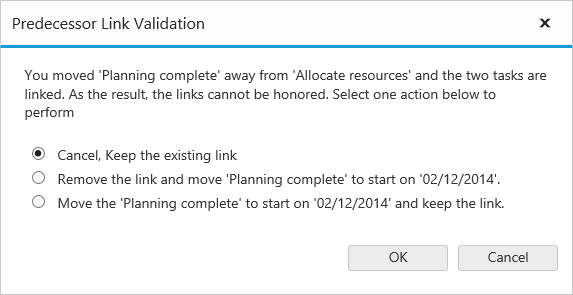

# Task Dependencies

Task dependencies or task relationship can be established between two task in Gantt. This dependencies effect the project schedule, if we change the predecessor of one task it will affect the successor task, which effect next task and so on.

## Task Relationship Types

Task relationships are categorized into four types based on the start and finish date of the task.

### Start to Start(SS)

You cannot start a task until the other task also starts.

### Start to Finish(SF)

You cannot finish a task until the other task is started.

### Finish to Start(FS)

You cannot start a task until the other task is completed.

### Finish to Finish(FF)

You cannot finish a task until the other task is completed.

## Define task relationship

Task relationships are defined in data source as string value and this values are mapped to Gantt control by using `PredecessorMapping` property. The following code example shows you how to enable the predecessor in the Gantt control.





@(Html.EJ().Gantt("Gantt")
//...
.PredecessorMapping("Predecessor")
.Datasource(ViewBag.datasource)
)@(Html.EJ().ScriptManager())





 public class GanttController : Controller
    {
        //
        // GET: /Default/
        public ActionResult Default()
        {
            var DataSource = GanttDefaultData.GetData();
            ViewBag.datasource = DataSource;
            return View();
        }
        public class GanttDefaultData
        {
		public static List<DefaultData> GetData()
		{
			List<DefaultData> list = new List<DefaultData>();
			list.Add(new DefaultData()
			{
				//..
				Children = (new List<DefaultData>()
				{
					new DefaultData()
					{
						Id = 4,
						Name = "Develop prototype"                           
					},
					 new DefaultData()
					{
						Id = 5,
						Name = "Get approval from customer",
						Predecessor: "4FS",                            
					},
					 new DefaultData()
					{
						Id = 6,
						Name = "Design complete",
						Predecessor: "5FS",                            
					},
					//..
				})
			});
			
			return list;
		}
      }       
    }




The following screenshot displays the output of the above code. 

Task relationship
{:.caption}

## Predecessor offset with duration units

In Gantt, predecessor offset can be defined with the following duration units. 

* Day
* Hour
* Minute

We can define offset with various offset duration units for predecessors by using the below code example.





@(Html.EJ().Gantt("Gantt")
//...
.PredecessorMapping("Predecessor")
.Datasource(ViewBag.datasource)
)@(Html.EJ().ScriptManager())





 public class GanttController : Controller
  {
	//
	// GET: /Default/
	public ActionResult Default()
	{
		var DataSource = GanttDefaultData.GetData();
		ViewBag.datasource = DataSource;
		return View();
	}
	public class GanttDefaultData
	{
		public static List<DefaultData> GetData()
		{
			List<DefaultData> list = new List<DefaultData>();
			list.Add(new DefaultData()
			{
				//..
				Children = (new List<DefaultData>()
				{
					new DefaultData()
					{
						Predecessor: "3FS+2d",                         
					},
					 new DefaultData()
					{
						Predecessor: "3FS+16h",                            
					},
					 new DefaultData()
					{
						Predecessor: "3FS+960m",                            
					},
					//..
				})
			});
			
			return list;
		}
	}       
 }




The following screen shot depicts the duration unit support in the predecessor offset.

## Enable/disable predecessor validation

By default Gantt tasks date values are validated as per predecessor task and it's relationship type, we can disable/enable this validation by using `EnablePredecessorValidation` property. The following code example shows how to disable predecessor validation in Gantt.



@(Html.EJ().Gantt("Gantt")
//...
.EnablePredecessorValidation(false)
.PredecessorMapping("Predecessor")
.Datasource(ViewBag.datasource)
)@(Html.EJ().ScriptManager())



The below screenshot shows the output of above code example.

Predecessor validation disabled mode
{:.caption}

Predecessor validation enabled mode
{:.caption}

## Validate predecessor links on editing

In Gantt, it is possible to validate the taskbar editing based on the predecessor connections. Below are the following ways to validate the taskbar editing.

* Using ActionBegin event 
* Using Validation dialog

### Using ActionBegin event

The `ActionBegin` event with requestType argument as **validateLinkedTask** will be triggered when editing a task with predecessor links.

It is possible to validate the editing within the `ActionBegin` event using the **validateMode** event argument. The validateMode event argument has the following properties.

<table>
<tr>
<td>
Argument  </td><td>
Default value  </td><td>
Description  </td></tr>
<tr>
<td>
args.validateMode.respectLink  </td><td>
false  </td><td>
In this validation mode, the predecessor links will be considered as high priority. With this mode enabled, when the successor task is moved before predecessor task's end date, the editing will be reverted and dates will be validated based on the dependency links.    </td></tr>
<tr>
<td>
args.validateMode.removeLink  </td><td>
false  </td><td>
In this validation mode, the taskbar editing will be considered as high priority, where in the case of inappropriate task dates the dependency links will be removed and tasks will be moved to the edited date.    </td></tr>
<tr>
<td>
args.validateMode.preserveLinkWithEditing  </td><td>
true  </td><td>
In this validation mode, taskbar editing will be considered along with the dependency links. There will be no validations in task editing.    </td></tr>
</table>

By default, the **preserveLinkWithEditing** validation mode will be enabled thus the validations will not occur when editing the linked tasks. 

The below code snippet explains enabling the **respectLink** validation mode while editing the linked tasks in the `ActionBegin` event.



@(Html.EJ().Gantt("Gantt")
//...
.ClientSideEvents(eve =>
	{                       
		eve.ActionBegin("actionBegin");
	})
)@(Html.EJ().ScriptManager())
 


### Using validation dialog

When disabling all the validation modes in the `ActionBegin` event, a validation popup will be displayed prompting the user to select the validation mode to validate taskbar editing.

This validation popup will display different options based on the successor task's start date after editing.

If the user moved the successor task, that starts after predecessor task's end date then the dialog will be rendered with below options,

* Cancel, Keep the existing link.
* Remove the link and move the task to start on edited date.
* Move the task to start on edited date and keep the link.

If the user moved the successor task, that starts before the predecessor task's end date then the dialog will be rendered with below options.
If the user moved the successor task, that starts before the predecessor task's end date then the dialog will be rendered with below options.

* Cancel, Keep the existing link.
* Remove the link and move the task to start on edited date.

The following code example explains this.



@(Html.EJ().Gantt("Gantt")
//...
.ClientSideEvents(eve =>
	{                       
		eve.ActionBegin("actionBegin");
	})
)@(Html.EJ().ScriptManager())
 


In this case, if the user dragging action violated the predecessor type then the following dialog will be rendered to perform operation.

