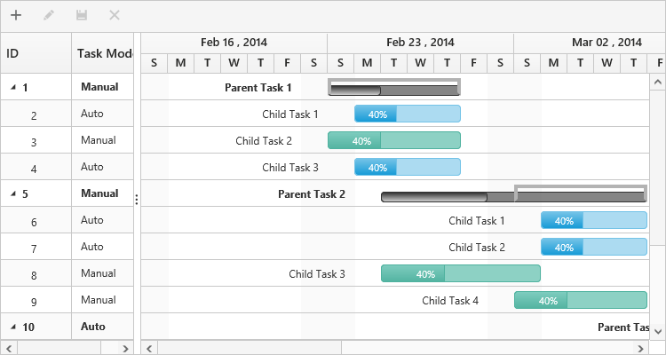

# Task Scheduling Modes

The Gantt provides support for automatic and manual task scheduling modes. Scheduling mode of a task is used to indicate whether the start and end dates of a task will be automatically validated or not. Using the property `TaskSchedulingMode` we can able to change the scheduling mode of a task. The following are the enumeration values that can be set to the property `TaskSchedulingMode`.

* Auto
* Manual
* Custom

## Automatically Scheduled Tasks

When the `TaskSchedulingMode` property is set as `Auto` scheduling mode, all the tasks in the project will be rendered as automatically scheduled tasks. Thus the start and end dates of the tasks in the project will be automatically validated. The tasks will be automatically scheduled based on the factors such as dependencies between the tasks, non-working days like holidays and weekends. Tasks automatically recalculate the scheduling date when its predecessor task has been affected. But still we can schedule the tasks and reset the start and end dates by manual editing. Summary tasks will also be automatically scheduled, but its start date, end date and duration values cannot be edited manually. 



@(Html.EJ().Gantt("Gantt")
     //...
	.TaskSchedulingMode(GanttTaskSchedulingMode.Auto)
	.Datasource(ViewBag.datasource)	
)@(Html.EJ().ScriptManager())



N> Automatic scheduling mode is the default task scheduling mode in Gantt.

## Manually Scheduled Tasks

When the `TaskSchedulingMode` property is set as `Manual` scheduling mode, all the tasks in the project will be rendered as manually scheduled tasks. Thus the dates of the tasks will not get validated automatically by the system. The tasks will not get rescheduled and dates will not be recalculated automatically based on the factors such as task dependencies and non-working days and hence manual scheduled tasks will lie on weekends and holidays. We can restrict this mode in predecessor editing alone, that is we can make to automatically validate the dates of the manual tasks on predecessor editing by enabling the property `ValidateManualTasksOnLinking`. By enabling this property, the dates of the manual tasks will recalculate automatically, when its predecessor task's dates have been changed.



@(Html.EJ().Gantt("Gantt")
     //...
	.TaskSchedulingMode(GanttTaskSchedulingMode.Manual)
    .ValidateManualTasksOnLinking(false)
)@(Html.EJ().ScriptManager())



## Custom

When the `TaskSchedulingMode` property is set as `Custom`, the scheduling mode for each tasks will be mapped form the data source field. The property `TaskSchedulingModeMapping` is used to map the scheduling mode field from the data source.





@(Html.EJ().Gantt("Gantt")
     //...
	.TaskSchedulingMode(GanttTaskSchedulingMode.Manual)
    .ValidateManualTasksOnLinking(false)
)@(Html.EJ().ScriptManager())





 public class GanttController : Controller
    {
        //
        // GET: /Default/
        public ActionResult Default()
        {
            var DataSource = GanttDefaultData.GetData();
            ViewBag.datasource = DataSource;
            return View();
        }
        public class GanttDefaultData
        {
            public static List<DefaultData> GetData()
            {
                List<DefaultData> list = new List<DefaultData>();
                list.Add(new DefaultData()
                {
                    Id = 1,
                    Name = "Design",
                    StartDate = "02/10/2014",
                    EndDate = "02/14/2014",
				    isManual = true,
                    Children = (new List<DefaultData>()
                    {
                        new DefaultData()
                        {
                            Id = 2,
                            Name = "Software Specification",
                            StartDate = "02/10/2014",
                            EndDate="02/12/2014",                            
                        },
                        new DefaultData()
                        {
                            Id = 3,
                            Name = "Develop Prototype",
                            StartDate = "02/10/2014",
                            EndDate="02/12/2014",
							isManual = true,
                        },
                       //..
                    })
                });
                
                return list;
            }
        }      
    }




[Click](https://mvc.syncfusion.com/demos/web/gantt/gantttaskschedulingmode) here to view the online demo sample for task scheduling modes.

The following screen shot depicts a project with custom scheduling mode, where both automatic and manual scheduling modes are mapped to the tasks.

