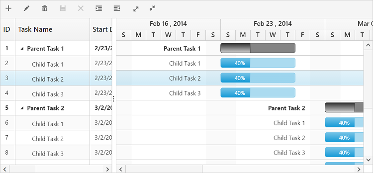

# Toolbar

In Gantt we can show/hide the Toolbar by using `ShowToolbar` property.We can add default toolbar items by `ToolbarItems`. User can also create a custom toolbar items by using `CustomToolbarItems`.

## Default Toolbar Items
Using Gantt default toolbar items we can perform below operations.

* **Add**- To add new task.

* **Edit**-To edit a selected task.

* **Delete**- To delete a selected task.
		   
* **Cancel**- To cancel the edited changes in a task.
		   
* **Update**- To save the edited changes in a task.
		   
* **ExpandAll**- To expand all the Gantt rows.
		   
* **CollapseAll**- To collapse all the Gantt rows.

* **Indent**- To indent the selected task in Gantt.
		   
* **Outdent**- To outdent the selected task in Gantt.
		   
* **CriticalPath**- To support critical path in Gantt.

* **PrevTimeSpan**- To navigate the Gantt timeline to previous time span.

* **NextTimeSpan**- To navigate the Gantt timeline to Next time span.

* **Search**- To perform search operation in Gantt.
		   
* **ExcelExport**- To export Gantt in Excel format.

* **PdfExport**- To export Gantt in Pdf format.

We can enable Gantt toolbar by using below code example:

  @(Html.EJ().Gantt("Gantt")                   
		   .ToolbarSettings(toolbar =>
		   {
			   toolbar.ShowToolbar(true);
			   toolbar.ToolbarItems(new List<GanttToolBarItems>()
			   {
				   GanttToolBarItems.Add,
				   GanttToolBarItems.Edit,
				   GanttToolBarItems.Delete,
				   GanttToolBarItems.Update,
				   GanttToolBarItems.Cancel,
				   GanttToolBarItems.Indent,
				   GanttToolBarItems.Outdent,
				   GanttToolBarItems.ExpandAll,
				   GanttToolBarItems.CollapseAll,
				   GanttToolBarItems.NextTimeSpan,
				   GanttToolBarItems.PrevTimeSpan,
				   GanttToolBarItems.Search,
				   GanttToolBarItems.PdfExport,
				   GanttToolBarItems.ExcelExport,
				   GanttToolBarItems.CriticalPath                           
			   });
		   })                   
        )@(Html.EJ().ScriptManager())

The following screenshot displays the toolbar option in Gantt control.

N> To perform add,edit,delete,cancel,update,indent,outdent using Toolbar items we need to enable add/edit/delete/indent using `EditSettings`.
 
## Custom Toolbar Items

CustomToolbarItems allows us to insert custom icons and custom template in Gantt toolbar. By using below properties we can customize Gantt toolbar as per our requirement.

* **Text**- To insert the custom icons in toolbar using CSS class name selector.

* **TemplateID**-To insert the custom icons in toolbar using script templates. Using this property we can bind HTML elements and other EJ controls to Gantt toolbar.

* **TooltipText**-Displays tooltip text for the custom icons. 

To insert EJ Controls in Gantt toolbar we need to initiate the control in `Create` client side event.In `ToolbarClick` client side event we can bind actions to the custom toolbar items.


    @(Html.EJ().Gantt("ToolbarTemplate")                  
           .ToolbarSettings(toolbar =>
            {
              toolbar.ShowToolbar(true);
              toolbar.CustomToolbarItems(ct =>
                 {
                   ct.TemplateID("#ColumnVisibility").TooltipText("Column Visibility").Add();                                  
                   ct.Text("Reset").TooltipText("Reset").Add();
                  });                          
            })                   
           .ClientSideEvents(cs =>
           {
                 cs.ToolbarClick("toolbarClick");
                 cs.Create("create");
            })                 
        )        
    
    
     


[Click](http://mvc.syncfusion.com/demos/web/gantt/gantttoolbartemplate) here to view the demo sample for custom toolbar item

