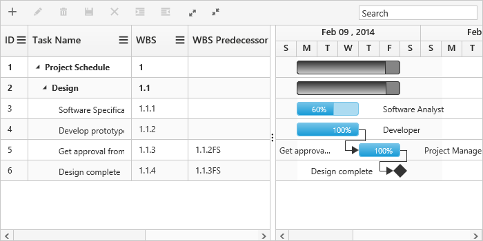

# Work Breakdown Structure

Work Breakdown Structure(WBS) in Gantt represents the entire project activities in various sub modules. It is used to split the large tasks into manageable small tasks. WBS value and WBS predecessor value of Gantt tasks are displayed in WBS column and WBS predecessor column. This can be enabled in Gantt by using `EnableWBS` and `EnableWBSPredecessor` properties. The following code example shows how to enable WBS columns in Gantt.



@(Html.EJ().Gantt("Gantt")
	// ...
	.EnableWBS(true)
    .EnableWBSPredecessor(true)
)@(Html.EJ().ScriptManager())



The below screenshot depicts the output of above code example.

[Click](https://mvc.syncfusion.com/demos/web/gantt/ganttwbs) here to view the online demo sample for WBS in Gantt.
