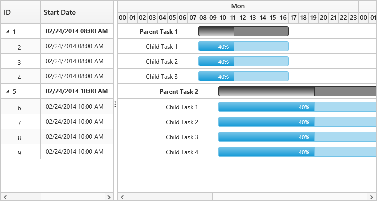

# Working Time Range

In Gantt control, working hours in a day for a project can be defined by using the `DayWorkingTime` property. Based on the working hours, automatic date scheduling and duration validations for a task are performed.

The below code snippet explains on how to define the working time range for the project in Gantt,



@(Html.EJ().Gantt("Gantt")
	// ...
	.DayWorkingTime(dt=>
	{
		dt.From("08:00 AM").To("12:00 PM").Add();
		dt.From("01:00 PM").To("05:00 PM").Add();
	})    
	)
@(Html.EJ().ScriptManager())



N> 1. Individual tasks can lie between any time within the defined working time range of the project.

N> 2. `DayWorkingTime` property is used to define the working time for the whole project.

The below demo explains the working time range in Gantt.

[Working Time Range](https://mvc.syncfusion.com/demos/web/gantt/ganttworkingtimerange)

The following screen shot shows working time range in Gantt control. 

