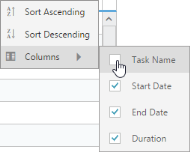
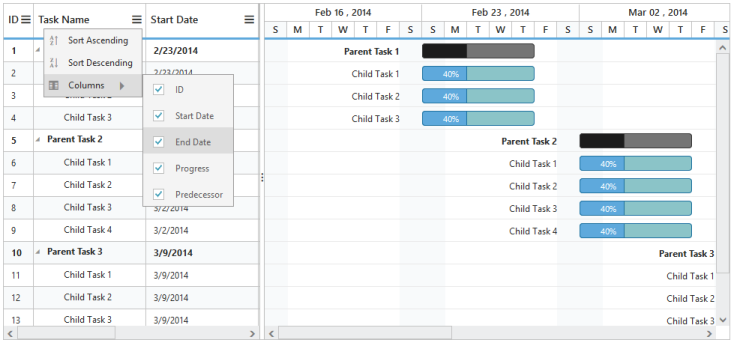

# Columns

The TreeGrid column displays the information from a bounded data source and it will be editable to update the task details through TreeGrid.

##Column Resizing 

You can change the width of the column in TreeGrid to show the entire text of the column by resizing the column. The following code example shows you how to enable the Column Resize feature at Gantt initialize.



@(Html.EJ().Gantt("Gantt")

//...

.AllowColumnResize(true)

)



##Column Template

Column template is used to customize the column’s look and feel, based on requirement. 

The following code example shows you how to display the icon in the TreeGrid column.



public class GanttCustomColumnController : Controller

    {

        // GET: /GanttCustomColumn/

        public ActionResult GanttCustomColumn()

        {

            ViewBag.datasource = this.GetDataSource();

            return View();

        }

        #region Create DataSource

        private List<Data> GetDataSource()

        {

            List<Data> DataCollection = new List<Data>();

            Data ParentData = new Data()

            {

                TaskId = 1,

                PlatForm="ASP.NET",

                TaskName = "Volume 1 Release",

                StartDate = new DateTime(2014, 01, 06),                

                Duration = 5,

                Progress="30"

            };

            Data ChildData = new Data()

            {

                TaskId = 2,

                PlatForm="Volume1Sprint1",

                TaskName = "Volume1Sprint1",

                StartDate = new DateTime(2014, 01, 06),                        

                Duration = 5,

                Progress = "100",                

            };

            ParentData.SubTasks = new List<Data>();

            ParentData.SubTasks.Add(ChildData);

            ChildData = new Data()

            {

                TaskId = 3,

                PlatForm="JS",

                TaskName = "Volume1Sprint2",

                StartDate = new DateTime(2014, 01, 13),                                                

                Duration = 5,

                Progress = "100"                

            };

            ParentData.SubTasks.Add(ChildData);

            ChildData = new Data()

            {

                TaskId = 4,

                PlatForm="Mobile MVC",

                TaskName = "Volume1Sprint3",

                StartDate = new DateTime(2014, 01, 20),                                

                Duration = 5,

                Progress = "100"        

            };

            ParentData.SubTasks.Add(ChildData);

            ChildData = new Data()

            {

                TaskId = 5,

                PlatForm="Silverlight",

                TaskName = "Volume1Sprint4",

                StartDate = new DateTime(2014, 01, 27),               

                Duration = 5,

                Progress="100"

            };

            ParentData.SubTasks.Add(ChildData);

            ChildData = new Data()

            {

                TaskId = 6,

                PlatForm="Windows Forms",

                TaskName = "Volume1Sprint5",

                StartDate = new DateTime(2014, 02, 3),               

                Duration = 5,

                Progress="100"

            };

            ParentData.SubTasks.Add(ChildData);

            ChildData = new Data()

            {

                TaskId = 7,

                PlatForm="Windows Phone",

                TaskName = "Volume1Sprint6",

                StartDate = new DateTime(2014, 02, 10),               

                Duration = 5,

                Progress="100"

            };

            ParentData.SubTasks.Add(ChildData);

            DataCollection.Add(ParentData);

            return DataCollection;

        }

        #endregion

        public class Data

        {

            public int TaskId { get; set; }

            public string TaskName { get; set; }

            public string PlatForm { get; set; }

            public DateTime StartDate { get; set; }

            public int Duration { get; set; }

            public List<Data> SubTasks { get; set; }

            public string Progress { get; set; }

            public string Predecessor { get; set; }

        }

    }
	
	



@(Html.EJ().Gantt("Gantt")

      //...      

      .ClientSideEvents(options =>

      {

          options.Load("load");

      })

      .Datasource(ViewBag.datasource)

      )

     @section ScriptSection{

         

        

}



The following screenshot displays the customized column in Gantt control.

##Column Chooser

Gantt supports enabling and disabling the visibility of the columns dynamically with the ShowColumnChooser property. The visibility of the custom columns can also be toggled with this property. Column chooser option is rendered as a sub menu item within the column menu in the Gantt columns. 

The column menu is enabled with the ShowColumnChooser property, where the default value for this property is false.

The column menu provides the following options:

* Sort Ascending
* Sort Descending
* Columns 

Sort Ascending and Sort Descending options can be enabled or disabled with the AllowSorting property. Single level sorting can be performed with these options. To perform multilevel sorting, AllowMultiSorting property should be enabled. You can also disable the visibility of a particular column in the column collection manually by setting the Visible property to false.



@(Html.EJ().Gantt("gantt")

 // ...

    .ShowColumnChooser(true)

    .AllowSorting(true)

    .AllowMultiSorting(true)

 // ...

)



The following screenshot displays the column chooser in the Gantt control.

