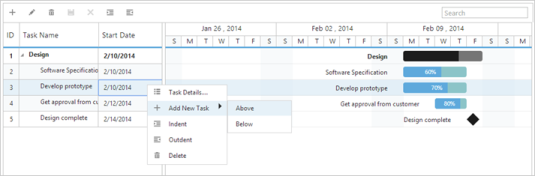
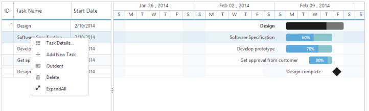

## Context Menu

Default Context Menu

The default context menu contains the following options.

* Task Details
* Add New Task
* Indent
* Outdent
* Delete

The following code example shows you how to enable the default context menu in Gantt control.



@(Html.EJ().Gantt("Gantt")

 //...

 .EnableContextMenu(true)

 .Datasource(ViewBag.datasource)

 )



The following screenshot shows the Default Context Menu in Gantt control.

{{ '' | markdownify }}
{:.image }

Custom Context Menu

You can add custom context menu option in Gantt control. The following code example shows you how to add the custom context menu option in Gantt control.



@(Html.EJ().Gantt("Gantt")

        //...

 .EnableContextMenu(true)

 .ClientSideEvents(options =>

 {

     options.ContextMenuOpen("contextMenuOpen");

 })

 .Datasource(ViewBag.datasource)

 )

@section ScriptSection{

   



The screenshot of the Custom Context Menu items in Gantt control is as follows.

{{ '' | markdownify }}
{:.image }

