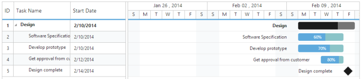

## Data Binding

Data binding is the process that establishes a connection between the application and different kinds of data sources such as business objects.

Local Data Binding

In the application that uses Gantt control, you can connect the data source generated by that application itself.

Hierarchy Data-source Binding

The following code example shows how to bind the hierarchical local data into the Gantt control.



CONTROLLER [CS]

public class GanttController : Controller

    {

        // GET: /Gantt/

        public ActionResult Gantt()

        {

            ViewBag.datasource = this.GetDataSource();

            return View();

        }

        #region CreateDataSource

        private List<Data> GetDataSource()

        {

            List<Data> DataCollection = new List<Data>();

            Data ParentData = new Data()

            {

                TaskId = 1,

                TaskName = "Design",

                StartDate = new DateTime(2014, 02, 10),

                EndDate = new DateTime(2014, 02, 14),

                BaselineStartDate = new DateTime(2014, 02, 10),

                BaselineEndDate = new DateTime(2014, 02, 12),

                Duration = 5

            };

            Data ChildData = new Data()

            {

                TaskId = 2,

                TaskName = "Software Specification",

                StartDate = new DateTime(2014, 02, 10),

                EndDate = new DateTime(2014, 02, 12),

                BaselineStartDate = new DateTime(2014, 02, 10),

                BaselineEndDate = new DateTime(2014, 02, 12),

                Duration = 4,

                Progress = "60",

                ResourceId = new List<int>() { 2 }

            };

            ParentData.SubTasks = new List<Data>();

            ParentData.SubTasks.Add(ChildData);

            ChildData = new Data()

            {

                TaskId = 3,

                TaskName = "Develop prototype",

                StartDate = new DateTime(2014, 02, 10),

                EndDate = new DateTime(2014, 02, 12),

                BaselineStartDate = new DateTime(2014, 02, 10),

                BaselineEndDate = new DateTime(2014, 02, 12),

                Duration = 4,

                Progress = "70",

                ResourceId = new List<int>() { 3 }

            };

            ParentData.SubTasks.Add(ChildData);

            ChildData = new Data()

            {

                TaskId = 4,

                TaskName = "Get approval from customer",

                StartDate = new DateTime(2014, 02, 12),

                EndDate = new DateTime(2014, 02, 14),

                BaselineStartDate = new DateTime(2014, 02, 10),

                BaselineEndDate = new DateTime(2014, 02, 12),

                Duration = 2,

                Progress = "80",

                ResourceId = new List<int>() { 1 },

                Predecessor = "3FS"

            };

            ParentData.SubTasks.Add(ChildData);

            ChildData = new Data()

            {

                TaskId = 5,

                TaskName = "Design complete",

                StartDate = new DateTime(2014, 02, 14),

                EndDate = new DateTime(2014, 02, 14),

                BaselineStartDate = new DateTime(2014, 02, 10),

                BaselineEndDate = new DateTime(2014, 02, 12),

                Duration = 0,

                Predecessor = "4FS"

            };

            ParentData.SubTasks.Add(ChildData);

            DataCollection.Add(ParentData);

            return DataCollection;

        }

        #endregion

        public class Data

        {

            public int TaskId { get; set; }

            public string TaskName { get; set; }

            public DateTime StartDate { get; set; }

            public DateTime EndDate { get; set; }

            public DateTime BaselineStartDate { get; set; }

            public DateTime BaselineEndDate { get; set; }

            public int Duration { get; set; }

            public List<Data> SubTasks { get; set; }

            public string Progress { get; set; }

            public List<int> ResourceId { get; set; }

            public string Predecessor { get; set; }

        }

    }

VIEW [CSHTML]

@using Syncfusion.JavaScript

@using Syncfusion.JavaScript.Models 

@using Syncfusion.MVC.EJ

<!DOCTYPE html>    

<html>

<head>

         @*Add script reference and style reference here*@

</head>

<body>

      @(Html.EJ().Gantt("Gantt")

              .TaskIdMapping("TaskId")

              .TaskNameMapping("TaskName")

              .StartDateMapping("StartDate")

              .DurationMapping("Duration")

              .ProgressMapping("Progress")

              .ScheduleStartDate("02/01/2014")

              .ScheduleEndDate("03/14/2014")                                          

              .ChildMapping("SubTasks")

              .TreeColumnIndex(1)                                          

              .Datasource(ViewBag.datasource)

              )

     @(Html.EJ().ScriptManager())

 </body>

 </html>



The output of the above steps is as follows.

{{ '' | markdownify }}
{:.image }

Self-Referential Data Binding (Flat Data)

Gantt can be rendered from self-referential data structures, by providing two fields: ID field and parent ID field.

* ID Field- This field must contain unique values used to identify nodes. Its name should be assigned to the TaskIdMapping property.
* Parent ID Field- This field must contain values that indicate parent nodes. Its name should be assigned to the ParentTaskIdMapping property.



CONTROLLER[CS]

public partial class GanttController : Controller

    {

        //

        // GET: /Default/

        public ActionResult Default()

        {

            var DataSource = GanttData.GetData();

            ViewBag.datasource = DataSource;

            return View();

        }

        public class GanttData

        {

            public static List<Data> GetData()

            {

                List<Data> list = new List<Data>();

                list.Add(new Data()

                {

                  Id= 1,

                 Name= "Task 1",

                 StartDate= "02/03/2014", 

                  Duration= 5

                });

                list.Add(new Data()

                {

                    Id = 2,

                    Name = "Child Task 1",

                    ParentId=1,

                    StartDate = "02/03/2014",

                    Duration = 5,

                });

                list.Add(new Data()

                {

                    Id = 3,

                    ParentId=1,

                    Name = "Child Task 2",

                    StartDate = "02/03/2014",

                    Duration = 5,

                    PercentDone = 100,      

                });

               list.Add(new Data()

                {

                    Id = 22,

                    ParentId=2,

                    Name = "Sub Child Task 1",

                    StartDate = "02/03/2014",

                    Duration = 5,

                    PercentDone = 40,

                });

                list.Add(new Data()

                {

                    Id = 23,

                    ParentId=2,

                    Name = "Sub Child Task 2",

                    StartDate = "02/03/2014",

                    Duration = 5,

                    PercentDone = 100,

                });

                list.Add(new Data()

                {

                    Id = 12,

                    ParentId=22,

                    Name = "Inner Child Task 1",

                    StartDate = "02/03/2014",

                    Duration = 5,

                });

                list.Add(new Data()

                {

                    Id = 13,

                    ParentId=22,

                    Name = "Inner Child Task 2",

                    StartDate = "02/03/2014",

                    Duration = 5,

                    PercentDone = 100,

                });

                list.Add(new Data()

                {

                    Id = 4,

                    Name = "Task 2",

                    StartDate = "02/03/2014",

                    Duration = 5,

                    PercentDone = 100,

                });

                list.Add(new Data()

                {

                    Id = 5, 

                    ParentId=4,

                    Name = "Child Task 1",

                    StartDate = "02/03/2014",

                    Duration = 5,

                    PercentDone = 100,

                });

                list.Add(new Data()

                {

                    Id = 6, 

                    ParentId=4,

                    Name = "Child Task 2",

                    StartDate = "02/07/2014",

                    Duration = 5,

                });

                list.Add(new Data()

                {

                    Id = 7, 

                    ParentId=6,

                    Name = "Sub Child Task 1",

                    StartDate = "02/07/2014",

                    Duration = 5,

                });

                list.Add(new Data()

                {

                    Id = 8, 

                    ParentId=7,

                    Name = "Inner Child Task 1",

                    StartDate = "02/10/2014",

                    Duration = 3,

                    PercentDone = 60,

                });

                list.Add(new Data()

                {

                    Id = 9, 

                    ParentId=7,

                    Name = "Inner Child Task 2",

                    StartDate = "02/10/2014",

                    Duration = 3,

                    PercentDone = 100,

                });

                list.Add(new Data()

                {

                    Id = 10, 

                    Name = "Task 3",

                    StartDate = "02/13/2014",

                    Duration = 2,

                    PercentDone = 100,

                });

                list.Add(new Data()

                {

                    Id = 11, 

                    Name = " Task 4",

                    StartDate = "02/14/2014",

                    Duration = 0,

                });

                return list;

            }

        }

        public class Data

        {

            public string StartDate { get; set; }

            public int Id { get; set; }

            public int ParentId { get; set; }

            public string Name { get; set; }

            public int Duration { get; set; }

            public int PercentDone { get; set; }

            public List<Data> Children { get; set; }

            public string Predescessor { get; set; }

        }

    }

VIEW[CSHTML]

        @(Html.EJ().Gantt("GantContainer")

              .TaskIdMapping("Id")

              .ParentTaskIdMapping("ParentId")

              .TaskNameMapping("Name")

              .StartDateMapping("StartDate")

              .DurationMapping("Duration")

              .ProgressMapping("PercentDone")

              .ScheduleStartDate("02/03/2014")

              .ScheduleEndDate("03/09/2014")

              .ChildMapping("Children")

              .Datasource(ViewBag.datasource)

)



The following screenshot shows the output of the above steps.

{{ '' | markdownify }}
{:.image }

