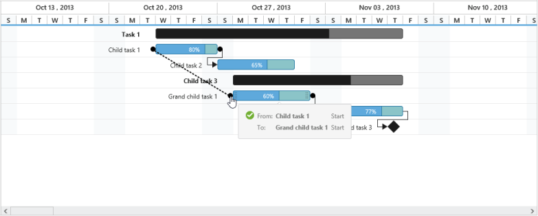

# Editing

The Gantt control provides built-in support to add, insert and update the task inside Gantt. Gantt provides three types of editing, they are:

* Cell Editing
* Normal Editing
* Taskbar Editing
* Predecessor Editing

## Cell Editing

Update the task details through grid cell editing by setting EditMode as CellEditing.

The following code example shows you how to enable CellEditing in Gantt control.



@(Html.EJ().Gantt("Gantt")

//...

.EditSettings(edit=>{

   edit.AllowEditing(true);

   edit.EditMode("cellEditing")

})

.Datasource(ViewBag.datasource)

)



The output of Gantt with CellEditing is as follows.

## Normal Editing

Update the task details through edit dialog by setting EditMode as Normal.

The following code example shows you how to enable normal editing in Gantt control.



@(Html.EJ().Gantt("Gantt")

//...

.EditSettings(edit=>{

   edit.AllowEditing(true);

   edit.EditMode("normal")       

})

.Datasource(ViewBag.datasource)

)



The following screenshot shows the output of normal editing.

## Taskbar Editing

Update the task details by interactions such as resizing and dragging the taskbar. The following code example shows you how to enable taskbar resizing in Gantt control.



@(Html.EJ().Gantt("Gantt")

//...

.AllowGanttChartEditing(true)

.Datasource(ViewBag.datasource)

)



## Predecessor Editing

Update the predecessor details of a task using mouse interactions. The following code example shows how to enable predecessor editing.



@(Html.EJ().Gantt("Gantt")

           //..

           .PredecessorMapping("predecessor")

           .AllowGanttChartEditing(true)                               

           .Datasource(ViewBag.datasource)

 )



The following screen shot shows the predecessor editing in Gantt control.

_Figure 39 : Predecessor Editing_

