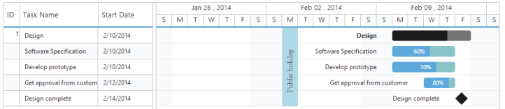

# Holidays

Holidays in Gantt control is used to highlight the non-working days in Gantt control and it can be initialized with Gantt control by using the following code example.



@(Html.EJ().Gantt("GanttContainer")

    //...

   .Holidays(new List<Syncfusion.JavaScript.Models.Holiday>

                               {

                                     new Syncfusion.JavaScript.Models.Holiday()

                                      {

                                         Day="2/11/2014", 

                                         Background="yellowgreen",

                                         Label="Public holiday"         

                                      },                        

                               })

              .Datasource(ViewBag.datasource)

             )



The following screenshot shows the output of Holidays in Gantt control.

_Figure 51: Holidays_

