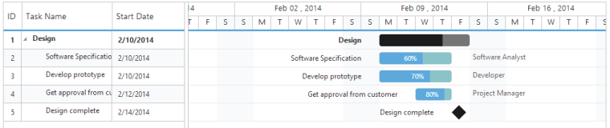

## Resources

Resources are represented by staff, equipment and materials etc. In Gantt control you can show /allocate the resources (human resources) for each task. The following steps explain how to configure Gantt with Resources

Step 1: Create a collection of JSON object, that contains id and name of the resource and assign it to Resources option.

Step 2:  Then, specify the field name for id and name of the resource in the Resource collection to ResourceIdMapping and ResourceNameMapping options. 

Step 3: The name of the field, which contains the actual resources assigned for a particular task in the Datasource is specified using ResourceInfoMapping.



CONTROLLER[CS]

//..

ViewBag.resource = this.GetResources();

//...

//...

 #region CreateResource Collection

 public class Resource

 {

     public int ResourceId { get; set; }

     public string ResourceName { get; set; }

 }

 //...

 public List<Resource> GetResources()

 {

     List<Resource> ResourceCollection = new List<Resource>();

     ResourceCollection.Add(new Resource() { ResourceId = 1, ResourceName = "Project Manager" });

     ResourceCollection.Add(new Resource() { ResourceId = 2, ResourceName = "Software Analyst" });

     ResourceCollection.Add(new Resource() { ResourceId = 3, ResourceName = "Developer" });

     ResourceCollection.Add(new Resource() { ResourceId = 4, ResourceName = "Testing Engineer" });

     return ResourceCollection;

 }

 #endregion  

VIEW[MVC]

@(Html.EJ().Gantt("Gantt")

         //…

        .ResourceInfoMapping("ResourceId")

        .ResourceNameMapping("ResourceName")

        .ResourceIdMapping("ResourceId")

        .Resources(ViewBag.resource)

        .ShowResourceNames(true)

        .Datasource(ViewBag.datasource)

        )



The following screenshot shows Gantt control with Resources.

{{ '' | markdownify }}
{:.image }

