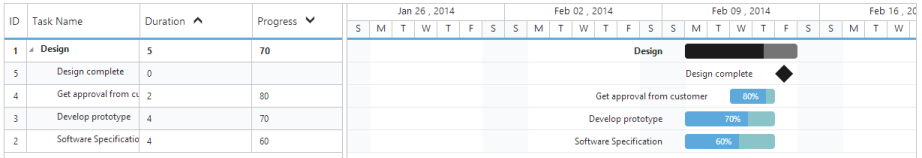

# Sorting

The Gantt control for JavaScript has built-in support for sorting one or more columns.

##Sorting Columns

Gantt allows the tasks to be sorted in ascending or descending order based on the selected column by enabling the AllowSorting option in Gantt control. The following code example shows you how to enable sorting in Gantt control.



@(Html.EJ().Gantt("Gantt")

//...

.AllowSorting(true)

.Datasource(ViewBag.datasource)

)



##Multicolumn sorting

Gantt allows you to sort multiple columns by clicking the desired column headers while holding the CTRL key. The following code example shows you how to enable multicolumn sorting in Gantt control.



@(Html.EJ().Gantt("Gantt")

//...

.AllowSorting(true)

.AllowMultiSorting(true)

.Datasource(ViewBag.datasource)

)



The following screenshot shows the output of multicolumn sorting in Gantt control.

