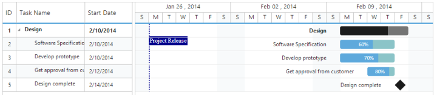

# Stripline

Stripline in Gantt control is used to highlight the important event in Gantt chart part. By using this feature, you can add the Striplines to highlight important days in your project. The following code example shows you how to add the Stripline in Gantt control.



@(Html.EJ().Gantt("Gantt")

     //...

 .StripLines(new   List<Syncfusion.JavaScript.Models.StripLine> 

                                  {

                                     new Syncfusion.JavaScript.Models.StripLine()

                                      { 

                                          Day="01/02/2014", 

                                          Label="Project Release", 

                                          LineStyle="dotted",

                                          LineColor="Darkblue",

                                          LineWidth=2 }, 

                               })

        })                                   	

        .Datasource(ViewBag.datasource)

        )



The following screenshot shows stripline in Gantt control.

