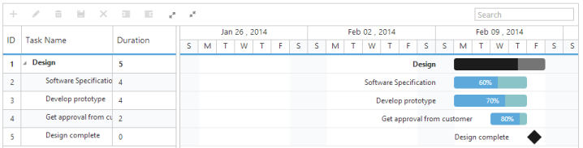

# Toolbar

Gantt control contains toolbar options for editing, searching, expanding and collapsing all records, indent, out dent, delete and add task. You can enable toolbar using the following code example.



@(Html.EJ().Gantt("Gantt")

//...

.ToolbarSettings(options =>

{

    options.ShowToolbar(true);

    options.ToolbarItems(new List<GanttToolBarItems>()

    {

        GanttToolBarItems.Add,

        GanttToolBarItems.Edit,

        GanttToolBarItems.Delete,

        GanttToolBarItems.Update,                 

        GanttToolBarItems.Cancel,

        GanttToolBarItems.Indent,

        GanttToolBarItems.Outdent,

        GanttToolBarItems.ExpandAll,

        GanttToolBarItems.CollapseAll,

        GanttToolBarItems.Search,

    });

})

.Datasource(ViewBag.datasource)

)



The following screenshot shows the toolbar option in Gantt control.

_Figure 46: Toolbar_

